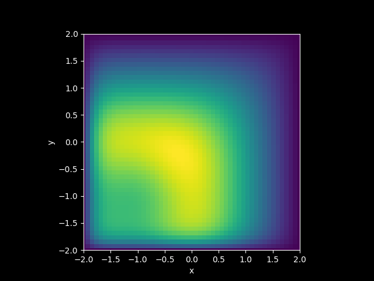

# ОТЧЕТ
## По лабораторной работе 10: Параллелизация двумерного уравнения теплопроводности

### Сведения о студенте
**Дата:** 14.10.2025 
**Семестр:** 1 
**Группа:** ПИН-м-о-25-1 
**Дисциплина:** Параллельные вычисления 
**Студент:** Джабраилов Тимур Султанович

---

## 1. Цель работы
Освоить методы распараллеливания алгоритмов решения многомерных уравнений в частных производных. Реализовать параллельные версии решения двумерного уравнения теплопроводности с использованием одномерной и двумерной декомпозиции расчетной области. Исследовать эффективность различных подходов к распараллеливанию.

## 2. Теоретическая часть
Рассматривается начально-краевая задача для двумерного уравнения параболического типа:
$$ \begin{cases} \varepsilon \left( \frac{\partial^2 u}{\partial x^2} + \frac{\partial^2 u}{\partial y^2} \right) -
\frac{\partial u}{\partial t} = -u \left( \frac{\partial u}{\partial x} + \frac{\partial u}{\partial y} \right) - u^3, \ (x,y)
\in (a,b) \times (c,d), \quad t \in (t_0,T], \ u(a,y,t) = u_{\text{left}}(y,t), \quad u(b,y,t) = u_{\text{right}}(y,t), \
u(x,c,t) = u_{\text{bottom}}(x,t), \quad u(x,d,t) = u_{\text{top}}(x,t), \ u(x,y,t_0) = u_{\text{init}}(x,y). \end{cases}
$$
Для численного решения используется явная схема:
$$ u_{i,j}^{m+1} = u_{i,j}^m + \tau \left( \varepsilon \left( \frac{u_{i+1,j}^m - 2u_{i,j}^m + u_{i-1,j}^m}{h_x^2} +
\frac{u_{i,j+1}^m - 2u_{i,j}^m + u_{i,j-1}^m}{h_y^2} \right) + u_{i,j}^m \left( \frac{u_{i+1,j}^m - u_{i-1,j}^m}
{2h_x} + \frac{u_{i,j+1}^m - u_{i,j-1}^m}{2h_y} \right) + (u_{i,j}^m)^3 \right). $$

## 3. Практическая реализация
### 3.1. Структура программы
Программа решает двумерную краевую задачу на равномерной прямоугольной сетке методом явной конечной разности во времени. Сначала задаются параметры домена, сетки по `x` и `y` и временная сетка, затем инициализируется трёхмерный массив u размера (`M + 1`, `N_x + 1`, `N_y + 1`) начальными условиями `u_init`. На каждом временном шаге явно присваиваются граничные значения по четырём сторонам, после чего для всех внутренних узлов (вложенные циклы по `i` и `j` внутри цикла по `m`) выполняется обновление по разностной схеме с членами диффузии, конвекции и нелинейной реакции.

### 3.2. Ключевые особенности реализации
- программа является однопроцессной. 
- использование трёхмерного numpy массива для хранения всей эволюции по времени

### 3.3. Инструкция по запуску
```bash
python main.py
```

## 4. Экспериментальная часть
### 4.1. Тестовые данные
N_x = 50; N_y = 50; M = 500

### 4.2. Методика измерений
- Intel Core i7 12700H: 6P + 8E ядра (14 ядер)
- DDR4 32GB оперативной памяти
- 5 запусков

### 4.3. Результаты измерений
#### Таблица 1. Замеры последовательной программы
|numprocs|N_x|N_y|M  |time|speedup|efficiency|
|--------|---|---|---|----|-------|----------|
|1       |50 |50 |500|2.5 |1      |1         |


### 5.1 Визуализация резульатата


Результат расчётов в виде графика

## 9. Приложения
### 9.1. Исходный код
```python
from numpy import empty, linspace, tanh
import time

def u_init(x, y) :
    u_init = 0.5*tanh(1/eps*((x - 0.5)**2 + (y - 0.5)**2 - 0.35**2)) - 0.17
    return u_init

def u_left(y, t) :
    u_left = 0.33
    return u_left

def u_right(y, t) :
    u_right = 0.33
    return u_right

def u_top(x, t) :
    u_top = 0.33
    return u_top

def u_bottom(x, t) :
    u_bottom = 0.33
    return u_bottom

start_time = time.time()

a = -2.; b = 2.
c = -2.; d = 2.
t_0 = 0.; T = 5.

eps = 10**(-1.0)

N_x = 50; N_y = 50; M = 500

h_x = (b - a)/N_x; x = linspace(a, b, N_x+1)
h_y = (d - c)/N_y; y = linspace(c, d, N_y+1)

tau = (T - t_0)/M; t = linspace(t_0, T, M+1)

u = empty((M + 1, N_x + 1, N_y + 1))

for i in range(N_x + 1) :
    for j in range(N_y + 1) :
        u[0, i, j] = u_init(x[i], y[j])

for m in range(1, M + 1) :
    for j in range(1, N_y) :
        u[m, 0, j] = u_left(y[j], t[m])
        u[m, N_x, j] = u_right(y[j], t[m])
    for i in range(0, N_x + 1) :
        u[m, i, N_y] = u_top(x[i], t[m])
        u[m, i, 0] = u_bottom(x[i], t[m])
    
for m in range(M) :
    print('m=',m)
    
    for i in range(1, N_x) :
        for j in range(1, N_y) :
            u[m+1, i, j] =  u[m,i,j] + \
                tau*(eps*((u[m,i+1,j] - 2*u[m,i,j] + u[m,i-1,j])/h_x**2 +
                          (u[m,i,j+1] - 2*u[m,i,j] + u[m,i,j-1])/h_y**2) +
                     u[m,i,j]*((u[m,i+1,j] - u[m,i-1,j])/(2*h_x) +
                               (u[m,i,j+1] - u[m,i,j-1])/(2*h_y)) + 
                     u[m,i,j]**3)

end_time = time.time()

print('Elapsed time is {:.4f} sec'.format(end_time-start_time))

from numpy import savez
savez('results_of_calculations', x=x, y=y, t=t, u=u)
```

### 9.2. Используемые библиотеки и версии
- Python 3.8+
- mpi4py 3.1.+
- NumPy 1.21.+
- OpenMPI 4.1.+

### 9.3. Рекомендуемая литература
Фундаментальные исследования (с аннотациями):
1. Hockney, R. W., & Jesshope, C. R. (1988). Parallel Computers 2: Architecture, Programming and
Algorithms. Adam Hilger.
Аннотация: Классическая работа, посвящённая архитектуре параллельных вычислительных
систем и алгоритмам для них. Содержит глубокий анализ методов распараллеливания сеточных
задач, включая явные и неявные схемы для уравнений в частных производных.
2. Ortega, J. M. (1988). Introduction to Parallel and Vector Solution of Linear Systems. Springer.
Аннотация: Фундаментальное введение в методы решения систем линейных уравнений на
параллельных архитектурах. Особое внимание уделяется алгоритмам для разреженных матриц и
их применению в задачах математической физики.
3. Gustafsson, B. (2008). High Order Difference Methods for Time Dependent PDE. Springer.
Аннотация: Монография, посвящённая численным методам высокого порядка точности для
решения уравнений в частных производных. Содержит анализ устойчивости и сходимости
разностных схем, а также вопросы их распараллеливания.
Практические руководства (с аннотациями):
1. Gropp, W., Lusk, E., & Skjellum, A. (2014). Using MPI: Portable Parallel Programming with the
Message-Passing Interface. MIT Press.
Аннотация: Практическое руководство по программированию с использованием MPI. Содержит
примеры реализации распределённых алгоритмов, включая задачи для УрЧП и методы
организации коммуникаций.
2. Pacheco, P. (2011). An Introduction to Parallel Programming. Morgan Kaufmann.
Аннотация: Учебник, ориентированный на практическое освоение параллельного
программирования. Включает разделы по MPI и примеры распараллеливания сеточных методов.
3. Dongarra, J. J., et al. (1998). Numerical Linear Algebra for High-Performance Computers. SIAM.
Аннотация: Сборник практических рекомендаций по реализации алгоритмов линейной алгебры
на высокопроизводительных системах. Содержит оптимизированные реализации методов для

---

*Отчет подготовлен в рамках курса "Параллельные вычисления"*