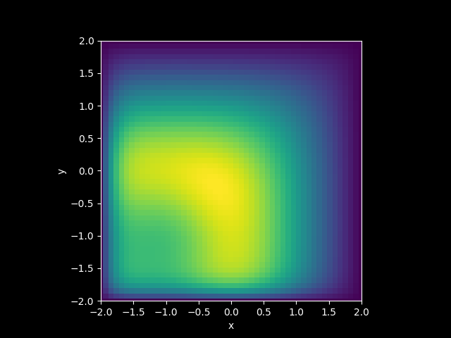
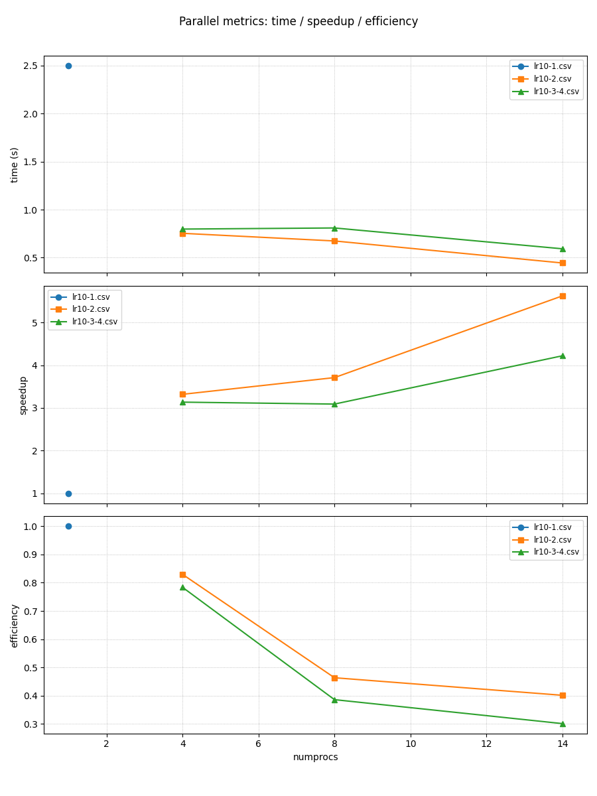

# ОТЧЕТ
## По лабораторной работе 10: Параллелизация двумерного уравнения теплопроводности

### Сведения о студенте
**Дата:** 14.10.2025 
**Семестр:** 1 
**Группа:** ПИН-м-о-25-1 
**Дисциплина:** Параллельные вычисления 
**Студент:** Джабраилов Тимур Султанович

---

## 1. Цель работы
Освоить методы распараллеливания алгоритмов решения многомерных уравнений в частных производных. Реализовать параллельные версии решения двумерного уравнения теплопроводности с использованием одномерной и двумерной декомпозиции расчетной области. Исследовать эффективность различных подходов к распараллеливанию.

## 2. Теоретическая часть
Рассматривается начально-краевая задача для двумерного уравнения параболического типа:
$$ \begin{cases} \varepsilon \left( \frac{\partial^2 u}{\partial x^2} + \frac{\partial^2 u}{\partial y^2} \right) -
\frac{\partial u}{\partial t} = -u \left( \frac{\partial u}{\partial x} + \frac{\partial u}{\partial y} \right) - u^3, \ (x,y)
\in (a,b) \times (c,d), \quad t \in (t_0,T], \ u(a,y,t) = u_{\text{left}}(y,t), \quad u(b,y,t) = u_{\text{right}}(y,t), \
u(x,c,t) = u_{\text{bottom}}(x,t), \quad u(x,d,t) = u_{\text{top}}(x,t), \ u(x,y,t_0) = u_{\text{init}}(x,y). \end{cases}
$$
Для численного решения используется явная схема:
$$ u_{i,j}^{m+1} = u_{i,j}^m + \tau \left( \varepsilon \left( \frac{u_{i+1,j}^m - 2u_{i,j}^m + u_{i-1,j}^m}{h_x^2} +
\frac{u_{i,j+1}^m - 2u_{i,j}^m + u_{i,j-1}^m}{h_y^2} \right) + u_{i,j}^m \left( \frac{u_{i+1,j}^m - u_{i-1,j}^m}
{2h_x} + \frac{u_{i,j+1}^m - u_{i,j-1}^m}{2h_y} \right) + (u_{i,j}^m)^3 \right). $$

### 2.2. Используемые функции MPI
# Функции MPI, используемые в коде
- Get_size() - получение количества процессов в коммуникаторе
- Create_cart() - создание декартовой топологии коммуникатора
- Get_rank() - получение ранга текущего процесса в коммуникаторе
- Get_coords() - получение координат процесса в декартовой топологии
- Wtime() - получение текущего времени (для замера производительности)
- Sendrecv() - объединенная операция отправки и приема данных
- Send() - отправка данных
- Recv() - прием данных

## 3. Практическая реализация
### 3.1. Структура программы
Программа решает ту же задачу, но использует двухмерную декартову топологию процессов (comm_cart с dims=(num_row,num_col)), поэтому домен разбивается по двум осям между процессами. Каждый процесс хранит локальный блок u_part_aux размера (M+1, N_x_part_aux, N_y_part_aux) (с halo-слоями по всем четырём сторонам), обновляет внутренние узлы явной схемы, затем выполняет обмены с четырьмя соседями: горизонтальные обмены столбцов и вертикальные обмены строк (через Sendrecv с копированием буферов).

### 3.2. Ключевые особенности реализации
истинная 2D-декомпозиция снижает объём локальных данных и балансирует нагрузку при большом числе процессов, но требует сложной логики разбиения

### 3.3. Инструкция по запуску
```bash
# Пример команды для запуска
mpiexec -n 14 python main.py
```

## 4. Экспериментальная часть
### 4.1. Тестовые данные
N_x = 50; N_y = 50; M = 500

### 4.2. Методика измерений
- Intel Core i7 12700H: 6P + 8E ядра (14 ядер)
- DDR4 32GB оперативной памяти
- 5 запусков

### 4.3. Результаты измерений
#### Таблица 1. Замеры производительности параллельной программы lr10-3-4.csv
|numprocs|N_x|N_y|M  |time|speedup|efficiency|
|--------|---|---|---|----|-------|----------|
|4       |50 |50 |500|0.7976186000742018|3.1343301168847204|0.7835825292211801|
|8       |50 |50 |500|0.8093053000047803|3.0890691065352387|0.38613363831690484|
|14      |50 |50 |500|0.5924645999912173|4.219661394177914|0.3014043852984224|

## 5. Визуализация результатов


Результат расчётов в виде графика



Результат замера производтельности

## 6. Анализ результатов
### 6.1. Анализ производительности
Для данного набора данных наилучшую эффективность показывают 4 процесса. После этого увеличение кол-ва процессов уменьшает время выполнения расчётов, но снижается это время довольно временно. Скорее всего это связано с небольшим объемом данных для вычслеий.

## 7. Ответы на контрольные вопросы
1. **Чем асинхронные (`Isend`/`Irecv`) отличаются от блокирующих?**
   Асинхронные возвращают управление сразу и дают возможность продолжать вычисления, пока сообщения передаются в фоновом режиме; блокирующие ждут завершения передачи. Асинхронные требуют управления `Request` и `Wait`. 

2. **Что такое отложенные (persistent) запросы и когда их применять?**
   `Send_init` или `Recv_init` создают persistent-запросы, которые многократно стартуют через `Start` или `Startall` и завершаются `Wait` - выгодно при повторяющемся шаблоне обменов (меньше затрат на установку). 

3. **Как правильно организовать перекрытие вычислений и коммуникаций?**
   Запустить `Isend` или `Irecv`, выполнять вычисления внутренних узлов, затем `Wait` для окончания приёма краёв и обработать граничные узлы. Ключ - чтобы вычисления занимали больше времени, чем асинхронная отправка, иначе перекрытие бесполезно. 

4. **Какие проблемы могут возникнуть при использовании неблокирующих операций?**
   Гонки при преждевременном доступе к буферам, утечки `Request` (не выполненные `Wait` или `Cancel`), неверные размеры - неверные данные или дедлоки. 

5. **Когда полезны `Sendrecv_replace` и когда — асинхронные операции?**
   `Sendrecv_replace` удобен для простых парных обменов (одно вызывание) и безопасен от дедлоков. Асинхронные выгодны при необходимости перекрытия и при больших сообщениях, часто в циклах.

6. **Как измерить выигрыш от асинхронности?**
   Сравнить время выполнения идентичных задач с блокирующими и неблокирующими реализациями, профилировать время на коммуникации и вычисления; выигрыш наблюдается, если коммуникации заметно перекрываются вычислениями. 

7. **Что такое правильный шаблон использования persistent-запросов?**
   Создать `Send_init` или `Recv_init` единожды, в цикле вызывать `Startall`, `Waitall`, и после окончания - `Free`. Подойдёт для многократных шагов времени. 

8. **Какие MPI-параметры/флаги влияют на поведение асинхронных операций?**
   Реализация MPI и её настройки буферизации, режим eager или rendezvous, а также использование выделенной сети влияют на производительность асинхронных вызовов. 

9. **Когда асинхронность не даёт выигрыша?**
   Если вычислительная работа между отправкой и ожиданием слишком мала (нечего перекрыть), либо если библиотека эффективно буферизует сообщения так, что блочные вызовы уже оптимальны. 

10. **Практические рекомендации для внедрения асинхронности в ваш код**
    Проверяйте корректность буферов, используйте отладочные запуски с небольшим числом процессов, профилируйте (время в `Wait`), применяйте persistent запросы для циклов, аккуратно документируйте порядок стартов или ожиданий. 


## 8. Заключение
### 8.1. Выводы
В ходе данной лабораторной работы была разработанна программа реализующая алгоритмы решения многомерхных уравнений в частных производных. А также исследована эффективность различных подходов к распараллелизоваю, при заданых условиях лучше всего показала себя программа lr10-2.

## 9. Приложения
### 9.1. Исходный код
```python
from mpi4py import MPI
from numpy import empty, int32, float64, linspace, tanh, meshgrid, sqrt
from matplotlib.pyplot import style, figure, axes, show

comm = MPI.COMM_WORLD
numprocs = comm.Get_size()

num_row = num_col = int32(sqrt(numprocs))

comm_cart = comm.Create_cart(dims=(num_row, num_col), periods=(False, False), reorder=True)
rank_cart = comm_cart.Get_rank()

def u_init(x, y) :
    u_init = 0.5*tanh(1/eps*((x - 0.5)**2 + (y - 0.5)**2 - 0.35**2)) - 0.17
    return u_init

def u_left(y, t) :
    u_left = 0.33
    return u_left

def u_right(y, t) :
    u_right = 0.33
    return u_right

def u_top(x, t) :
    u_top = 0.33
    return u_top

def u_bottom(x, t) :
    u_bottom = 0.33
    return u_bottom

if rank_cart == 0 :
    start_time = MPI.Wtime()

a = -2.; b = 2.; c = -2.; d = 2.
t_0 = 0.; T = 5.
eps = 10**(-1.0)

N_x = 50; N_y = 50; M = 500

h_x = (b - a)/N_x; x = linspace(a, b, N_x+1)
h_y = (d - c)/N_y; y = linspace(c, d, N_y+1)

tau = (T - t_0)/M; t = linspace(t_0, T, M+1)

def auxiliary_arrays_determination(M, num) : 
    ave, res = divmod(M, num)
    rcounts = empty(num, dtype=int32)
    displs = empty(num, dtype=int32)
    for k in range(0, num) : 
        if k < res :
            rcounts[k] = ave + 1
        else :
            rcounts[k] = ave
        if k == 0 :
            displs[k] = 0
        else :
            displs[k] = displs[k-1] + rcounts[k-1]   
    return rcounts, displs

rcounts_N_x, displs_N_x = auxiliary_arrays_determination(N_x + 1, num_col)
rcounts_N_y, displs_N_y = auxiliary_arrays_determination(N_y + 1, num_row)

my_row, my_col = comm_cart.Get_coords(rank_cart)  
    
N_x_part = rcounts_N_x[my_col]
N_y_part = rcounts_N_y[my_row]
    
if my_col in [0, num_col - 1] :
    N_x_part_aux = N_x_part + 1
else :
    N_x_part_aux = N_x_part + 2
    
if my_row in [0, num_row - 1] :
    N_y_part_aux = N_y_part + 1
else :
    N_y_part_aux = N_y_part + 2
    
displs_N_x_aux = displs_N_x - 1; displs_N_x_aux[0] = 0
displs_N_y_aux = displs_N_y - 1; displs_N_y_aux[0] = 0

displ_x_aux = displs_N_x_aux[my_col]
displ_y_aux = displs_N_y_aux[my_row]

u_part_aux = empty((M + 1, N_x_part_aux, N_y_part_aux), dtype=float64)

for i in range(N_x_part_aux) :
    for j in range(N_y_part_aux) :
        u_part_aux[0, i, j] = u_init(x[displ_x_aux + i], y[displ_y_aux + j])  
        
for m in range(1, M + 1) :
    for j in range(1, N_y_part_aux - 1) :
        if my_col == 0 :
            u_part_aux[m, 0, j] = u_left(y[displ_y_aux + j], t[m])
        if my_col == num_col - 1 :
            u_part_aux[m, N_x_part_aux - 1, j] = u_right(y[displ_y_aux + j], t[m])
    for i in range(N_x_part_aux) :
        if my_row == 0 :
            u_part_aux[m, i, 0] = u_bottom(x[displ_x_aux + i], t[m])
        if my_row == num_row - 1 :
            u_part_aux[m, i, N_y_part_aux - 1] = u_top(x[displ_x_aux + i], t[m])
        
for m in range(M) :
    
    for i in range(1, N_x_part_aux - 1) :
        for j in range(1, N_y_part_aux - 1) :
            u_part_aux[m+1, i, j] =  u_part_aux[m,i,j] + \
                tau*(eps*((u_part_aux[m,i+1,j] - 2*u_part_aux[m,i,j] + u_part_aux[m,i-1,j])/h_x**2 +
                          (u_part_aux[m,i,j+1] - 2*u_part_aux[m,i,j] + u_part_aux[m,i,j-1])/h_y**2) +
                      u_part_aux[m,i,j]*((u_part_aux[m,i+1,j] - u_part_aux[m,i-1,j])/(2*h_x) +
                                (u_part_aux[m,i,j+1] - u_part_aux[m,i,j-1])/(2*h_y)) + 
                      u_part_aux[m,i,j]**3)
                
    if my_col > 0 : 
        comm_cart.Sendrecv(sendbuf=[u_part_aux[m+1, 1, 1:], N_y_part, MPI.DOUBLE], 
                           dest=my_row*num_col + (my_col-1), sendtag=0, 
                           recvbuf=[u_part_aux[m+1, 0, 1:], N_y_part, MPI.DOUBLE], 
                           source=my_row*num_col + (my_col-1), recvtag=MPI.ANY_TAG, status=None)
        
    if my_col < num_col-1 :
        comm_cart.Sendrecv(sendbuf=[u_part_aux[m+1, N_x_part_aux-2, 1:], N_y_part, MPI.DOUBLE], 
                           dest=my_row*num_col + (my_col+1), sendtag=0, 
                           recvbuf=[u_part_aux[m+1, N_x_part_aux-1, 1:], N_y_part, MPI.DOUBLE], 
                           source=my_row*num_col + (my_col+1), recvtag=MPI.ANY_TAG, status=None)
        
    if my_row > 0 :     
        temp_array_send = u_part_aux[m+1, 1:N_x_part+1, 1].copy()
        temp_array_recv = empty(N_x_part, dtype=float64)
        comm_cart.Sendrecv(sendbuf=[temp_array_send, N_x_part, MPI.DOUBLE], 
                           dest=(my_row-1)*num_col + my_col, sendtag=0, 
                           recvbuf=[temp_array_recv, N_x_part, MPI.DOUBLE], 
                           source=(my_row-1)*num_col + my_col, recvtag=MPI.ANY_TAG, status=None)
        u_part_aux[m+1, 1:N_x_part+1, 0] = temp_array_recv
        
    if my_row < num_row-1 :    
        temp_array_send = u_part_aux[m+1, 1:N_x_part+1, N_y_part_aux-2].copy()
        temp_array_recv = empty(N_x_part, dtype=float64)
        comm_cart.Sendrecv(sendbuf=[temp_array_send, N_x_part, MPI.DOUBLE], 
                           dest=(my_row+1)*num_col + my_col, sendtag=0, 
                           recvbuf=[temp_array_recv, N_x_part, MPI.DOUBLE], 
                           source=(my_row+1)*num_col + my_col, recvtag=MPI.ANY_TAG, status=None)
        u_part_aux[m+1, 1:N_x_part+1, N_y_part_aux-1] = temp_array_recv
        
if rank_cart == 0 :
    end_time = MPI.Wtime()

if rank_cart == 0 :
    u_T = empty((N_x + 1, N_y + 1), dtype=float64)
else : 
    u_T = None

if rank_cart == 0 :
    for m in range(num_row) :
        for n in range(num_col) :
            if m == 0 and n == 0 :
                for i in range(N_x_part) :
                    u_T[i, 0:N_y_part] = u_part_aux[M, i, 0:N_y_part]
            else :
                for i in range(rcounts_N_x[n]) :
                    comm_cart.Recv([u_T[displs_N_x[n] + i, displs_N_y[m]:], rcounts_N_y[m], MPI.DOUBLE], 
                                   source=(m*num_col + n), tag=0, status=None)
else :
    for i in range(N_x_part) :
        if my_row == 0 :
            if my_col == 0 :
                comm_cart.Send([u_part_aux[M, i, 0:], N_y_part, MPI.DOUBLE], dest=0, tag=0)
            if my_col in range(1, num_col) :
                comm_cart.Send([u_part_aux[M, 1+i, 0:], N_y_part, MPI.DOUBLE], dest=0, tag=0)
        if my_row in range(1, num_row) :
            if my_col == 0 :
                comm_cart.Send([u_part_aux[M, i, 1:], N_y_part, MPI.DOUBLE], dest=0, tag=0)
            if my_col in range(1, num_col) :
                comm_cart.Send([u_part_aux[M, 1+i, 1:], N_y_part, MPI.DOUBLE], dest=0, tag=0)

if rank_cart == 0 :
    
    print('N_x={}, N_y={}, M={}'.format(N_x, N_y, M))
    print('Number of MPI process is {}'.format(numprocs))
    print('Elapsed time is {:.4f} sec.'.format(end_time-start_time))
    
    style.use('dark_background')
    fig = figure()
    ax = axes(xlim=(a,b), ylim=(c, d))
    ax.set_xlabel('x'); ax.set_ylabel('y'); ax.set_aspect('equal') 
    X, Y = meshgrid(x, y)
    ax.pcolor(X, Y, u_T, shading='auto')
    show()
```

### 9.2. Используемые библиотеки и версии
- Python 3.8+
- mpi4py 3.1.+
- NumPy 1.21.+
- OpenMPI 4.1.+

### 9.3. Рекомендуемая литература
Фундаментальные исследования (с аннотациями):
1. Hockney, R. W., & Jesshope, C. R. (1988). Parallel Computers 2: Architecture, Programming and
Algorithms. Adam Hilger.
Аннотация: Классическая работа, посвящённая архитектуре параллельных вычислительных
систем и алгоритмам для них. Содержит глубокий анализ методов распараллеливания сеточных
задач, включая явные и неявные схемы для уравнений в частных производных.
2. Ortega, J. M. (1988). Introduction to Parallel and Vector Solution of Linear Systems. Springer.
Аннотация: Фундаментальное введение в методы решения систем линейных уравнений на
параллельных архитектурах. Особое внимание уделяется алгоритмам для разреженных матриц и
их применению в задачах математической физики.
3. Gustafsson, B. (2008). High Order Difference Methods for Time Dependent PDE. Springer.
Аннотация: Монография, посвящённая численным методам высокого порядка точности для
решения уравнений в частных производных. Содержит анализ устойчивости и сходимости
разностных схем, а также вопросы их распараллеливания.
Практические руководства (с аннотациями):
1. Gropp, W., Lusk, E., & Skjellum, A. (2014). Using MPI: Portable Parallel Programming with the
Message-Passing Interface. MIT Press.
Аннотация: Практическое руководство по программированию с использованием MPI. Содержит
примеры реализации распределённых алгоритмов, включая задачи для УрЧП и методы
организации коммуникаций.
2. Pacheco, P. (2011). An Introduction to Parallel Programming. Morgan Kaufmann.
Аннотация: Учебник, ориентированный на практическое освоение параллельного
программирования. Включает разделы по MPI и примеры распараллеливания сеточных методов.
3. Dongarra, J. J., et al. (1998). Numerical Linear Algebra for High-Performance Computers. SIAM.
Аннотация: Сборник практических рекомендаций по реализации алгоритмов линейной алгебры
на высокопроизводительных системах. Содержит оптимизированные реализации методов для

---

*Отчет подготовлен в рамках курса "Параллельные вычисления"*