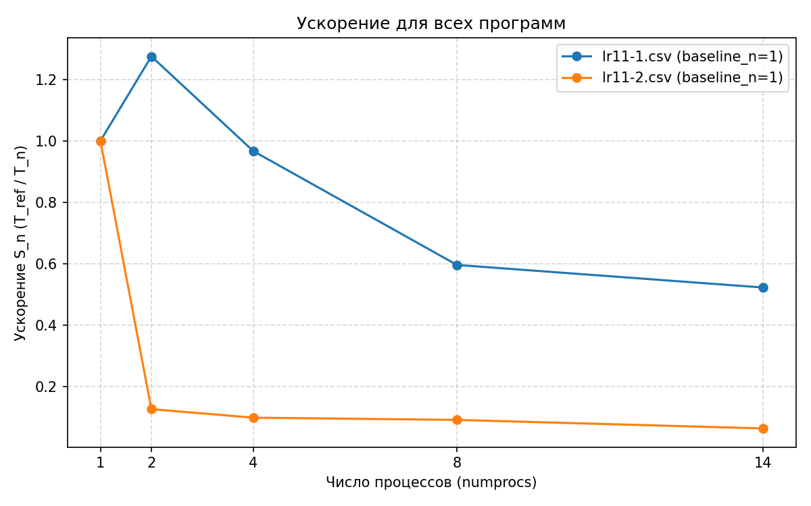
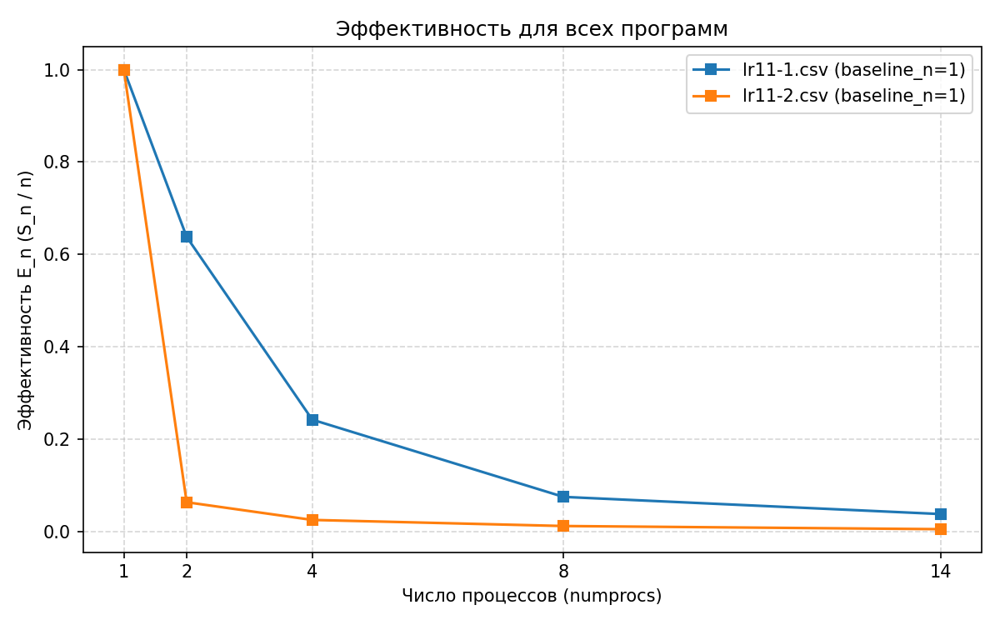
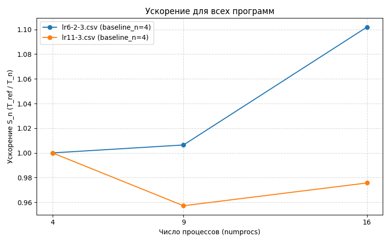
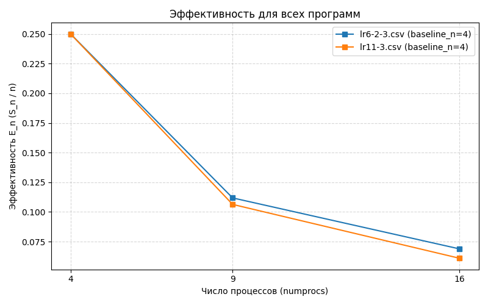

# ОТЧЕТ
## По лабораторной работе 11: Применение асинхронных операций в MPI

### Сведения о студенте
- **Дата:** 16.10.2025
- **Семестр:** 1 семестр
- **Группа:** ПИН-м-о-25-1 
- **Дисциплина:** Праллельные вычисления
- **Студент:** Джабраилов Тимур Султанович

---

## 1. Цель работы
Освоить использование асинхронных операций в MPI для повышения эффективности параллельных программ. Изучить функции Isend, Irecv, Waitall, Send_init, Recv_init и Startall. Применить асинхронные операции для оптимизации коммуникационных паттернов в параллельных алгоритмах.

## 2. Теоретическая часть
### 2.1. Основные понятия и алгоритмы
Асинхронные операции позволяют инициировать передачу данных без блокировки выполнения
программы, что особенно полезно для перекрытия вычислений и коммуникаций. На этой
лабораторной работе мы изучим:
Блокирующие и неблокирующие операции.
Функции Isend, Irecv, Waitall.
Отложенные запросы на взаимодействие: Send_init, Recv_init, Startall.

### 2.2. Используемые функции MPI
- Isend
- Irecv
- Waitall
- Send_init
- Recv_init
- Startall

## 3. Практическая реализация
### 3.1. Структура программы
#### 3.1.1 Структура программы lr11-1
Программа организует процессы в кольцо, где каждый процесс асинхронно отправляет свой ранг левому соседу и получает значение от правого соседа. После завершения обмена процессы выводят полученные значения.

#### 3.1.2 Структура программы lr11-2
Программа реализует кольцевую пересылку данных между процессами, где каждый процесс 10 раз последовательно отправляет свое значение следующему процессу и получает значение от предыдущего процесса, обновляя свое значение полученным. В результате после 10 итераций все значения циклически сдвигаются по кольцу процессов.

#### 3.1.3 Структура программы lr11-3
Струтура програма осталось такой же как и в lr6-2-3, однако некоторые операции были реализованы вручную асинхронно, с помощью команд отложенных выполнений и асинронной отправки и получения.

### 3.3. Инструкция по запуску
```bash
mpiexec -n 4 python lr11-1.py
mpiexec -n 4 python lr11-2.py
mpiexec -n 4 python lr11-3.py
```

## 4. Экспериментальная часть
### 4.1. Тестовые данные lr11-1
Генерируются автоматически на основании кол-ва процессов

### 4.2 Тестовые данные lr11-2
Генерируются автоматически на основании кол-ва процессов

### 4.3. Тестовые данные lr11-3
N = 100, M = 200000

### 4.2. Методика измерений
- Intel Core i7 12700H: 6P + 8E ядра (14 ядер)
- DDR4 32GB оперативной памяти
- 5 запусков

### 4.3. Результаты измерений
#### Таблица 1. Время выполнения lr11-3
|numprocs|N  |M     |time              |
|--------|---|------|------------------|
|4       |100|200000|14.37818359999801 |
|9       |100|200000|15.021519000001717|
|16      |100|200000|14.737294100006693|

## 5. Визуализация результатов
### 5.1 Результат выполнения lr11-1
### 5.1.1 Результат в консоле
```bash
Rank 2: received b = [3, 3, 3, 3, 3, 3, 3, 3, 3, 3], work = 16312661072
Rank 1: received b = [2, 2, 2, 2, 2, 2, 2, 2, 2, 2], work = 16177537760
Rank 3: received b = [0, 0, 0, 0, 0, 0, 0, 0, 0, 0], work = 16248948160
Rank 0: received b = [1, 1, 1, 1, 1, 1, 1, 1, 1, 1], work = 15882834288
```

### 5.2. Результат выполнения lr11-2
### 5.2.1 Результат в консоле
```bash
Rank 2: final a = [0, 0, 0, 0, 0, 0, 0, 0, 0, 0]
Rank 2: avg work time = 0.022696 s, avg wait-after-work = 0.000222 s, avg total = 0.022918 s
Rank 3: final a = [1, 1, 1, 1, 1, 1, 1, 1, 1, 1]
Rank 3: avg work time = 0.023031 s, avg wait-after-work = 0.000049 s, avg total = 0.023080 s
Rank 1: final a = [3, 3, 3, 3, 3, 3, 3, 3, 3, 3]
Rank 1: avg work time = 0.024336 s, avg wait-after-work = 0.000113 s, avg total = 0.024449 s
Rank 0: final a = [2, 2, 2, 2, 2, 2, 2, 2, 2, 2]
Rank 0: avg work time = 0.024794 s, avg wait-after-work = 0.000048 s, avg total = 0.024842 s
```

### 5.3. Графики ускорения и эффективности
#### 5.3.1 График ускорения lr11-3


#### 5.3.2 График эффективности lr11-3


#### 5.3.1 График ускорения lr11-3


#### 5.3.2 График эффективности lr11-3



## 6. Анализ результатов
### 6.2. Анализ производительности lr11-1 и lr11-2
Обе программы корректно отрабатывают передавая по кругу массиви из 10 элементов. Графики показывают, что лучше себя показывает версия программы использующая неотложенные асинхронные операции.

### 6.2. Анализ производительности lr11-3
По графикам ускорения и эффективности можно заметить, что лучше себя показывает программа lr-2-3, которая обладает более высоким ускорением и эффективностью, причём разница увеличивается с увеличением кол-ва процессов

## 7. Ответы на контрольные вопросы
1. **Чем асинхронные (`Isend`/`Irecv`) отличаются от блокирующих?**
   Асинхронные возвращают управление сразу и дают возможность продолжать вычисления, пока сообщения передаются в фоновом режиме; блокирующие ждут завершения передачи/приёма. Асинхронные требуют управления `Request` и `Wait`. 

2. **Что такое отложенные (persistent) запросы и когда их применять?**
   `Send_init`/`Recv_init` создают persistent-запросы, которые многократно стартуют через `Start`/`Startall` и завершаются `Wait` — выгодно при повторяющемся шаблоне обменов (меньше затрат на установку). 

3. **Как правильно организовать перекрытие вычислений и коммуникаций?**
   Запустить `Isend`/`Irecv`, выполнять вычисления внутренних узлов, затем `Wait` для окончания приёма краёв и обработать граничные узлы. Ключ — чтобы вычисления занимали больше времени, чем асинхронная отправка/приём (иначе перекрытие бесполезно). 

4. **Какие проблемы могут возникнуть при использовании неблокирующих операций?**
   Гонки (race conditions) при преждевременном доступе к буферам, утечки `Request` (не выполненные `Wait`/`Cancel`), неверные размеры/теги → неверные данные или дедлоки. 

5. **Когда полезны `Sendrecv_replace` и когда — асинхронные операции?**
   `Sendrecv_replace` удобен для простых парных обменов (одно вызывание) и безопасен от дедлоков. Асинхронные выгодны при необходимости перекрытия и при больших сообщениях, часто в циклах.

6. **Как измерить выигрыш от асинхронности?**
   Сравнить время выполнения идентичных задач с блокирующими и неблокирующими реализациями, профилировать время на коммуникации и вычисления; выигрыш наблюдается, если коммуникации заметно перекрываются вычислениями. 

7. **Что такое правильный шаблон использования persistent-запросов?**
   Создать `Send_init`/`Recv_init` единожды, в цикле вызывать `Startall`, `Waitall`, и после окончания — `Free` (или оставить на уничтожение). Подойдёт для многократных шагов времени. 

8. **Какие MPI-параметры/флаги влияют на поведение асинхронных операций?**
   Реализация MPI (OpenMPI/MPICH) и её настройки буферизации, режим eager/rendezvous, а также использование выделенной сети/интерконнекта влияют на производительность асинхронных вызовов. 

9. **Когда асинхронность не даёт выигрыша?**
   Если вычислительная работа между отправкой и ожиданием слишком мала (нечего перекрыть), либо если сеть/библиотека эффективно буферизует сообщения так, что блочные вызовы уже оптимальны. 

10. **Практические рекомендации для внедрения асинхронности в ваш код**
    Проверяйте корректность буферов, используйте отладочные запуски с небольшим числом процессов, профилируйте (время в `Wait`), применяйте persistent запросы для циклов, аккуратно документируйте порядок стартов/ожиданий. 


## 8. Заключение
### 8.1. Выводы
В рамках данной лабораторной работы были получены навыки работы с асинхронными операциями отправки и получения данных, а также методы откладывания выполнения этих операций с помощью специальных функций MPI.


## 9. Приложения
### 9.1. Исходный код lr11-1
```python
from mpi4py import MPI
import numpy as np

comm = MPI.COMM_WORLD
size = comm.Get_size()
rank = comm.Get_rank()

N = 10

a = np.full(N, rank, dtype=np.int32)
b = np.empty(N, dtype=np.int32)

if size == 1:
    print(f'Rank {rank}: only one process, nothing to exchange. a={a}')
else:
    dst = (rank - 1) % size
    src = (rank + 1) % size

    req_send = comm.Isend(a, dest=dst, tag=0)
    req_recv = comm.Irecv(b, source=src, tag=0)

    work_iters = 500_000
    work = 0
    for i in range(work_iters):
        work += (i * (rank + 1)) & 0xFFFF
    MPI.Request.Waitall([req_send, req_recv])

    print(f'Rank {rank}: received b = {b.tolist()}, work = {work}')
```

### 9.2. Исходный код lr11-1
```python
from mpi4py import MPI
import numpy as np

comm = MPI.COMM_WORLD
numprocs = comm.Get_size()
rank = comm.Get_rank()

N = 10
iters = 10

a = np.full(N, rank, dtype=np.int32)
a_recv = np.empty(N, dtype=np.int32)

if numprocs == 1:
    print(f'Rank {rank}: only one process — nothing to exchange. a={a.tolist()}')
else:
    dst = (rank + 1) % numprocs
    src = (rank - 1) % numprocs

    req_send = comm.Send_init(a, dest=dst, tag=0)
    req_recv = comm.Recv_init(a_recv, source=src, tag=0)
    requests = [req_send, req_recv]

    work_iters = 300_000

    work_times = []
    wait_after_work_times = []
    total_times = []

    for k in range(iters):
        t0 = MPI.Wtime()
        MPI.Prequest.Startall(requests)

        work = 0
        for i in range(work_iters):
            work += (i * (rank + 1)) & 0xFFFF

        t1 = MPI.Wtime()
        MPI.Request.Waitall(requests)
        t2 = MPI.Wtime()

        a[:] = a_recv[:]

        work_times.append(t1 - t0)
        wait_after_work_times.append(t2 - t1)
        total_times.append(t2 - t0)

    for r in requests:
        r.Free()

    avg_work = sum(work_times) / len(work_times)
    avg_wait_after_work = sum(wait_after_work_times) / len(wait_after_work_times)
    avg_total = sum(total_times) / len(total_times)

    print(f'Rank {rank}: final a = {a.tolist()}')
    print(f'Rank {rank}: avg work time = {avg_work:.6f} s, '
          f'avg wait-after-work = {avg_wait_after_work:.6f} s, avg total = {avg_total:.6f} s')
```

### 9.3. Исходный код lr11-1
```python
import csv
import os
from mpi4py import MPI
from numpy import empty, array, zeros, int32, float64, hstack, dot
from threadpoolctl import threadpool_limits

comm = MPI.COMM_WORLD
numprocs = comm.Get_size()
rank = comm.Get_rank()

# используем MPI.Compute_dims вместо sqrt, чтобы получить корректные размеры сетки
dims = MPI.Compute_dims(int(numprocs), [0, 0])
num_row = int(dims[0])
num_col = int(dims[1])

# защитная проверка
if num_row * num_col != numprocs:
    if rank == 0:
        print(f"Cannot create cartesian grid: {num_row}x{num_col} != {numprocs}")
    MPI.Finalize()
    raise SystemExit(1)

comm_cart = comm.Create_cart(dims=(num_row, num_col),
                             periods=(True, True), reorder=True)

# если create_cart по каким-то причинам вернул COMM_NULL — выйти
if comm_cart == MPI.COMM_NULL:
    if rank == 0:
        print("comm_cart is MPI.COMM_NULL, exiting.")
    MPI.Finalize()
    raise SystemExit(1)

rank_cart = comm_cart.Get_rank()

prefixPath = '../../lr4/src/data/datasets/data_C/'
inPath = prefixPath + 'in.dat'
aDataPath = prefixPath + 'AData.dat'
bDataPath = prefixPath + 'bData.dat'

with threadpool_limits(limits=1):
    if (rank == 0):
        t0 = MPI.Wtime()
    else:
        t0 = None

    def conjugate_gradient_method(A_part, b_part, x_part, N_part_arr, M_part_arr,
                                  N_arr, comm_cart, num_row, num_col):
        # N_part_arr, M_part_arr, N_arr are numpy scalars (int32) — конвертируем в Python int
        N_part = int(N_part_arr)
        M_part = int(M_part_arr)
        N = int(N_arr)

        neighbour_up, neighbour_down = comm_cart.Shift(direction=0, disp=1)
        neighbour_left, neighbour_right = comm_cart.Shift(direction=1, disp=1)

        ScalP_temp = empty(1, dtype=float64)

        s = 1

        p_part = zeros(N_part, dtype=float64)

        # helper: perform ring accumulation using persistent Send_init/Recv_init
        # send_arr: numpy array to start from (will be forwarded around ring)
        # steps: how many forwardings (num_col-1 or num_row-1)
        # dest: destination rank for send
        # source: source rank for recv
        def ring_accumulate(send_arr, steps, dest, source):
            # accum starts with local contribution
            accum = send_arr.copy()
            if steps <= 0:
                return accum, send_arr

            # prepare send and recv buffers (contiguous)
            send_local = send_arr.copy()
            recv_local = empty(send_local.shape, dtype=send_local.dtype)

            # create persistent requests on communicator
            send_req = comm_cart.Send_init(send_local, dest=dest, tag=0)
            recv_req = comm_cart.Recv_init(recv_local, source=source, tag=0)
            reqs = [send_req, recv_req]

            for _ in range(steps):
                # prepare send_local as the block to forward
                send_local[:] = send_arr
                # start requests (no Startall in some mpi4py; используем Start() у каждого)
                for r in reqs:
                    r.Start()
                # waitall
                MPI.Request.Waitall(reqs)
                # после приёма добавляем к аккумулятору
                accum = accum + recv_local
                # подготовим для следующего шага: будем отправлять то, что только получили
                send_arr = recv_local.copy()

            # освобождаем persistent-запросы
            send_req.Free()
            recv_req.Free()
            return accum, send_arr

        while s <= N:

            if s == 1:
                Ax_part_temp = dot(A_part, x_part)
                Ax_part = Ax_part_temp.copy()
                if int(num_col) - 1 > 0:
                    Ax_part, Ax_part_temp = ring_accumulate(Ax_part_temp, int(num_col) - 1,
                                                           neighbour_right, neighbour_left)
                b_part = Ax_part - b_part
                r_part_temp = dot(A_part.T, b_part)
                r_part = r_part_temp.copy()
                if int(num_row) - 1 > 0:
                    r_part, r_part_temp = ring_accumulate(r_part_temp, int(num_row) - 1,
                                                         neighbour_down, neighbour_up)
            else:
                ScalP_temp[0] = dot(p_part, q_part)
                ScalP = ScalP_temp.copy()
                if int(num_col) - 1 > 0:
                    ScalP, ScalP_temp = ring_accumulate(ScalP_temp, int(num_col) - 1,
                                                       neighbour_right, neighbour_left)
                r_part = r_part - q_part / ScalP

            ScalP_temp[0] = dot(r_part, r_part)
            ScalP = ScalP_temp.copy()
            if int(num_col) - 1 > 0:
                ScalP, ScalP_temp = ring_accumulate(ScalP_temp, int(num_col) - 1,
                                                   neighbour_right, neighbour_left)
            p_part = p_part + r_part / ScalP

            Ap_part_temp = dot(A_part, p_part)
            Ap_part = Ap_part_temp.copy()
            if int(num_col) - 1 > 0:
                Ap_part, Ap_part_temp = ring_accumulate(Ap_part_temp, int(num_col) - 1,
                                                       neighbour_right, neighbour_left)
            q_part_temp = dot(A_part.T, Ap_part)
            q_part = q_part_temp.copy()
            if int(num_row) - 1 > 0:
                q_part, q_part_temp = ring_accumulate(q_part_temp, int(num_row) - 1,
                                                     neighbour_down, neighbour_up)

            ScalP_temp[0] = dot(p_part, q_part)
            ScalP = ScalP_temp.copy()
            if int(num_col) - 1 > 0:
                ScalP, ScalP_temp = ring_accumulate(ScalP_temp, int(num_col) - 1,
                                                   neighbour_right, neighbour_left)
            x_part = x_part - p_part / ScalP

            s = s + 1

        return x_part

    if rank_cart == 0:
        f1 = open(inPath, 'r')
        N = array(int32(f1.readline()))
        M = array(int32(f1.readline()))
        f1.close()
    else:
        N = array(0, dtype=int32)

    comm_cart.Bcast([N, 1, MPI.INT], root=0)

    def auxiliary_arrays_determination(M_val, num):
        ave, res = divmod(M_val, num)
        rcounts = empty(num, dtype=int32)
        displs = empty(num, dtype=int32)
        for k in range(0, num):
            if k < res:
                rcounts[k] = ave + 1
            else:
                rcounts[k] = ave
            if k == 0:
                displs[k] = 0
            else:
                displs[k] = displs[k - 1] + rcounts[k - 1]
        return rcounts, displs

    if rank_cart == 0:
        rcounts_M, displs_M = auxiliary_arrays_determination(int(M), num_row)
        rcounts_N, displs_N = auxiliary_arrays_determination(int(N), num_col)
    else:
        rcounts_M = None; displs_M = None
        rcounts_N = None; displs_N = None

    M_part = array(0, dtype=int32); N_part = array(0, dtype=int32)

    comm_col = comm_cart.Split(rank_cart % num_col, rank_cart)
    comm_row = comm_cart.Split(rank_cart // num_col, rank_cart)

    # Scatter размеров столбцов/строк
    if rank_cart in range(num_col):
        comm_row.Scatter([rcounts_N, 1, MPI.INT],
                         [N_part, 1, MPI.INT], root=0)
    if rank_cart in range(0, numprocs, num_col):
        comm_col.Scatter([rcounts_M, 1, MPI.INT],
                         [M_part, 1, MPI.INT], root=0)

    comm_col.Bcast([N_part, 1, MPI.INT], root=0)
    comm_row.Bcast([M_part, 1, MPI.INT], root=0)

    A_part = empty((int(M_part), int(N_part)), dtype=float64)

    group = comm_cart.Get_group()

    if rank_cart == 0:
        f2 = open(aDataPath, 'r')
        for m in range(num_row):
            a_temp = empty(int(rcounts_M[m]) * int(N), dtype=float64)
            for j in range(int(rcounts_M[m])):
                for n in range(num_col):
                    for i in range(int(rcounts_N[n])):
                        a_temp[int(rcounts_M[m]) * int(displs_N[n]) + j * int(rcounts_N[n]) + i] = float64(f2.readline())
            if m == 0:
                comm_row.Scatterv([a_temp, rcounts_M[m] * rcounts_N, rcounts_M[m] * displs_N, MPI.DOUBLE],
                                  [A_part, int(M_part) * int(N_part), MPI.DOUBLE], root=0)
            else:
                group_temp = group.Range_incl([(0, 0, 1), (m * num_col, (m + 1) * num_col - 1, 1)])
                comm_temp = comm_cart.Create(group_temp)
                rcounts_N_temp = hstack((array(0, dtype=int32), rcounts_N))
                displs_N_temp = hstack((array(0, dtype=int32), displs_N))
                comm_temp.Scatterv([a_temp, rcounts_M[m] * rcounts_N_temp, rcounts_M[m] * displs_N_temp, MPI.DOUBLE],
                                   [empty(0, dtype=float64), 0, MPI.DOUBLE], root=0)
                group_temp.Free(); comm_temp.Free()
        f2.close()
    else:
        if rank_cart in range(num_col):
            comm_row.Scatterv([None, None, None, None],
                              [A_part, int(M_part) * int(N_part), MPI.DOUBLE], root=0)
        for m in range(1, num_row):
            group_temp = group.Range_incl([(0, 0, 1), (m * num_col, (m + 1) * num_col - 1, 1)])
            comm_temp = comm_cart.Create(group_temp)
            if rank_cart in range(m * num_col, (m + 1) * num_col):
                comm_temp.Scatterv([None, None, None, None],
                                   [A_part, int(M_part) * int(N_part), MPI.DOUBLE], root=0)
                comm_temp.Free()
            group_temp.Free()

    if rank_cart == 0:
        b = empty(int(M), dtype=float64)
        f3 = open(bDataPath, 'r')
        for j in range(int(M)):
            b[j] = float64(f3.readline())
        f3.close()
    else:
        b = None

    b_part = empty(int(M_part), dtype=float64)

    if rank_cart in range(0, numprocs, num_col):
        comm_col.Scatterv([b, rcounts_M, displs_M, MPI.DOUBLE],
                          [b_part, int(M_part), MPI.DOUBLE], root=0)

    comm_row.Bcast([b_part, int(M_part), MPI.DOUBLE], root=0)

    if rank_cart == 0:
        x = zeros(int(N), dtype=float64)
    else:
        x = None

    x_part = empty(int(N_part), dtype=float64)

    if rank_cart in range(num_col):
        comm_row.Scatterv([x, rcounts_N, displs_N, MPI.DOUBLE],
                          [x_part, int(N_part), MPI.DOUBLE], root=0)

    comm_col.Bcast([x_part, int(N_part), MPI.DOUBLE], root=0)

    x_part = conjugate_gradient_method(A_part, b_part, x_part, N_part, M_part,
                                       N, comm_cart, num_row, num_col)

    if rank_cart in range(num_col):
        comm_row.Gatherv([x_part, int(N_part), MPI.DOUBLE],
                         [x, rcounts_N, displs_N, MPI.DOUBLE], root=0)

    if rank == 0:
        t1 = MPI.Wtime()
        elapsed = t1 - t0
        csv_file = "lr11-3.csv"
        need_header = not os.path.exists(csv_file)
        with open(csv_file, "a", newline="") as f:
            writer = csv.writer(f)
            if need_header:
                writer.writerow(["numprocs", "N", "M", "time"])
            writer.writerow([numprocs, N, M, elapsed])
        print(f"nprocs={numprocs}, time={elapsed:.6f} s (written to {csv_file})")

```


### 9.2. Используемые библиотеки и версии
- Python 3.8+
- mpi4py 3.1.+
- NumPy 1.21.+
- OpenMPI 4.1.+

### 9.3. Рекомендуемая литература
Фундаментальные исследования (с аннотациями):
1. Gropp, W., Lusk, E., & Thakur, R. (1999). Using MPI-2: Advanced Features of the Message-Passing
Interface. MIT Press.
Аннотация: Классическая работа, посвящённая расширенным возможностям MPI-2. Содержит
детальное описание асинхронных операций и отложенных запросов, включая их семантику и
применение в высокопроизводительных вычислениях.
2. Hoefler, T., & Traff, J. L. (2009). Sparse Collective Operations for MPI. IEEE International
Symposium on Parallel & Distributed Processing.
Аннотация: Статья иссуждает оптимизацию коллективных операций в MPI, включая
использование асинхронных механизмов для уменьшения накладных расходов. Работа актуальна
для понимания современных подходов к оптимизации коммуникаций.
3. Barnett, M., Gupta, S., Payne, D. G., & van de Geijn, R. (1993). Broadcasting on Meshes with
Wormhole Routing. Journal of Parallel and Distributed Computing.
Аннотация: Фундаментальное исследование, анализирующее эффективность коммуникационных
операций на сеточных топологиях. Работа закладывает теоретический базис для понимания
преимуществ асинхронных операций.
Практические руководства (с аннотациями):
1. Gropp, W., Lusk, E., & Skjellum, A. (2014). Using MPI: Portable Parallel Programming with the
Message-Passing Interface. MIT Press.
Аннотация: Практическое руководство по программированию с использованием MPI. Содержит
примеры реализации асинхронных операций и отложенных запросов, а также рекомендации по
их применению.
2. Pacheco, P. (2011). An Introduction to Parallel Programming. Morgan Kaufmann.
Аннотация: Учебник, ориентированный на практическое освоение параллельного
программирования. Включает разделы по асинхронным операциям MPI и примеры их
использования.
3. MPI Forum. (2021). MPI: A Message-Passing Interface Standard. Version 4.0.
Аннотация: Официальная спецификация стандарта MPI. Содержит формальные описания
функций Isend, Irecv, Send_init, Recv_init и других, необходимых для выполнения работы.


---

*Отчет подготовлен в рамках курса "Параллельные вычисления"*