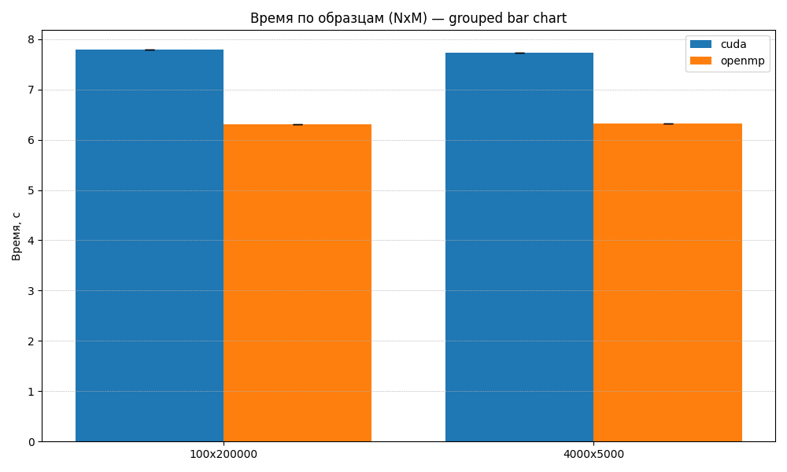
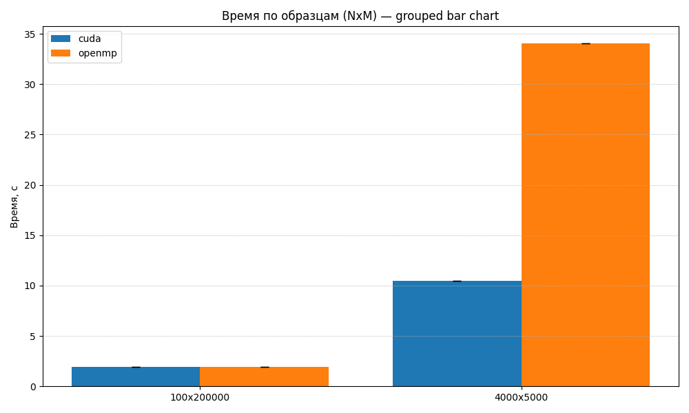

```markdown
# ОТЧЕТ
## По лабораторной работе 12: Гибридное программирование

### Сведения о студенте
**Дата:** 18.10.2025
**Семестр:** семестр 1
**Группа:** ПИН-м-о-25-1 
**Дисциплина:** Параллельные вычисления
**Студент:** Джабраилов Тимур Султанович

---

## 1. Цель работы
Освоить основы гибридного параллельного программирования, сочетающего технологию MPI для распределённых вычислений и OpenMP для многопоточности на узлах с общей памятью. Исследовать эффективность гибридного подхода на примере метода сопряжённых градиентов.

## 2. Теоретическая часть
### 2.1. Основные понятия и алгоритмы
Гибридное программирование позволяет комбинировать:
MPI — для коммуникации между узлами с распределённой памятью,
OpenMP — для параллелизма на многоядерных CPU внутри одного узла.
CUDA — для массивно-параллельных вычислений на GPU внутри узлов
Такое сочетание особенно эффективно на современных суперкомпьютерах, где каждый узел содержит
многоядерный процессор


### 2.2. Используемые функции MPI
- Get_rank
- Get_size
- Bcast
- Wtime
- Scatterv
- Scatter
- Gatherv
- Reduce
- Allgatherv
- Reduce_scatter
- Allreduce
- Split
- Create_cart
- Shift
- Sendrecv_replace

## 3. Практическая реализация
### 3.1 Простые гибридные программы
#### 3.1.1 работа с OpenMP
```python
from mpi4py import MPI
import threading
import os
import sys

def worker(thread_id, num_threads, rank, size, lock):
    with lock:
        print(f"MPI process {rank}/{size}, OpenMP thread {thread_id}/{num_threads}", flush=True)

def main():
    required = MPI.THREAD_FUNNELED

    if not MPI.Is_initialized():
        provided = MPI.Init_thread(required)
    else:
        provided = MPI.Query_thread()

    comm = MPI.COMM_WORLD
    rank = comm.Get_rank()
    size = comm.Get_size()

    try:
        num_threads = int(os.environ.get("OMP_NUM_THREADS", "4"))
    except ValueError:
        num_threads = 4

    lock = threading.Lock()
    threads = []
    for tid in range(num_threads):
        t = threading.Thread(target=worker, args=(tid, num_threads, rank, size, lock))
        t.start()
        threads.append(t)

    for t in threads:
        t.join()

    if not MPI.Is_finalized():
        MPI.Finalize()

if __name__ == "__main__":
    main()
```

Результат выполнения:
```bash
MPI process 0/1, OpenMP thread 0/4
MPI process 0/1, OpenMP thread 1/4
MPI process 0/1, OpenMP thread 2/4
MPI process 0/1, OpenMP thread 3/4
```

#### 3.1.2 работа с CUDA
```python
from mpi4py import MPI
import cupy as cp
import numpy as np
import sys

comm = MPI.COMM_WORLD
rank = comm.Get_rank()
size = comm.Get_size()

print(f"MPI process {rank}/{size} initialized", flush=True)

try:
    ngpus = cp.cuda.runtime.getDeviceCount()
except Exception:
    ngpus = 1

if ngpus <= 0:
    if rank == 0:
        print("No CUDA devices found. Exiting.", file=sys.stderr)
    sys.exit(1)

device_id = rank % ngpus
cp.cuda.Device(device_id).use()
print(f"Rank {rank} using GPU device {device_id}", flush=True)

kernel_code = r'''
extern "C" __global__ void hello_cuda(int rank, int* device_data) {
    int tid = threadIdx.x + blockIdx.x * blockDim.x;
    if (tid == 0) {
        printf("Hello from GPU, MPI rank: %d, thread %d\n", rank, tid);
        device_data[tid] = rank * 1000 + tid;
    }
}
'''

hello_kernel = cp.RawKernel(kernel_code, 'hello_cuda')

device_data = cp.zeros(1, dtype=cp.int32)

hello_kernel((1,), (1,), (np.int32(rank), device_data))

cp.cuda.Device().synchronize()

host_data = int(device_data.get()[0])

print(f"MPI rank {rank} received from GPU: {host_data}", flush=True)

gathered = comm.gather(host_data, root=0)

if rank == 0:
    print("Collected data from all GPUs:", end=" ")
    for v in gathered:
        print(v, end=" ")
    print()
```

Результат выполнения:
```
MPI process 1/4 initialized
MPI process 0/4 initialized
MPI process 3/4 initialized
MPI process 2/4 initialized
Rank 1 using GPU device 0
Rank 0 using GPU device 0
Rank 2 using GPU device 0
Rank 3 using GPU device 0
Hello from GPU, MPI rank: 1, thread 0
MPI rank 1 received from GPU: 1000
Hello from GPU, MPI rank: 0, thread 0
MPI rank 0 received from GPU: 0
Hello from GPU, MPI rank: 2, thread 0
MPI rank 2 received from GPU: 2000
Hello from GPU, MPI rank: 3, thread 0
MPI rank 3 received from GPU: 3000
Collected data from all GPUs: 0 1000 2000 3000
```

### 3.2 Умножение матрицы на вектор
#### 3.2.1 Умножение матрицы на вектор c OpenMP
```python
import time
from mpi4py import MPI
from numpy import empty , array , int32 , float64 , dot, ones

comm = MPI.COMM_WORLD
rank = comm.Get_rank()
numprocs = comm.Get_size()

prefixPath = '../data/data_A/'
inPath = prefixPath + 'in.dat'
aDataPath = prefixPath + 'AData.dat'
bDataPath = prefixPath + 'bData.dat'

start_time = time.time()

if rank == 0:
  f1 = open(inPath, 'r')
  N = array(int32(f1.readline()))
  M = array(int32(f1.readline()))
  f1.close()
else:
  N = array(0, dtype=int32)

comm.Bcast([N, 1, MPI.INT], root=0)

if rank == 0:
  ave, res = divmod(M, numprocs -1)
  rcounts = empty(numprocs , dtype=int32)
  displs = empty(numprocs , dtype=int32)
  
  rcounts[0] = 0
  displs[0] = 0
  
  for k in range(1, numprocs):
    if k <= res:
      rcounts[k] = ave+1
    else:
      rcounts[k] = ave
    displs[k] = displs[k-1] + rcounts[k-1]
else: # rank != 0
  rcounts = None
  displs = None

M_part = array(0, dtype=int32)

comm.Scatterv([rcounts, ones(numprocs, dtype=int32), array(range(numprocs)), MPI.INT], [M_part, 1, MPI.INT], root=0)

A_part = empty((M_part, N), dtype=float64)
if rank == 0:
    f2 = open(aDataPath, 'r')
    A = empty((M, N), dtype=float64)
    for j in range(M):
        for i in range(N):
            A[j, i] = float64(f2.readline())
    f2.close()
    comm.Scatterv([A, rcounts*N, displs*N, MPI.DOUBLE],
                [A_part, M_part*N, MPI.DOUBLE], root=0)
else: # rank != 0
    comm.Scatterv([None, None, None, None],
                [A_part, M_part*N, MPI.DOUBLE], root=0)

x = empty(N, dtype=float64)
if rank == 0:
    f3 = open(bDataPath, 'r')
    for i in range(N):
        x[i] = float64(f3.readline())
    f3.close()

comm.Bcast([x, N, MPI.DOUBLE], root=0)

b_part = dot(A_part, x)

if rank == 0:
  b = empty(M, dtype=float64)
else:
  b = None

comm.Gatherv([b_part, M_part, MPI.DOUBLE], [b, rcounts, displs, MPI.DOUBLE], root=0)

end_time = time.time()
elapsed = end_time - start_time

if rank == 0:
  print('N: ' + str(N))
  print('M: ' + str(M))
  print('elapsed: ' + str(elapsed))
```

#### 3.2.2 Умножение матрицы на вектор c CUDA
```python
import time
from mpi4py import MPI
import numpy as np
import cupy as cp

comm = MPI.COMM_WORLD
rank = comm.Get_rank()
numprocs = comm.Get_size()

prefixPath = '../data/data_A/'
inPath = prefixPath + 'in.dat'
aDataPath = prefixPath + 'AData.dat'
bDataPath = prefixPath + 'bData.dat'

start_time = time.time()

if rank == 0:
    f1 = open(inPath, 'r')
    N = np.array(np.int32(f1.readline()))
    M = np.array(np.int32(f1.readline()))
    f1.close()
else:
    N = np.array(0, dtype=np.int32)

comm.Bcast([N, 1, MPI.INT], root=0)

if rank == 0:
    ave, res = divmod(M, numprocs - 1)
    rcounts = np.empty(numprocs, dtype=np.int32)
    displs = np.empty(numprocs, dtype=np.int32)

    rcounts[0] = 0
    displs[0] = 0

    for k in range(1, numprocs):
        if k <= res:
            rcounts[k] = ave + 1
        else:
            rcounts[k] = ave
        displs[k] = displs[k - 1] + rcounts[k - 1]
else: 
    rcounts = None
    displs = None

M_part = np.array(0, dtype=np.int32)

comm.Scatterv([rcounts, np.ones(numprocs, dtype=np.int32), np.array(range(numprocs)), MPI.INT],
              [M_part, 1, MPI.INT], root=0)

A_part = np.empty((int(M_part), int(N)), dtype=np.float64)
if rank == 0:
    f2 = open(aDataPath, 'r')
    A = np.empty((int(M), int(N)), dtype=np.float64)
    for j in range(int(M)):
        for i in range(int(N)):
            A[j, i] = np.float64(f2.readline())
    f2.close()
    # В Scatterv указываем размеры в элементах (не в байтах) — rcounts*N и displs*N
    comm.Scatterv([A, rcounts * int(N), displs * int(N), MPI.DOUBLE],
                  [A_part, int(M_part) * int(N), MPI.DOUBLE], root=0)
else:
    comm.Scatterv([None, None, None, None],
                  [A_part, int(M_part) * int(N), MPI.DOUBLE], root=0)

x = np.empty(int(N), dtype=np.float64)
if rank == 0:
    f3 = open(bDataPath, 'r')
    for i in range(int(N)):
        x[i] = np.float64(f3.readline())
    f3.close()

comm.Bcast([x, int(N), MPI.DOUBLE], root=0)

A_part_gpu = cp.asarray(A_part)
x_gpu = cp.asarray(x)

b_part_gpu = cp.dot(A_part_gpu, x_gpu)

b_part = cp.asnumpy(b_part_gpu).astype(np.float64)

if rank == 0:
    b = np.empty(int(M), dtype=np.float64)
else:
    b = None

comm.Gatherv([b_part, int(M_part), MPI.DOUBLE], [b, rcounts, displs, MPI.DOUBLE], root=0)

end_time = time.time()
elapsed = end_time - start_time

if rank == 0:
    print('N: ' + str(int(N)))
    print('M: ' + str(int(M)))
    print('elapsed: ' + str(elapsed))
```

#### 3.2.3 Сравнение производительности умножения матрицы на вектор

Таблица длительностей 2-х версий:
|type  |N    |M     |time|
|------|-----|------|----|
|openmp| 100 |200000|6.30|
|openmp| 4000|5000  |6.33|
|cuda  | 100 |200000|7.80|
|cuda  | 4000|5000  |7.73|

График длительностей 2-х версий:



### 3.3 Решение СЛАУ
#### 3.3.1 Решение СЛАУ c OpenMP
```python
from mpi4py import MPI
from numpy import empty, array, zeros, int32, float64, arange, dot, sqrt, hstack
from matplotlib.pyplot import style, figure, axes, show

comm = MPI.COMM_WORLD
numprocs = comm.Get_size()
rank = comm.Get_rank()

prefixPath = '../data/data_B/'
inPath = prefixPath + 'in.dat'
aDataPath = prefixPath + 'AData.dat'
bDataPath = prefixPath + 'bData.dat'

num_row = num_col = int32(sqrt(numprocs))

comm_cart = comm.Create_cart(dims=(num_row, num_col), 
                             periods=(True, True), reorder=True)

rank_cart = comm_cart.Get_rank()

def conjugate_gradient_method(A_part, b_part, x_part, N_part, M_part, 
                              N, comm_cart, num_row, num_col) :
    
    neighbour_up, neighbour_down = comm_cart.Shift(direction=0, disp=1)
    neighbour_left, neighbour_right = comm_cart.Shift(direction=1, disp=1)
    
    Ax_part_temp = empty(M_part, dtype=float64)
    Ax_part_temp_recv = empty(M_part, dtype=float64)
    
    r_part_temp = empty(N_part, dtype=float64)
    r_part_temp_recv = empty(N_part, dtype=float64)
    
    ScalP_temp = empty(1, dtype=float64)
    ScalP_temp_recv = empty(1, dtype=float64)

    requests = [MPI.Request() for i in range(6)]
    
    requests[0] = comm_cart.Send_init([Ax_part_temp, M_part, MPI.DOUBLE], 
                                      dest=neighbour_right, tag=0)
    requests[1] = comm_cart.Recv_init([Ax_part_temp_recv, M_part, MPI.DOUBLE], 
                                      source=neighbour_left, tag=MPI.ANY_TAG)
    requests[2] = comm_cart.Send_init([r_part_temp, N_part, MPI.DOUBLE], 
                                      dest=neighbour_down, tag=0)
    requests[3] = comm_cart.Recv_init([r_part_temp_recv, N_part, MPI.DOUBLE], 
                                      source=neighbour_up, tag=MPI.ANY_TAG)
    requests[4] = comm_cart.Send_init([ScalP_temp, 1, MPI.DOUBLE], 
                                      dest=neighbour_right, tag=0)
    requests[5] = comm_cart.Recv_init([ScalP_temp_recv, 1, MPI.DOUBLE], 
                                      source=neighbour_left, tag=MPI.ANY_TAG)
    
    s = 1
    
    p_part = zeros(N_part, dtype=float64)

    while s <= N :

        if s == 1 :
            Ax_part_temp[:] = dot(A_part, x_part)
            Ax_part = Ax_part_temp.copy()
            for n in range(num_col-1) :
                MPI.Prequest.Startall([requests[0], requests[1]])
                MPI.Request.Waitall([requests[0], requests[1]], statuses=None)
                Ax_part_temp[:] = Ax_part_temp_recv
                Ax_part = Ax_part + Ax_part_temp
            b_part = Ax_part - b_part  
            r_part_temp[:] = dot(A_part.T, b_part)
            r_part = r_part_temp.copy()
            for m in range(num_row-1) :
                MPI.Prequest.Startall([requests[2], requests[3]])
                MPI.Request.Waitall([requests[2], requests[3]], statuses=None)
                r_part_temp[:] = r_part_temp_recv
                r_part = r_part + r_part_temp
        else :
            ScalP_temp[0] = dot(p_part, q_part)
            ScalP = ScalP_temp.copy()
            for n in range(num_col-1) :
                MPI.Prequest.Startall([requests[4], requests[5]])
                MPI.Request.Waitall([requests[4], requests[5]], statuses=None)
                ScalP_temp[0] = ScalP_temp_recv
                ScalP = ScalP + ScalP_temp
            r_part = r_part - q_part/ScalP
        
        ScalP_temp[0] = dot(r_part, r_part)
        ScalP = ScalP_temp.copy()
        for n in range(num_col-1) :
            MPI.Prequest.Startall([requests[4], requests[5]])
            MPI.Request.Waitall([requests[4], requests[5]], statuses=None)
            ScalP_temp[0] = ScalP_temp_recv
            ScalP = ScalP + ScalP_temp
        p_part = p_part + r_part/ScalP
        
        Ax_part_temp[:] = dot(A_part, p_part)
        Ap_part = Ax_part_temp.copy()
        for n in range(num_col-1) :
            MPI.Prequest.Startall([requests[0], requests[1]])
            MPI.Request.Waitall([requests[0], requests[1]], statuses=None)
            Ax_part_temp[:] = Ax_part_temp_recv
            Ap_part = Ap_part + Ax_part_temp
        r_part_temp[:] = dot(A_part.T, Ap_part)
        q_part = r_part_temp.copy()
        for m in range(num_row-1) :
            MPI.Prequest.Startall([requests[2], requests[3]])
            MPI.Request.Waitall([requests[2], requests[3]], statuses=None)
            r_part_temp[:] = r_part_temp_recv
            q_part = q_part + r_part_temp
        
        ScalP_temp[0] = dot(p_part, q_part)
        ScalP = ScalP_temp.copy()
        for n in range(num_col-1) :
            MPI.Prequest.Startall([requests[4], requests[5]])
            MPI.Request.Waitall([requests[4], requests[5]], statuses=None)
            ScalP_temp[0] = ScalP_temp_recv
            ScalP = ScalP + ScalP_temp
        x_part = x_part - p_part/ScalP
        
        s = s + 1
        
    for i in range(len(requests)) :   
        MPI.Request.Free(requests[i])
    
    return x_part

if rank_cart == 0 :
    f1 = open(inPath, 'r')
    N = array(int32(f1.readline()))
    M = array(int32(f1.readline()))
    f1.close()
else :
    N = array(0, dtype=int32)

comm_cart.Bcast([N, 1, MPI.INT], root=0)

def auxiliary_arrays_determination(M, num) : 
    ave, res = divmod(M, num)
    rcounts = empty(num, dtype=int32)
    displs = empty(num, dtype=int32)
    for k in range(0, num) : 
        if k < res :
            rcounts[k] = ave + 1
        else :
            rcounts[k] = ave
        if k == 0 :
            displs[k] = 0
        else :
            displs[k] = displs[k-1] + rcounts[k-1]   
    return rcounts, displs

if rank_cart == 0 :
    rcounts_M, displs_M = auxiliary_arrays_determination(M, num_row)
    rcounts_N, displs_N = auxiliary_arrays_determination(N, num_col)
else :
    rcounts_M = None; displs_M = None
    rcounts_N = None; displs_N = None

M_part = array(0, dtype=int32); N_part = array(0, dtype=int32)

comm_col = comm_cart.Split(rank_cart % num_col, rank_cart)
comm_row = comm_cart.Split(rank_cart // num_col, rank_cart)

if rank_cart in range(num_col) :
    comm_row.Scatter([rcounts_N, 1, MPI.INT], 
                     [N_part, 1, MPI.INT], root=0) 
if rank_cart in range(0, numprocs, num_col) :
    comm_col.Scatter([rcounts_M, 1, MPI.INT], 
                     [M_part, 1, MPI.INT], root=0) 

comm_col.Bcast([N_part, 1, MPI.INT], root=0)
comm_row.Bcast([M_part, 1, MPI.INT], root=0)  

A_part = empty((M_part, N_part), dtype=float64)

group = comm_cart.Get_group()

if rank_cart == 0 :
    f2 = open(aDataPath, 'r')
    for m in range(num_row) :
        a_temp = empty(rcounts_M[m]*N, dtype=float64)
        for j in range(rcounts_M[m]) :
            for n in range(num_col) :
                for i in range(rcounts_N[n]) :
                    a_temp[rcounts_M[m]*displs_N[n] + j*rcounts_N[n] + i] = float64(f2.readline())
        if m == 0 :
            comm_row.Scatterv([a_temp, rcounts_M[m]*rcounts_N, rcounts_M[m]*displs_N, MPI.DOUBLE], 
                              [A_part, M_part*N_part, MPI.DOUBLE], root=0)
        else :
            group_temp = group.Range_incl([(0,0,1), (m*num_col,(m+1)*num_col-1,1)]) 
            comm_temp = comm_cart.Create(group_temp)
            rcounts_N_temp = hstack((array(0, dtype=int32), rcounts_N))
            displs_N_temp = hstack((array(0, dtype=int32), displs_N))
            comm_temp.Scatterv([a_temp, rcounts_M[m]*rcounts_N_temp, rcounts_M[m]*displs_N_temp, MPI.DOUBLE], 
                               [empty(0, dtype=float64), 0, MPI.DOUBLE], root=0)
            group_temp.Free(); comm_temp.Free()
    f2.close()
else :
    if rank_cart in range(num_col) :
        comm_row.Scatterv([None, None, None, None], 
                          [A_part, M_part*N_part, MPI.DOUBLE], root=0)
    for m in range(1, num_row) :
        group_temp = group.Range_incl([(0,0,1), (m*num_col,(m+1)*num_col-1,1)])
        comm_temp = comm_cart.Create(group_temp)
        if rank_cart in range(m*num_col, (m+1)*num_col) :
            comm_temp.Scatterv([None, None, None, None], 
                               [A_part, M_part*N_part, MPI.DOUBLE], root=0)
            comm_temp.Free()
        group_temp.Free()
    
if rank_cart == 0 :
    b = empty(M, dtype=float64)
    f3 = open(bDataPath, 'r')
    for j in range(M) :
        b[j] = float64(f3.readline())
    f3.close()
else :
    b = None
    
b_part = empty(M_part, dtype=float64) 
 	
if rank_cart in range(0, numprocs, num_col) :    
    comm_col.Scatterv([b, rcounts_M, displs_M, MPI.DOUBLE], 
                      [b_part, M_part, MPI.DOUBLE], root=0)
    
comm_row.Bcast([b_part, M_part, MPI.DOUBLE], root=0)

if rank_cart == 0 :
    x = zeros(N, dtype=float64)
else :
    x = None
    
x_part = empty(N_part, dtype=float64)

if rank_cart in range(num_col) :
    comm_row.Scatterv([x, rcounts_N, displs_N, MPI.DOUBLE], 
                      [x_part, N_part, MPI.DOUBLE], root=0)
    
comm_col.Bcast([x_part, N_part, MPI.DOUBLE], root=0)

if rank_cart == 0 :
    start_time = MPI.Wtime()

x_part = conjugate_gradient_method(A_part, b_part, x_part, N_part, M_part, 
                                   N, comm_cart, num_row, num_col)

if rank_cart == 0 :
    end_time = MPI.Wtime()
    
if rank_cart == 0 :
    print('N={}, M={}'.format(N,M))
    print('Number of MPI process is {}'.format(numprocs))
    print('Elapsed time is {:.4f} sec.'.format(end_time-start_time))

if rank_cart in range(num_col) :
    comm_row.Gatherv([x_part, N_part, MPI.DOUBLE], 
                     [x, rcounts_N, displs_N, MPI.DOUBLE], root=0)

# if rank_cart == 0 :
#     style.use('dark_background')
#     fig = figure()
#     ax = axes(xlim=(0, N), ylim=(-1.5, 1.5))
#     ax.set_xlabel('i'); ax.set_ylabel('x[i]')
#     ax.plot(arange(N), x, '-y', lw=3)
#     show()
```

#### 3.3.2 Решение СЛАУ c CUDA
```python
from mpi4py import MPI
import cupy as cp
from numpy import empty, array, zeros, int32, float64, arange, dot, sqrt, hstack
from matplotlib.pyplot import style, figure, axes, show

comm = MPI.COMM_WORLD
numprocs = comm.Get_size()
rank = comm.Get_rank()

prefixPath = '../data/data_B/'
inPath = prefixPath + 'in.dat'
aDataPath = prefixPath + 'AData.dat'
bDataPath = prefixPath + 'bData.dat'

num_row = num_col = int32(sqrt(numprocs))

comm_cart = comm.Create_cart(dims=(num_row, num_col), 
                             periods=(True, True), reorder=True)

rank_cart = comm_cart.Get_rank()

def conjugate_gradient_method(A_part, b_part, x_part, N_part, M_part, 
                              N, comm_cart, num_row, num_col) :
    
    A_part_d = cp.asarray(A_part)
    
    neighbour_up, neighbour_down = comm_cart.Shift(direction=0, disp=1)
    neighbour_left, neighbour_right = comm_cart.Shift(direction=1, disp=1)
    
    Ax_part_temp = empty(M_part, dtype=float64)
    Ax_part_temp_recv = empty(M_part, dtype=float64)
    
    r_part_temp = empty(N_part, dtype=float64)
    r_part_temp_recv = empty(N_part, dtype=float64)
    
    ScalP_temp = empty(1, dtype=float64)
    ScalP_temp_recv = empty(1, dtype=float64)

    requests = [MPI.Request() for i in range(6)]
    
    requests[0] = comm_cart.Send_init([Ax_part_temp, M_part, MPI.DOUBLE], 
                                      dest=neighbour_right, tag=0)
    requests[1] = comm_cart.Recv_init([Ax_part_temp_recv, M_part, MPI.DOUBLE], 
                                      source=neighbour_left, tag=MPI.ANY_TAG)
    requests[2] = comm_cart.Send_init([r_part_temp, N_part, MPI.DOUBLE], 
                                      dest=neighbour_down, tag=0)
    requests[3] = comm_cart.Recv_init([r_part_temp_recv, N_part, MPI.DOUBLE], 
                                      source=neighbour_up, tag=MPI.ANY_TAG)
    requests[4] = comm_cart.Send_init([ScalP_temp, 1, MPI.DOUBLE], 
                                      dest=neighbour_right, tag=0)
    requests[5] = comm_cart.Recv_init([ScalP_temp_recv, 1, MPI.DOUBLE], 
                                      source=neighbour_left, tag=MPI.ANY_TAG)
    
    s = 1
    
    p_part = zeros(N_part, dtype=float64)

    while s <= N :

        if s == 1 :
            x_part_d = cp.asarray(x_part)
            Ax_part_temp[:] = cp.dot(A_part_d, x_part_d).get()
            Ax_part = Ax_part_temp.copy()
            for n in range(num_col-1) :
                MPI.Prequest.Startall([requests[0], requests[1]])
                MPI.Request.Waitall([requests[0], requests[1]], statuses=None)
                Ax_part_temp[:] = Ax_part_temp_recv
                Ax_part = Ax_part + Ax_part_temp
            b_part = Ax_part - b_part 
            b_part_d = cp.asarray(b_part)
            r_part_temp[:] = cp.dot(A_part_d.T, b_part_d).get()
            r_part = r_part_temp.copy()
            for m in range(num_row-1) :
                MPI.Prequest.Startall([requests[2], requests[3]])
                MPI.Request.Waitall([requests[2], requests[3]], statuses=None)
                r_part_temp[:] = r_part_temp_recv
                r_part = r_part + r_part_temp
        else :
            ScalP_temp[0] = dot(p_part, q_part)
            ScalP = ScalP_temp.copy()
            for n in range(num_col-1) :
                MPI.Prequest.Startall([requests[4], requests[5]])
                MPI.Request.Waitall([requests[4], requests[5]], statuses=None)
                ScalP_temp[0] = ScalP_temp_recv
                ScalP = ScalP + ScalP_temp
            r_part = r_part - q_part/ScalP
        
        ScalP_temp[0] = dot(r_part, r_part)
        ScalP = ScalP_temp.copy()
        for n in range(num_col-1) :
            MPI.Prequest.Startall([requests[4], requests[5]])
            MPI.Request.Waitall([requests[4], requests[5]], statuses=None)
            ScalP_temp[0] = ScalP_temp_recv
            ScalP = ScalP + ScalP_temp
        p_part = p_part + r_part/ScalP
        
        p_part_d = cp.asarray(p_part)
        Ax_part_temp[:] = cp.dot(A_part_d, p_part_d).get()
        Ap_part = Ax_part_temp.copy()
        for n in range(num_col-1) :
            MPI.Prequest.Startall([requests[0], requests[1]])
            MPI.Request.Waitall([requests[0], requests[1]], statuses=None)
            Ax_part_temp[:] = Ax_part_temp_recv
            Ap_part = Ap_part + Ax_part_temp
        Ap_part_d = cp.asarray(Ap_part)
        r_part_temp[:] = cp.dot(A_part_d.T, Ap_part_d).get()
        q_part = r_part_temp.copy()
        for m in range(num_row-1) :
            MPI.Prequest.Startall([requests[2], requests[3]])
            MPI.Request.Waitall([requests[2], requests[3]], statuses=None)
            r_part_temp[:] = r_part_temp_recv
            q_part = q_part + r_part_temp
        
        ScalP_temp[0] = dot(p_part, q_part)
        ScalP = ScalP_temp.copy()
        for n in range(num_col-1) :
            MPI.Prequest.Startall([requests[4], requests[5]])
            MPI.Request.Waitall([requests[4], requests[5]], statuses=None)
            ScalP_temp[0] = ScalP_temp_recv
            ScalP = ScalP + ScalP_temp
        x_part = x_part - p_part/ScalP
        
        s = s + 1
        
    for i in range(len(requests)) :   
        MPI.Request.Free(requests[i])
    
    return x_part

if rank_cart == 0 :
    f1 = open(inPath, 'r')
    N = array(int32(f1.readline()))
    M = array(int32(f1.readline()))
    f1.close()
else :
    N = array(0, dtype=int32)

comm_cart.Bcast([N, 1, MPI.INT], root=0)

def auxiliary_arrays_determination(M, num) : 
    ave, res = divmod(M, num)
    rcounts = empty(num, dtype=int32)
    displs = empty(num, dtype=int32)
    for k in range(0, num) : 
        if k < res :
            rcounts[k] = ave + 1
        else :
            rcounts[k] = ave
        if k == 0 :
            displs[k] = 0
        else :
            displs[k] = displs[k-1] + rcounts[k-1]   
    return rcounts, displs

if rank_cart == 0 :
    rcounts_M, displs_M = auxiliary_arrays_determination(M, num_row)
    rcounts_N, displs_N = auxiliary_arrays_determination(N, num_col)
else :
    rcounts_M = None; displs_M = None
    rcounts_N = None; displs_N = None

M_part = array(0, dtype=int32); N_part = array(0, dtype=int32)

comm_col = comm_cart.Split(rank_cart % num_col, rank_cart)
comm_row = comm_cart.Split(rank_cart // num_col, rank_cart)

if rank_cart in range(num_col) :
    comm_row.Scatter([rcounts_N, 1, MPI.INT], 
                     [N_part, 1, MPI.INT], root=0) 
if rank_cart in range(0, numprocs, num_col) :
    comm_col.Scatter([rcounts_M, 1, MPI.INT], 
                     [M_part, 1, MPI.INT], root=0) 

comm_col.Bcast([N_part, 1, MPI.INT], root=0)
comm_row.Bcast([M_part, 1, MPI.INT], root=0)  

A_part = empty((M_part, N_part), dtype=float64)

group = comm_cart.Get_group()

if rank_cart == 0 :
    f2 = open(aDataPath, 'r')
    for m in range(num_row) :
        a_temp = empty(rcounts_M[m]*N, dtype=float64)
        for j in range(rcounts_M[m]) :
            for n in range(num_col) :
                for i in range(rcounts_N[n]) :
                    a_temp[rcounts_M[m]*displs_N[n] + j*rcounts_N[n] + i] = float64(f2.readline())
        if m == 0 :
            comm_row.Scatterv([a_temp, rcounts_M[m]*rcounts_N, rcounts_M[m]*displs_N, MPI.DOUBLE], 
                              [A_part, M_part*N_part, MPI.DOUBLE], root=0)
        else :
            group_temp = group.Range_incl([(0,0,1), (m*num_col,(m+1)*num_col-1,1)]) 
            comm_temp = comm_cart.Create(group_temp)
            rcounts_N_temp = hstack((array(0, dtype=int32), rcounts_N))
            displs_N_temp = hstack((array(0, dtype=int32), displs_N))
            comm_temp.Scatterv([a_temp, rcounts_M[m]*rcounts_N_temp, rcounts_M[m]*displs_N_temp, MPI.DOUBLE], 
                               [empty(0, dtype=float64), 0, MPI.DOUBLE], root=0)
            group_temp.Free(); comm_temp.Free()
    f2.close()
else :
    if rank_cart in range(num_col) :
        comm_row.Scatterv([None, None, None, None], 
                          [A_part, M_part*N_part, MPI.DOUBLE], root=0)
    for m in range(1, num_row) :
        group_temp = group.Range_incl([(0,0,1), (m*num_col,(m+1)*num_col-1,1)])
        comm_temp = comm_cart.Create(group_temp)
        if rank_cart in range(m*num_col, (m+1)*num_col) :
            comm_temp.Scatterv([None, None, None, None], 
                               [A_part, M_part*N_part, MPI.DOUBLE], root=0)
            comm_temp.Free()
        group_temp.Free()
    
if rank_cart == 0 :
    b = empty(M, dtype=float64)
    f3 = open(bDataPath, 'r')
    for j in range(M) :
        b[j] = float64(f3.readline())
    f3.close()
else :
    b = None
    
b_part = empty(M_part, dtype=float64) 
 	
if rank_cart in range(0, numprocs, num_col) :    
    comm_col.Scatterv([b, rcounts_M, displs_M, MPI.DOUBLE], 
                      [b_part, M_part, MPI.DOUBLE], root=0)
    
comm_row.Bcast([b_part, M_part, MPI.DOUBLE], root=0)

if rank_cart == 0 :
    x = zeros(N, dtype=float64)
else :
    x = None
    
x_part = empty(N_part, dtype=float64)

if rank_cart in range(num_col) :
    comm_row.Scatterv([x, rcounts_N, displs_N, MPI.DOUBLE], 
                      [x_part, N_part, MPI.DOUBLE], root=0)
    
comm_col.Bcast([x_part, N_part, MPI.DOUBLE], root=0)

if rank_cart == 0 :
    start_time = MPI.Wtime()

x_part = conjugate_gradient_method(A_part, b_part, x_part, N_part, M_part, 
                                   N, comm_cart, num_row, num_col)

if rank_cart == 0 :
    end_time = MPI.Wtime()
    
if rank_cart == 0 :
    print('N={}, M={}'.format(N,M))
    print('Number of MPI process (+CUDA) is {}'.format(numprocs))
    print('Elapsed time is {:.4f} sec.'.format(end_time-start_time))

if rank_cart in range(num_col) :
    comm_row.Gatherv([x_part, N_part, MPI.DOUBLE], 
                     [x, rcounts_N, displs_N, MPI.DOUBLE], root=0)

# if rank_cart == 0 :
#     style.use('dark_background')
#     fig = figure()
#     ax = axes(xlim=(0, N), ylim=(-1.5, 1.5))
#     ax.set_xlabel('i'); ax.set_ylabel('x[i]')
#     ax.plot(arange(N), x, '-y', lw=3)
#     show()
```

#### 3.3.3 Сравнение производительности решения СЛАУ

Таблица длительностей 2-х версий:
|type  |N    |M     |time|
|------|-----|------|----|
|openmp|100  |200000|1.9 |
|openmp|4000 |5000  |34.08|
|cuda  |100  |200000|1.95|
|cuda  |4000 |5000  |10.44|


График длительностей 2-х версий:


## 7. Ответы на контрольные вопросы
1. **Почему гибридное программирование (MPI+OpenMP) полезно?**
   Позволяет уменьшить количество MPI-процессов, использовать многопоточность внутри узла и лучше задействовать многоядерные CPU; удобнее балансировать работу между вычислениями и коммуникацией. 

2. **Какие сложности возникают при смешивании MPI и OpenMP?**
   Нужна поддержка `MPI_Init_thread` с уровнем `MPI_THREAD_MULTIPLE`/`FUNNELED`, проблемы с нитевой безопасностью библиотек, выбор числа потоков на процесс и предотвращение конкуренции за кэш/память. 

3. **Как выбирать топологию процессов и потоков на узле?**
   Часто: 1 MPI-процесс на узел + несколько OpenMP-потоков; выбор зависит от NUMA, кэшей и задачи - профилируйте и пробуйте варианты. 

4. **Что нужно учесть при использовании MPI + CUDA (GPU)?**
   Управление передачами host - device (пиннинг памяти), асинхронные копирования + стримы для перекрытия, минимизация host - host коммуницы между узлами (передавайте данные GPU - GPU через GPUDirect если поддерживается). 

5. **Какие преимущества даёт размещение данных прямо на GPU?**
   Уменьшается overhead копирований; можно выполнять большие вычисления локально и передавать только сокращённые данные по сети - выигрыш в пропускной способности и латентности. 

6. **Как профилировать гибридные приложения?**
   Используйте инструменты: MPI-профайлеры (mpiP, IntelTrace, TAU), OpenMP профайлеры, CUDA-профайлеры (nsight). Ищите время ожидания MPI, загрузку CPU/GPU, балансы работы.

7. **Какие общие ошибки при гибриде стоит избегать?**
   Создание слишком большого числа MPI-рангов на узле, забытые barriers в OpenMP, гонки при доступе к общим данным, частые синхронизации GPU - CPU.

8. **Когда лучше использовать MPI+CUDA, а когда — MPI+OpenMP?**
   MPI+CUDA - при наличии мощных GPU и задач с большим числом параллельных операций на элемент; MPI+OpenMP - при CPU-ориентированных задачах и когда GPU недоступны. Часто комбинируют все три (MPI+OpenMP+CUDA) на крупных системах. 

9. **Как минимизировать коммуникации в гибридной версии?**
   Уменьшить число MPI-рангов (на узел), агрегировать сообщения, выполнять редукции локально потоками/на GPU прежде чем отправлять по сети. Использовать топо-aware mapping и GPUDirect-RDMA при поддержке.

10. **Рекомендации по постепенному переходу к гибридной реализации**
    Сначала профилировать и найти узкие места; затем параллелить внутри узла (OpenMP) или портировать горячие ядра на GPU; тестировать корректность и масштабируемость на каждом шаге.


## 8. Заключение
### 8.1. Выводы
В ходе данной лабораторной работы были получены навыки работы с CUDA и OpenMP в комбинации с MPI, для того, чтобы уменьшить накладные раскходы при коммуникации между процессами.

### 9.2. Используемые библиотеки и версии
- Python 3.8+
- mpi4py 3.1.+
- NumPy 1.21.+
- OpenMPI 4.1.+

### 9.3. Рекомендуемая литература
---

*Отчет подготовлен в рамках курса "Параллельные вычисления"*
```