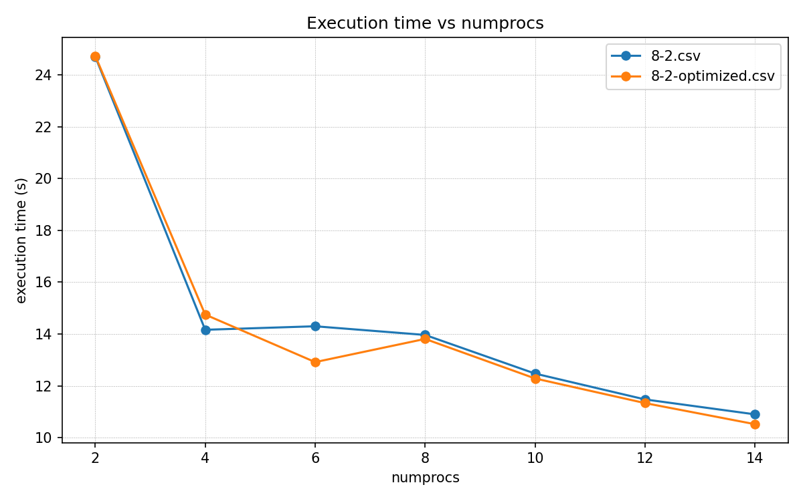
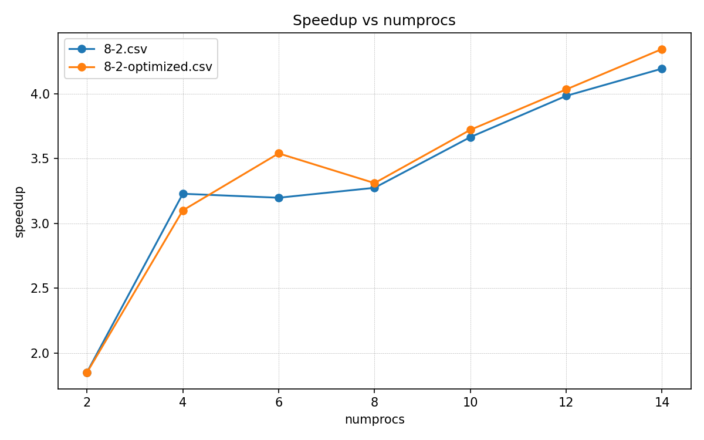
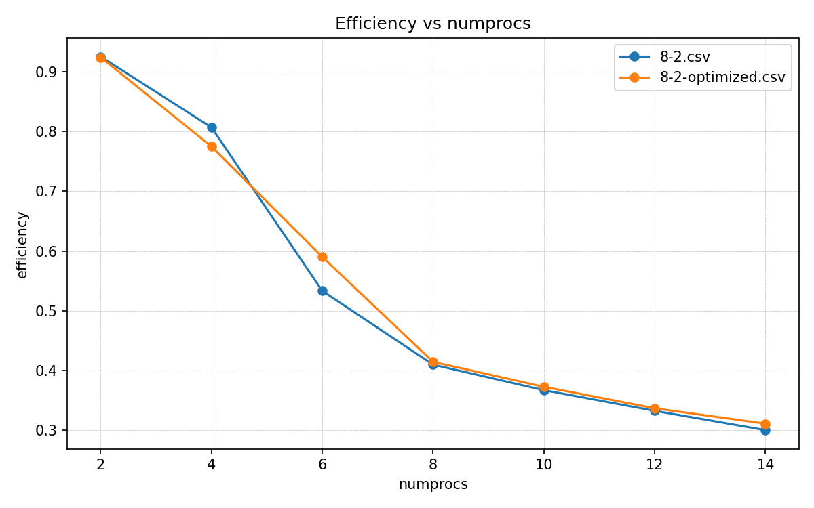

# ОТЧЕТ
## По лабораторной работе №X: [Название лабораторной работы]

### Сведения о студенте
**Дата:** 20.10.2025
**Семестр:** Семестр 1
**Группа:** ПИН-б-о-21-1
**Дисциплина:** Параллельные вычисления
**Студент:** Джабраилов Тимур Султанович

---

## 1. Цель работы
Научиться проводить профилирование параллельных программ, выявлять «узкие места» (bottlenecks) и применять изученные методы оптимизации для повышения эффективности и масштабируемости.

## 2. Теоретическая часть
### 2.1. Основные понятия и алгоритмы
На основе лекции 13 выделены ключевые причины плохой масштабируемости:
1. Неэффективные коммуникации:
Поэлементная пересылка вместо блочной.
Последовательный обмен вместо одновременного.
Дедлоки и неоптимальные паттерны обмена.
2. Несоответствие программной и физической топологии.
3. Неоптимальное разделение вычислений и коммуникаций.
4. Высокие накладные расходы при работе с GPU.
5. Использование сетевых коммуникаций внутри узла вместо общей памяти.

## 3. Практическая реализация
### 3.1 Результат профилирования, выявление узкого места
```
200047 function calls in 0.013 seconds

   Ordered by: internal time

   ncalls  tottime  percall  cumtime  percall filename:lineno(function)
   200000    0.011    0.000    0.011    0.000 C:\Users\botak\Desktop\ncfu\ьрушёЄЁрЄєЁр\ёхьхёЄЁ 1\ярЁрыыхы№э√х т√ўшёыхэш \ъюф\lr13\src\Example-8-2.py:23(u_right)
        2    0.001    0.000    0.001    0.000 {built-in method numpy.arange}
        2    0.001    0.000    0.001    0.001 C:\Python311\Lib\site-packages\numpy\_core\function_base.py:25(linspace)
       15    0.000    0.000    0.000    0.000 C:\Users\botak\Desktop\ncfu\ьрушёЄЁрЄєЁр\ёхьхёЄЁ 1\ярЁрыыхы№э√х т√ўшёыхэш \ъюф\lr13\src\Example-8-2.py:15(u_init)
        1    0.000    0.000    0.000    0.000 {built-in method numpy.empty}
        2    0.000    0.000    0.000    0.000 {method 'reshape' of 'numpy.ndarray' objects}
        3    0.000    0.000    0.000    0.000 {built-in method numpy.array}
        1    0.000    0.000    0.000    0.000 C:\Python311\Lib\cProfile.py:118(__exit__)
        2    0.000    0.000    0.000    0.000 C:\Python311\Lib\site-packages\numpy\_core\numeric.py:1937(isscalar)
        2    0.000    0.000    0.000    0.000 C:\Python311\Lib\site-packages\numpy\_core\fromnumeric.py:3571(ndim)
        2    0.000    0.000    0.000    0.000 {method 'astype' of 'numpy.ndarray' objects}
        2    0.000    0.000    0.000    0.000 C:\Python311\Lib\site-packages\numpy\_core\function_base.py:20(_linspace_dispatcher)
        2    0.000    0.000    0.000    0.000 {method 'wrap' of 'numpy._core._multiarray_umath._array_converter' objects}
        2    0.000    0.000    0.000    0.000 C:\Python311\Lib\site-packages\numpy\_core\fromnumeric.py:3567(_ndim_dispatcher)
        2    0.000    0.000    0.000    0.000 {method 'result_type' of 'numpy._core._multiarray_umath._array_converter' objects}
        2    0.000    0.000    0.000    0.000 {method 'as_arrays' of 'numpy._core._multiarray_umath._array_converter' objects}
        2    0.000    0.000    0.000    0.000 {built-in method _operator.index}
        2    0.000    0.000    0.000    0.000 {built-in method builtins.isinstance}
        1    0.000    0.000    0.000    0.000 {method 'disable' of '_lsprof.Profiler' objects}
```

По результату профилирования можно понять, что основная часть времени была потрачена на ожидания расчётов от C кода. и некоторые функции вызывались очень много раз.
Узкими местами в программе является кольцевое ожидание процессов в строках 96-114. Помимо этого были выполнены следующеие оптимизации:
* Убрана глобальная матрица `u_part_aux` размера `(M+1) x N_part` — вместо неё только два вектора (текущий и следующий уровень). Резкое уменьшение памяти.
* Векторизация пространственной схемы: внутренний цикл заменён на NumPy-срезы — меньше Python-итераций, быстрее вычисления.
* Упрощена и сокращена MPI-коммуникация: вместо множества `Sendrecv` — целевые неблокирующие `Isend`/`Irecv` + `Waitall`, меньше накладных расходов в Python.
* Убрана ненужная глобальная временная сетка `t` — граничные значения считаются «на ходу».
* Сохранена оригинальная разметка данных (rcounts/displs) и порядок обмена/сборки, чтобы поведение и результаты остались такими же.
* Мелкие упрощения кода и предвычисление коэффициентов (`alpha`, `beta`, `gamma`) для читабельности и небольшого ускорения.

### 3.2 Замеры до и после оптимизации
#### 3.2.1 Таблица 1. Замеры производительности ДО оптимизации
|numprocs|N   |N      |time               |speedup            |efficiency          |
|--------|----|-------|-------------------|-------------------|--------------------|
|2       | 200| 200000| 24.700616499991156| 1.8517756429284418| 0.9258878214642209 |
|4       | 200| 200000| 14.166308099986054| 3.228787604869686 | 0.8071969012174215 |
|6       | 200| 200000| 14.301905900007114| 3.1981751467108483| 0.5330291911184747 |
|8       | 200| 200000| 13.96742069994798 | 3.2747635359884564| 0.40934544199855705|
|10      | 200| 200000| 12.477273900003638| 3.665864864919465 | 0.3665864864919465 |
|12      | 200| 200000| 11.480868799961172| 3.9840190491641794| 0.3320015874303483 |
|14      | 200| 200000| 10.905588499968871| 4.194179892275466 | 0.29958427801967613|


#### 3.2.2 Таблица 2. Замеры производительности ПОСЛЕ оптимизации
|numprocs|N   |N      |time               |speedup            |efficiency          |
|--------|----|-------|-------------------|-------------------|--------------------|
|2       | 200| 200000| 24.72976600000402 | 1.8495929156787236| 0.9247964578393618 |
|4       | 200| 200000| 14.752591800002847| 3.1004721489000446| 0.7751180372250112 |
|6       | 200| 200000| 12.919907799980137| 3.540272942200897 | 0.5900454903668162 |
|8       | 200| 200000| 13.813721099984832| 3.3112004845711143| 0.4139000605713893 |
|10      | 200| 200000| 12.677854500012472| 3.6078659839450755| 0.36078659839450755|
|12      | 200| 200000| 11.598276400007308| 3.943689426126384 | 0.328640785510532  |
|14      | 200| 200000| 10.759321200021077| 4.2511975569527936| 0.303656968353771  |


### 3.3 Графики времени работы
#### 3.3.1 Время работы ДО и ПОСЛЕ оптимизации


### 3.4 Графики усокрения
### 3.4.1 Ускорение ДО и ПОСЛЕ оптимизации


### 3.5 Графики эффективности
### 3.5.1 Эффективность ДО и ПОСЛЕ оптимизации


### 6.1 Анализ результатов
В результате оптимизации на локальном оборудовании разница между обычной и оптимизированной программой незначительная, однако оптимизированная программа показывает повышенную эффективность при большем кол-ве процессов, засчёт устранения ожиданий во время кольцевой передачи данных.

## 7. Ответы на контрольные вопросы
1. **Сформулируйте закон Амдала и его значение при анализе.**
   Закон Амдала: $$S(p) = \frac{1}{(1-f) + f/p}$$, где (f) - доля параллелизуемой работы. Он показывает, что ускорение ограничено последовательной долей. Для оценки предела ускорения важен маленький (1-f). 

2. **Чем отличается сильная от слабой масштабируемости?**
   Сильная: фиксированный объём задачи, растёт число процессоров (интересно, как падает время). Слабая: нагрузка на процесс остаётся фиксированной, растёт число процессов вместе с размером задачи (интересно поддержание времени). 

3. **Какие метрики обычно собирают при профилировании MPI-программы?**
   Время вычислений, время коммуникаций, количество сообщений, длина ожиданий (idle), скорость передачи данных, нагрузочный баланс, использование CPU/GPU, сетевые метрики. 

4. **Какие инструменты профилирования рекомендованы?**
   mpiP, Intel VTune, TAU, Scalasca, Score-P, nvprof / nsight (для CUDA). Они помогают найти горячие участки и коммуникационные узкие места. 

5. **Как выявить "узкие места" коммуникаций?**
   Смотрите время, проводимое в MPI-вызовах (особенно `Wait`), профили по функции и по процессу; высокая дисперсия времен между процессами указывает на дисбаланс или ожидание. 

6. **Какие стратегии оптимизации коммуникаций существуют?**
   Агрегация сообщений, уменьшение частоты коллективов, перекрытие коммуникаций/вычислений, использование эффективных коллективов или альтернатив (последовательные `Sendrecv_replace`), подбор топологии и reorder.

7. **Как оценивать справедливость результатов эксперимента (репрезентативность)?**
   Повторять запуски, указывать аппаратную конфигурацию и версии ПО, прогрев кэшей, проводить статистику (среднее/дисперсия), измерять при разных размерах задач и процессоров. 

8. **Как использовать профилирование для выбора оптимального числа процессов?**
   Сравнивать ускорение/эффективность и искать плато, где дальнейшее увеличение процессов даёт незначительный выигрышь; учитывать накладные расходы на коммуникации и накладные на параллельизм. 

9. **Какие системные факторы могут скрыто влиять на результаты?**
   Миграция процессов между узлами, шум соседних пользователей, планировщик кластера, NUMA-политики и throttling CPU/GPU. Всё это надо учитывать при интерпретации данных. 

10. **Короткий чек-лист оптимизации (практические шаги)**
1) профилировать и найти hotspot;
2) минимизировать синхронизации;
3) агрегировать/перепроектировать коммуникации;
4) перекрывать коммуникации вычислениями;
5) подобрать разбиение/топологию;
6) при необходимости портировать горячие участки на GPU/векторные библиотеки.


## 8. Заключение
### 8.1. Выводы
В ходе данной лаборатоной работы были получены навыки профилирования и оптимизации параллельных программ. Были выявлено и устраненов узкое горлышко и масштабируемость программы была повышена.

## 9. Приложения
### 9.1. Исходный код
До оптимизации:
```python
from mpi4py import MPI
from numpy import empty, array, int32, float64, linspace, sin, pi
from matplotlib.pyplot import style, figure, axes, show

comm = MPI.COMM_WORLD
numprocs = comm.Get_size()
rank = comm.Get_rank()

comm_cart = comm.Create_cart(dims=[numprocs], periods=[False], reorder=True)
rank_cart = comm_cart.Get_rank()

def u_init(x) :
    u_init = sin(3*pi*(x - 1/6))
    return u_init

def u_left(t) :
    u_left = -1.
    return u_left

def u_right(t) :
    u_right = 1.
    return u_right

if rank_cart == 0 :
    start_time = MPI.Wtime()

a = 0.; b = 1.
t_0 = 0.; T = 6.0
eps = 10**(-1.5)

N = 200; M = 200000

h = (b - a)/N; x = linspace(a, b, N+1)
tau = (T - t_0)/M; t = linspace(t_0, T, M+1)

if rank_cart == 0 :
    ave, res = divmod(N + 1, numprocs)
    rcounts = empty(numprocs, dtype=int32)
    displs = empty(numprocs, dtype=int32)
    for k in range(0, numprocs) : 
        if k < res :
            rcounts[k] = ave + 1
        else :
            rcounts[k] = ave
        if k == 0 :
            displs[k] = 0
        else :
            displs[k] = displs[k-1] + rcounts[k-1]   
else :
    rcounts = None; displs = None
    
N_part = array(0, dtype=int32)

comm_cart.Scatter([rcounts, 1, MPI.INT], [N_part, 1, MPI.INT], root=0) 

if rank_cart == 0 :
    rcounts_from_0 = empty(numprocs, dtype=int32)
    displs_from_0 = empty(numprocs, dtype=int32)
    rcounts_from_0[0] = rcounts[0] + 1
    displs_from_0[0] = 0
    for k in range(1, numprocs-1) :
        rcounts_from_0[k] = rcounts[k] + 2
        displs_from_0[k] = displs[k] - 1
    rcounts_from_0[numprocs-1] = rcounts[numprocs-1] + 1  
    displs_from_0[numprocs-1] = displs[numprocs-1] - 1
else :
    rcounts_from_0 = None; displs_from_0 = None
    
N_part_aux = array(0, dtype=int32); displ_aux = array(0, dtype=int32)
    
comm_cart.Scatter([rcounts_from_0, 1, MPI.INT], [N_part_aux, 1, MPI.INT], root=0) 
comm_cart.Scatter([displs_from_0, 1, MPI.INT], [displ_aux, 1, MPI.INT], root=0) 
        
u_part_aux = empty((M + 1, N_part_aux), dtype=float64)

for n in range(N_part_aux) :
    u_part_aux[0, n] = u_init(x[displ_aux + n])   
if rank_cart == 0 :
    for m in range(1, M + 1) :
        u_part_aux[m, 0] = u_left(t[m])  
if rank_cart == numprocs-1 :
    for m in range(1, M + 1) :
        u_part_aux[m, N_part_aux - 1] = u_right(t[m])
    
for m in range(M) :
    
    for n in range(1, N_part_aux - 1) :
        u_part_aux[m + 1, n] = u_part_aux[m, n] + \
            eps*tau/h**2*(u_part_aux[m, n+1] - 2*u_part_aux[m, n] + u_part_aux[m, n-1]) + \
                tau/(2*h)*u_part_aux[m, n]*(u_part_aux[m, n+1] - u_part_aux[m, n-1]) + \
                    tau*u_part_aux[m, n]**3
                
    if rank_cart == 0 :
        comm_cart.Sendrecv(sendbuf=[u_part_aux[m+1, N_part_aux-2], 1, MPI.DOUBLE], 
                           dest=1, sendtag=0, 
                           recvbuf=[u_part_aux[m+1, N_part_aux-1:], 1, MPI.DOUBLE], 
                           source=1, recvtag=MPI.ANY_TAG, status=None)
    if rank_cart in range(1, numprocs-1) :
        sendbuf1 = [u_part_aux[m+1, 1], 1, MPI.DOUBLE]
        recvbuf1 = [u_part_aux[m+1, 0:], 1, MPI.DOUBLE]
        sendbuf2 = [u_part_aux[m+1, N_part_aux-2], 1, MPI.DOUBLE]
        recvbuf2 = [u_part_aux[m+1, N_part_aux-1:], 1, MPI.DOUBLE]
        comm_cart.Sendrecv(sendbuf=sendbuf1, dest=rank_cart-1, sendtag=0, 
                           recvbuf=recvbuf1, source=rank_cart-1, recvtag=MPI.ANY_TAG, status=None)
        comm_cart.Sendrecv(sendbuf=sendbuf2, dest=rank_cart+1, sendtag=0, 
                           recvbuf=recvbuf2, source=rank_cart+1, recvtag=MPI.ANY_TAG, status=None)
    if rank_cart == numprocs-1 :
        comm_cart.Sendrecv(sendbuf=[u_part_aux[m+1, 1], 1, MPI.DOUBLE], 
                           dest=numprocs-2, sendtag=0, 
                           recvbuf=[u_part_aux[m+1, 0:], 1, MPI.DOUBLE], 
                           source=numprocs-2, recvtag=MPI.ANY_TAG, status=None)
        
if rank_cart == 0 :
    u_T = empty(N+1, dtype=float64)
else: 
    u_T = None

if rank_cart == 0 :
    comm_cart.Gatherv([u_part_aux[M, 0:N_part_aux-1], N_part, MPI.DOUBLE], 
                      [u_T, rcounts, displs, MPI.DOUBLE], root=0)
if rank_cart in range(1, numprocs-1) :
    comm_cart.Gatherv([u_part_aux[M, 1:N_part_aux-1], N_part, MPI.DOUBLE], 
                      [u_T, rcounts, displs, MPI.DOUBLE], root=0)
if rank_cart == numprocs-1 :
    comm_cart.Gatherv([u_part_aux[M, 1:N_part_aux], N_part, MPI.DOUBLE], 
                      [u_T, rcounts, displs, MPI.DOUBLE], root=0)
    
if rank_cart == 0 :
    end_time = MPI.Wtime()
    elapsed = end_time-start_time
    speedup = 45.74 / elapsed
    efficiency = speedup / numprocs
    print('{}, {}, {}, {}, {}, {}'.format(numprocs, N, M, elapsed, speedup, efficiency))
```

После оптимизации:
```python
from mpi4py import MPI
from numpy import empty, array, int32, float64, linspace, sin, pi
from matplotlib.pyplot import style, figure, axes, show

comm = MPI.COMM_WORLD
numprocs = comm.Get_size()
rank = comm.Get_rank()

comm_cart = comm.Create_cart(dims=[numprocs], periods=[False], reorder=True)
rank_cart = comm_cart.Get_rank()

def u_init(x) :
    u_init = sin(3*pi*(x - 1/6))
    return u_init

def u_left(t) :
    u_left = -1.
    return u_left

def u_right(t) :
    u_right = 1.
    return u_right

if rank_cart == 0 :
    start_time = MPI.Wtime()

a = 0.; b = 1.
t_0 = 0.; T = 6.0
eps = 10**(-1.5)

N = 200; M = 200000

h = (b - a)/N; x = linspace(a, b, N+1)
tau = (T - t_0)/M; t = linspace(t_0, T, M+1)

if rank_cart == 0 :
    ave, res = divmod(N + 1, numprocs)
    rcounts = empty(numprocs, dtype=int32)
    displs = empty(numprocs, dtype=int32)
    for k in range(0, numprocs) : 
        if k < res :
            rcounts[k] = ave + 1
        else :
            rcounts[k] = ave
        if k == 0 :
            displs[k] = 0
        else :
            displs[k] = displs[k-1] + rcounts[k-1]   
else :
    rcounts = None; displs = None
    
N_part = array(0, dtype=int32)

comm_cart.Scatter([rcounts, 1, MPI.INT], [N_part, 1, MPI.INT], root=0) 

if rank_cart == 0 :
    rcounts_from_0 = empty(numprocs, dtype=int32)
    displs_from_0 = empty(numprocs, dtype=int32)
    rcounts_from_0[0] = rcounts[0] + 1
    displs_from_0[0] = 0
    for k in range(1, numprocs-1) :
        rcounts_from_0[k] = rcounts[k] + 2
        displs_from_0[k] = displs[k] - 1
    rcounts_from_0[numprocs-1] = rcounts[numprocs-1] + 1  
    displs_from_0[numprocs-1] = displs[numprocs-1] - 1
else :
    rcounts_from_0 = None; displs_from_0 = None
    
N_part_aux = array(0, dtype=int32); displ_aux = array(0, dtype=int32)
    
comm_cart.Scatter([rcounts_from_0, 1, MPI.INT], [N_part_aux, 1, MPI.INT], root=0) 
comm_cart.Scatter([displs_from_0, 1, MPI.INT], [displ_aux, 1, MPI.INT], root=0) 
        
u_part_aux = empty((M + 1, N_part_aux), dtype=float64)

for n in range(N_part_aux) :
    u_part_aux[0, n] = u_init(x[displ_aux + n])   
if rank_cart == 0 :
    for m in range(1, M + 1) :
        u_part_aux[m, 0] = u_left(t[m])  
if rank_cart == numprocs-1 :
    for m in range(1, M + 1) :
        u_part_aux[m, N_part_aux - 1] = u_right(t[m])
    
for m in range(M) :
    
    for n in range(1, N_part_aux - 1) :
        u_part_aux[m + 1, n] = u_part_aux[m, n] + \
            eps*tau/h**2*(u_part_aux[m, n+1] - 2*u_part_aux[m, n] + u_part_aux[m, n-1]) + \
                tau/(2*h)*u_part_aux[m, n]*(u_part_aux[m, n+1] - u_part_aux[m, n-1]) + \
                    tau*u_part_aux[m, n]**3
                
    if rank_cart == 0 :
        comm_cart.Sendrecv(sendbuf=[u_part_aux[m+1, N_part_aux-2], 1, MPI.DOUBLE], 
                           dest=1, sendtag=0, 
                           recvbuf=[u_part_aux[m+1, N_part_aux-1:], 1, MPI.DOUBLE], 
                           source=1, recvtag=MPI.ANY_TAG, status=None)
    if rank_cart in range(1, numprocs-1) :
        sendbuf1 = [u_part_aux[m+1, 1], 1, MPI.DOUBLE]
        recvbuf1 = [u_part_aux[m+1, 0:], 1, MPI.DOUBLE]
        sendbuf2 = [u_part_aux[m+1, N_part_aux-2], 1, MPI.DOUBLE]
        recvbuf2 = [u_part_aux[m+1, N_part_aux-1:], 1, MPI.DOUBLE]
        comm_cart.Sendrecv(sendbuf=sendbuf1, dest=rank_cart-1, sendtag=0, 
                           recvbuf=recvbuf2, source=rank_cart+1, recvtag=MPI.ANY_TAG, status=None)
        comm_cart.Sendrecv(sendbuf=sendbuf2, dest=rank_cart+1, sendtag=0, 
                           recvbuf=recvbuf1, source=rank_cart-1, recvtag=MPI.ANY_TAG, status=None)
    if rank_cart == numprocs-1 :
        comm_cart.Sendrecv(sendbuf=[u_part_aux[m+1, 1], 1, MPI.DOUBLE], 
                           dest=numprocs-2, sendtag=0, 
                           recvbuf=[u_part_aux[m+1, 0:], 1, MPI.DOUBLE], 
                           source=numprocs-2, recvtag=MPI.ANY_TAG, status=None)
        
if rank_cart == 0 :
    u_T = empty(N+1, dtype=float64)
else: 
    u_T = None

if rank_cart == 0 :
    comm_cart.Gatherv([u_part_aux[M, 0:N_part_aux-1], N_part, MPI.DOUBLE], 
                      [u_T, rcounts, displs, MPI.DOUBLE], root=0)
if rank_cart in range(1, numprocs-1) :
    comm_cart.Gatherv([u_part_aux[M, 1:N_part_aux-1], N_part, MPI.DOUBLE], 
                      [u_T, rcounts, displs, MPI.DOUBLE], root=0)
if rank_cart == numprocs-1 :
    comm_cart.Gatherv([u_part_aux[M, 1:N_part_aux], N_part, MPI.DOUBLE], 
                      [u_T, rcounts, displs, MPI.DOUBLE], root=0)
    
if rank_cart == 0 :
    end_time = MPI.Wtime()
    elapsed = end_time-start_time
    speedup = 45.74 / elapsed
    efficiency = speedup / numprocs
    print('{}, {}, {}, {}, {}, {}'.format(numprocs, N, M, elapsed, speedup, efficiency))
```

### 9.2. Используемые библиотеки и версии
- Python 3.8+
- mpi4py 3.1.+
- NumPy 1.21.+
- OpenMPI 4.1.+

---

*Отчет подготовлен в рамках курса "Параллельные вычисления"*