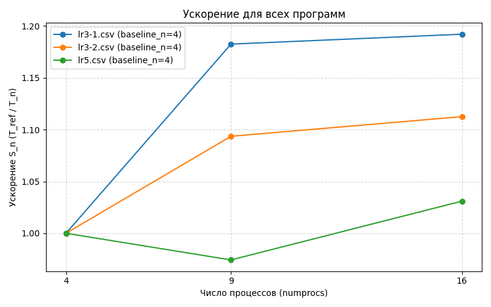
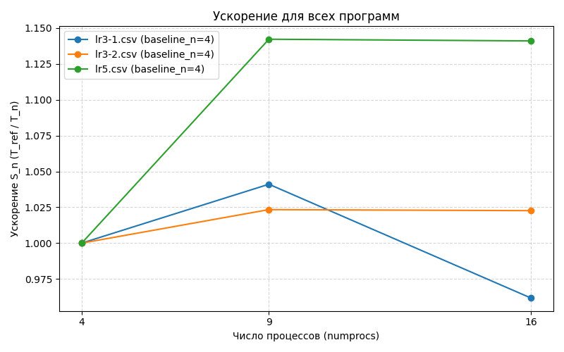
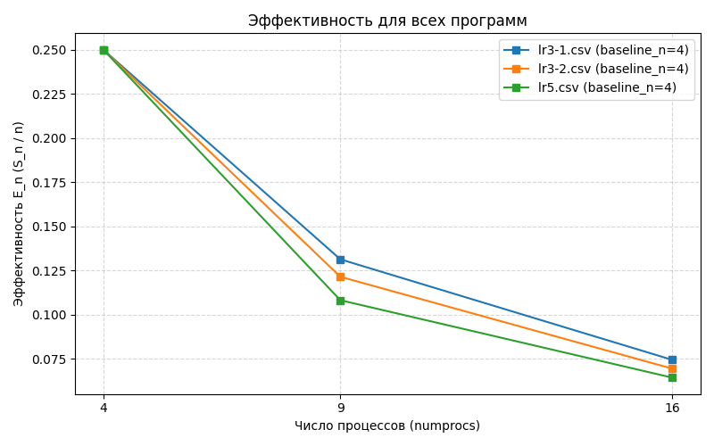
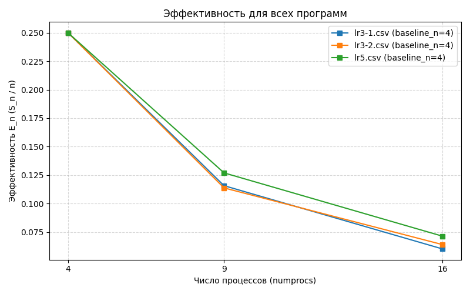

# ОТЧЕТ
## По лабораторной работе 5: Операции с группами процессов и коммуникаторами. Двумерная декомпозиция матрицы.

### Сведения о студенте
- **Дата:** 09.10.2025 
- **Семестр:** 1
- **Группа:** ПИН-м-о-25-1
- **Дисциплина:** Параллельные вычисления 
- **Студент:** Джабраилов Тимур Султанович

---

## 1. Цель работы
Освоить технику работы с группами процессов и коммуникаторами в MPI. Реализовать параллельный алгоритм умножения матрицы на вектор с двумерным разбиением матрицы на блоки. Исследовать эффективность нового подхода по сравнению с предыдущими реализациями.

## 2. Теоретическая часть
### 2.1. Основные понятия и алгоритмы
Двумерная декомпозиция данных: Разбиение матрицы на блоки по строкам и столбцам
Коммуникаторы и группы процессов: Создание и использование дополнительных
коммуникаторов (Split, Create)
Коллективные операции в подгруппах: Особенности использования Scatterv, Bcast, Reduce в
созданных коммуникаторах
Оптимизация коммуникаций: Снижение объема передаваемых данных за счет двумерной
декомпозиции

### 2.2. Используемые функции MPI
- Get_rank
- Get_size
- Bcast
- Wtime
- Scatterv
- Scatter
- Gatherv
- Reduce
- Allgatherv
- Reduce_scatter
- Allreduce
- Split
- Create
- Get_group

## 3. Практическая реализация
### 3.1. Структура программы
* 2-D блочная декомпозиция: матрица `A` разбита на блоки `M_part × N_part`; `b` - по блочным строкам, `x` - по блочным столбцам.
* Процессы организованы в квадратную сетку `num_row * num_col` (`num_row = num_col = sqrt(numprocs)`).
* Два подкоммуникатора: `comm_row` (процессы одной строке) и `comm_col` (процессы одного столбца).
* Локальные операции: `A_part * vec` и `A_part.T * vec` выполняются локально; сбор/распространение - через collectives в `comm_row` / `comm_col`.
* IO: rank 0 читает файлы, формирует буферы и раздаёт данные через `Scatterv`/`Scatterv` (с учетом `rcounts`/`displs`).
* Тайминг/запись результатов - только на rank 0.


### 3.2. Ключевые особенности реализации
* Подкоммуникаторы `comm_row`/`comm_col` дают независимые коммуникации по строкам и столбцам - сокращают трафик и избегают глобальных collectives.
* Нерегулярные блоки (`N`/`M` не делятся ровно) - решено с `rcounts`/`displs` и `Scatterv`/`Gatherv`.
* Сборка блоков `A`: rank 0 формирует `a_temp` по блочным строкам и создаёт временные группы/коммуникаторы (`group.Range_incl` + `comm.Create`) для корректной `Scatterv` только в нужные процессы.
* CG: локальные mat-vec, затем редукции в `comm_row`/`comm_col` (например `Ax` по строке, `A^T b` по столбцу), broadcast только внутри нужной группы - минимизация обмена.
* Управление потоками: `threadpool_limits(limits=1)` для корректности замеров

### 3.3. Инструкция по запуску
```bash
# Пример команды для запуска
mpiexec -n 4 python src/main.py
mpiexec -n 9 python src/main.py
mpiexec -n 16 python src/main.py
```

## 4. Экспериментальная часть
### 4.1. Тестовые данные
1. N = 100, M = 200 000
2. N = 4000, M = 5000

### 4.2. Методика измерений
- Intel Core i7 12700H: 6P + 8E ядра (14 ядер)
- DDR4 32GB оперативной памяти
- 5 запусков

### 4.3. Результаты измерений
#### Таблица 1. Длительность выполнений lr3-1 
|numprocs|N   |M     |time              |
|--------|----|------|------------------|
|4       |100 |200000|7.909049699985189 |
|9       |100 |200000|6.688573400024325 |
|16      |100 |200000|6.634971399966162 |
|4       |4000|5000  |41.864692299976014|
|9       |4000|5000  |40.21351269999286 |
|16      |4000|5000  |43.531909800018184|

#### Таблица 2. Длительность выполнений lr3-2 
|numprocs|N   |M     |time              |
|--------|----|------|------------------|
|4       |100 |200000|7.32206970002153  |
|9       |100 |200000|6.6956604000297375|
|16      |100 |200000|6.581611500005238 |
|4       |4000|5000  |41.51055850001285 |
|9       |4000|5000  |40.56265340000391 |
|16      |4000|5000  |40.59119449998252 |

#### Таблица 3. Длительность выполнений lr5 
|numprocs|N   |M     |time              |
|--------|----|------|------------------|
|4       |100 |200000|12.965214500029106|
|9       |100 |200000|13.307466399972327|
|16      |100 |200000|12.575392299972009|
|4       |4000|5000  |50.397777700040024|
|9       |4000|5000  |44.12330610002391 |
|16      |4000|5000  |44.169274599989876|


## 5. Визуализация результатов
### 5.1. График ускорения
Для N = 100, M = 200 000:



Для N = 4000, M = 5000:



По данным графикам ускорения можно понять, что для более квадратной матрицы новый алгоритм показывает большее ускорение, а для более протяжённой структуры наоборот, довольно плохо ускорятется

### 5.2. График эффективности
Для N = 100, M = 200 000:



Для N = 4000, M = 5000:



По данным графикам эффективности можно понять, что для более квадратной матрицы новый алгоритм показывает заметно лучшую эффективностЬ, а для более протяжённой матрицы, наоборот, заметно худшую.

## 6. Анализ результатов
### 6.1. Анализ производительности
Проведя анализ можно понять, что новый алгоритм больше подходит для структур более квадратный, тоесть тех у которых порядок N и M как можно ближе друг к другу. А старвый алгорим показывает значительные проблеммы для структур с большим N.

## 7. Ответы на контрольные вопросы
1. В чем основное преимущество двумерной декомпозиции данных перед одномерной с точки зрения объема передаваемых данных?
> Передаются только части векторов, а не полные копии. Объём данных на процесс уменьшается.

2. Объясните принцип работы функции MPI.Split. Что такое color и key?
> color определяет группу, key - порядок в ней. Процессы с одинаковым color создают новый коммуникатор.

3. Почему при двумерной декомпозиции для равномерного распределения данных желательно использовать число процессов, являющееся полным квадратом?
> Чтобы создать равномерную сетку P_row * P_col и упростить разбиение на одинаковые блоки.

4. Опишите процедуру распределения блоков матрицы с использованием временных коммуникаторов. В чем ее сложность?
> Двойной Scatter: сначала по строкам/столбцам, затем внутри них. Сложность - в расчёте смещений и управлении буферами.

5. Как организована редукция частичных результатов при умножении матрицы на вектор в двумерной декомпозиции и почему именно так?
> Редукция по строкам для суммирования частичных результатов. Это локализует коммуникации.

6. Каким образом в модифицированном МСГ удалось избежать операций с векторами полной длины N?
> Использованием локальных коллективов в подкоммуникаторах вместо глобальных операций.

7. На каких процессах сосредоточена работа с векторами x и p (длины N), а на каких — с векторами b и Ax (длины M) в новой реализации?
> x / p - в столбцовых коммуникаторах (длина N), b / Ax - в строковых (длина M).

8. В каких сценариях (соотношение N и M) двумерная декомпозиция показывает наибольшую эффективность и почему?
> При больших и сравнимых N и M, и большом числе процессов. Т.к. у каждого процессам не должен быть весь вектор, а лишь его кусок.

9. Каковы основные накладные расходы у реализации с двумерной декомпозицией
> Создание коммуникаторов, сложная логика распределения данных, дополнительные коллективные операции.

10. Какие дальнейшие шаги по оптимизации алгоритма вы можете предложить?
> Оптимальный выбор сетки процессов 

## 8. Заключение
### 8.1. Выводы
В ходе данной лабораторной работы были получен навыки создания нового алгоритма вычисления СЛАУ, который параллелизирует не только вычисления строк, но и столбцов, что позволяет уменьшить накладные расходы на коммуникацию между процессами.

## 9. Приложения
### 9.1. Исходный код
```python
import csv
import os
from mpi4py import MPI
from numpy import empty, array, int32, float64, zeros, arange, dot, sqrt, hstack
from matplotlib.pyplot import style, figure, axes, show
from threadpoolctl import threadpool_limits

comm = MPI.COMM_WORLD
numprocs = comm.Get_size()
rank = comm.Get_rank()

prefixPath = '../../lr4/src/data/datasets/data_C/'
inPath = prefixPath + 'in.dat'
aDataPath = prefixPath + 'AData.dat'
bDataPath = prefixPath + 'bData.dat'

with threadpool_limits(limits=1):
  if (rank == 0):
      t0 = MPI.Wtime()
  else:
      t0 = None

  def conjugate_gradient_method(A_part, b_part, x_part, N_part, M_part, 
                                N, comm, comm_row, comm_col, rank):
          
      r_part = empty(N_part, dtype=float64)
      p_part = empty(N_part, dtype=float64)
      q_part = empty(N_part, dtype=float64)
      
      if rank in range(num_col) :
          ScalP = array(0, dtype=float64)
          ScalP_temp = empty(1, dtype=float64)
      
      s = 1
      
      p_part = zeros(N_part, dtype=float64)

      while s <= N :

          if s == 1 :
              comm_col.Bcast([x_part, N_part, MPI.DOUBLE], root=0)
              Ax_part_temp = dot(A_part, x_part)
              Ax_part = empty(M_part, dtype=float64)
              comm_row.Reduce([Ax_part_temp, M_part, MPI.DOUBLE], 
                              [Ax_part, M_part, MPI.DOUBLE], 
                              op=MPI.SUM, root=0)
              if rank in range(0, numprocs, num_col) : 
                  b_part = Ax_part - b_part
              comm_row.Bcast([b_part, M_part, MPI.DOUBLE], root=0)    
              r_part_temp = dot(A_part.T, b_part)
              comm_col.Reduce([r_part_temp, N_part, MPI.DOUBLE], 
                              [r_part, N_part, MPI.DOUBLE], 
                              op=MPI.SUM, root=0)
          else :
              if rank in range(num_col) :
                  ScalP_temp[0] = dot(p_part, q_part)
                  comm_row.Allreduce([ScalP_temp, 1, MPI.DOUBLE], 
                                    [ScalP, 1, MPI.DOUBLE], op=MPI.SUM)
                  r_part = r_part - q_part/ScalP
          
          if rank in range(num_col) :
              ScalP_temp[0] = dot(r_part, r_part)
              comm_row.Allreduce([ScalP_temp, 1, MPI.DOUBLE], 
                                [ScalP, 1, MPI.DOUBLE], op=MPI.SUM)
              p_part = p_part + r_part/ScalP
          
          comm_col.Bcast([p_part, N_part, MPI.DOUBLE], root=0)
          Ap_part_temp = dot(A_part, p_part)
          Ap_part = empty(M_part, dtype=float64)
          comm_row.Allreduce([Ap_part_temp, M_part, MPI.DOUBLE], 
                            [Ap_part, M_part, MPI.DOUBLE], op=MPI.SUM)
          q_part_temp = dot(A_part.T, Ap_part)
          comm_col.Reduce([q_part_temp, N_part, MPI.DOUBLE], 
                          [q_part, N_part, MPI.DOUBLE], 
                          op=MPI.SUM, root=0)
          
          if rank in range(num_col) :
              ScalP_temp[0] = dot(p_part, q_part)
              comm_row.Allreduce([ScalP_temp, 1, MPI.DOUBLE], 
                                [ScalP, 1, MPI.DOUBLE], op=MPI.SUM)
              x_part = x_part - p_part/ScalP
          
          s = s + 1
      
      return x_part

  if rank == 0 :
      f1 = open(inPath, 'r')
      N = array(int32(f1.readline()))
      M = array(int32(f1.readline()))
      f1.close()
  else :
      N = array(0, dtype=int32)

  comm.Bcast([N, 1, MPI.INT], root=0)

  num_col = num_row = int32(sqrt(numprocs))

  def auxiliary_arrays_determination(M, num) : 
      ave, res = divmod(M, num)
      rcounts = empty(num, dtype=int32)
      displs = empty(num, dtype=int32)
      for k in range(0, num) : 
          if k < res :
              rcounts[k] = ave + 1
          else :
              rcounts[k] = ave
          if k == 0 :
              displs[k] = 0
          else :
              displs[k] = displs[k-1] + rcounts[k-1]   
      return rcounts, displs

  if rank == 0 :
      rcounts_M, displs_M = auxiliary_arrays_determination(M, num_row)
      rcounts_N, displs_N = auxiliary_arrays_determination(N, num_col)
  else :
      rcounts_M = None; displs_M = None
      rcounts_N = None; displs_N = None

  M_part = array(0, dtype=int32); N_part = array(0, dtype=int32)

  comm_col = comm.Split(rank % num_col, rank)
  comm_row = comm.Split(rank // num_col, rank)

  if rank in range(num_col) :
      comm_row.Scatter([rcounts_N, 1, MPI.INT], 
                      [N_part, 1, MPI.INT], root=0) 
  if rank in range(0, numprocs, num_col) :
      comm_col.Scatter([rcounts_M, 1, MPI.INT], 
                      [M_part, 1, MPI.INT], root=0) 

  comm_col.Bcast([N_part, 1, MPI.INT], root=0)
  comm_row.Bcast([M_part, 1, MPI.INT], root=0)  

  A_part = empty((M_part, N_part), dtype=float64)

  group = comm.Get_group()

  if rank == 0 :
      f2 = open(aDataPath, 'r')
      for m in range(num_row) :
          a_temp = empty(rcounts_M[m]*N, dtype=float64)
          for j in range(rcounts_M[m]) :
              for n in range(num_col) :
                  for i in range(rcounts_N[n]) :
                      a_temp[rcounts_M[m]*displs_N[n] + j*rcounts_N[n] + i] = float64(f2.readline())
          if m == 0 :
              comm_row.Scatterv([a_temp, rcounts_M[m]*rcounts_N, rcounts_M[m]*displs_N, MPI.DOUBLE], 
                                [A_part, M_part*N_part, MPI.DOUBLE], root=0)
          else :
              group_temp = group.Range_incl([(0,0,1), (m*num_col,(m+1)*num_col-1,1)]) 
              comm_temp = comm.Create(group_temp)
              rcounts_N_temp = hstack((array(0, dtype=int32), rcounts_N))
              displs_N_temp = hstack((array(0, dtype=int32), displs_N))
              comm_temp.Scatterv([a_temp, rcounts_M[m]*rcounts_N_temp, rcounts_M[m]*displs_N_temp, MPI.DOUBLE], 
                                [empty(0, dtype=float64), 0, MPI.DOUBLE], root=0)
              group_temp.Free(); comm_temp.Free()
      f2.close()
  else :
      if rank in range(num_col) :
          comm_row.Scatterv([None, None, None, None], 
                            [A_part, M_part*N_part, MPI.DOUBLE], root=0)
      for m in range(1, num_row) :
          group_temp = group.Range_incl([(0,0,1), (m*num_col,(m+1)*num_col-1,1)])
          comm_temp = comm.Create(group_temp)
          if rank in range(m*num_col, (m+1)*num_col) :
              comm_temp.Scatterv([None, None, None, None], 
                                [A_part, M_part*N_part, MPI.DOUBLE], root=0)
              comm_temp.Free()
          group_temp.Free()
      
  if rank == 0 :
      b = empty(M, dtype=float64)
      f3 = open(bDataPath, 'r')
      for j in range(M) :
          b[j] = float64(f3.readline())
      f3.close()
  else:
      b = None
      
  b_part = empty(M_part, dtype=float64) 
    
  if rank in range(0, numprocs, num_col) :    
      comm_col.Scatterv([b, rcounts_M, displs_M, MPI.DOUBLE], 
                        [b_part, M_part, MPI.DOUBLE], root=0)

  if rank == 0 :
      x = zeros(N, dtype=float64)
  else :
      x = None
      
  x_part = empty(N_part, dtype=float64) 

  if rank in range(num_col) :
      comm_row.Scatterv([x, rcounts_N, displs_N, MPI.DOUBLE], 
                      [x_part, N_part, MPI.DOUBLE], root=0)

  x_part = conjugate_gradient_method(A_part, b_part, x_part, N_part, M_part, 
                                    N, comm, comm_row, comm_col, rank)

  if rank in range(num_col) :
      comm_row.Gatherv([x_part, N_part, MPI.DOUBLE], 
                      [x, rcounts_N, displs_N, MPI.DOUBLE], root=0)

  if rank == 0:
      t1 = MPI.Wtime()
      elapsed = t1 - t0
      csv_file = "timings_slay.csv"
      need_header = not os.path.exists(csv_file)
      with open(csv_file, "a", newline="") as f:
          writer = csv.writer(f)
          if need_header:
              writer.writerow(["numprocs", "N", "M", "time"])
          writer.writerow([numprocs, N, M, elapsed])
      print(f"nprocs={numprocs}, time={elapsed:.6f} s (written to {csv_file})")

  # if rank == 0 :
  #     style.use('dark_background')
  #     fig = figure()
  #     ax = axes(xlim=(0, N), ylim=(-1.5, 1.5))
  #     ax.set_xlabel('i'); ax.set_ylabel('x[i]')
  #     ax.plot(arange(N), x, '-y', lw=3)
  #     show()
```

### 9.2. Используемые библиотеки и версии
- Python 3.8+
- mpi4py 3.1.+
- NumPy 1.21.+
- OpenMPI 4.1.+
- matplotlib 3.10+

### 9.3. Рекомендуемая литература
Фундаментальные исследования (с аннотациями):
1. Gropp, W., Lusk, E., & Thakur, R. (1999). Using MPI-2: Advanced Features of the Message-Passing
Interface. MIT Press.
Аннотация: Классическое руководство по расширенным возможностям MPI-2. Содержит
детальное описание работы с группами процессов, коммуникаторами и односторонними
коммуникациями, что является теоретической основой для данной лабораторной работы. В
книге подробно разбираются функции MPI_Comm_split и MPI_Comm_create.
2. Thakur, R., Rabenseifner, R., & Gropp, W. (2005). Optimization of Collective Communication
Operations in MPICH. International Journal of High Performance Computing Applications.
Аннотация: Статья глубоко исследует внутренние механизмы и оптимизацию
коллективных операций в одной из самых популярных реализаций MPI — MPICH. Знание
0502_lab_Операции с группами процессов и коммуникаторами. Двумерная декомпозиция матрицы.md
этих принципов помогает понять, почему использование специализированных
коммуникаторов (как в данной работе) может значительно повысить производительность.
3. Barnett, M., Gupta, S., Payne, D. G., & van de Geijn, R. (1993). Broadcasting on Meshes with
Wormhole Routing. Journal of Parallel and Distributed Computing.
Аннотация: Фундаментальное исследование, анализирующее эффективность
коммуникационных операций на сеточных топологиях. Работа закладывает теоретический
базис для понимания того, почему двумерная декомпозиция и соответствующие ей
коммуникационные паттерны могут быть оптимальными для многих линейноалгебраических операций на современных суперкомпьютерных архитектурах.
Практические руководства (с аннотациями):
1. MPI Forum. (2021). MPI: A Message-Passing Interface Standard. Version 4.0.
Аннотация: Официальная спецификация стандарта MPI. Является первоисточником и
исчерпывающим справочником по всем функциям MPI, их аргументам и поведению.
Незаменима для точного понимания семантики используемых в работе функций, таких как
Scatterv, Reduce и Split.
2. Pacheco, P. (2011). An Introduction to Parallel Programming. Morgan Kaufmann.
Аннотация: Отличное практическое введение в параллельное программирование,
включая обширный раздел по MPI. Книга содержит множество примеров и упражнений,
которые помогают закрепить концепции на практике, и служит хорошим дополнением к
лекционному материалу.
3. Gropp, W., Hoefler, T., Thakur, R., & Lusk, E. (2014). Using Advanced MPI: Modern Features of the
Message-Passing Interface. MIT Press.
Аннотация: Прямое продолжение классической книги по MPI-2, фокусирующееся на
современных возможностях. Содержит разделы, посвященные топологиям виртуальных
коммуникаторов и гибридному программированию, что является логичным следующим
шагом после освоения материала данной лабораторной работы.

---

*Отчет подготовлен в рамках курса "Параллельные вычисления"*
