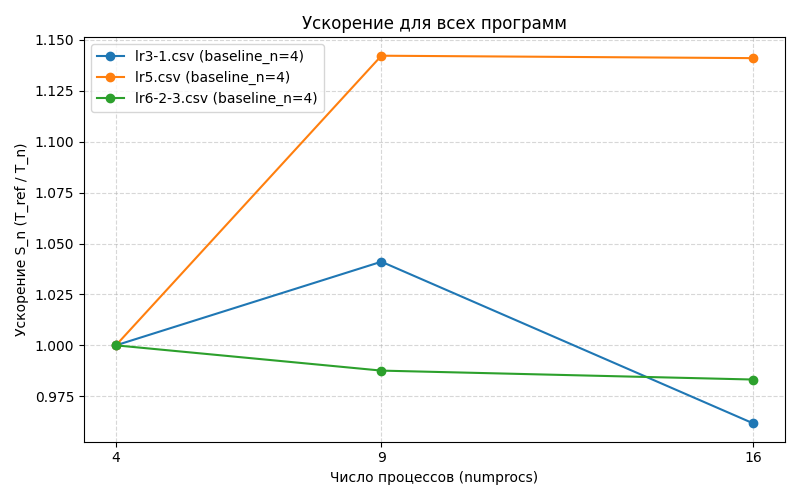
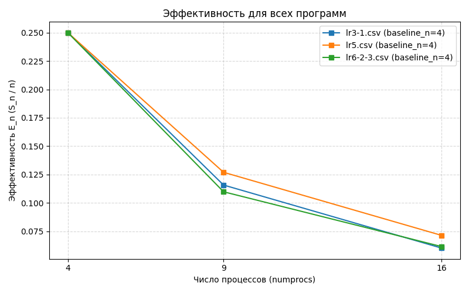

# ОТЧЕТ
## По лабораторной работе 6: Виртуальные топологии в MPI. Оптимизация коммуникаций

### Сведения о студенте
- **Дата:** 11.10.2025 
- **Семестр:** 1
- **Группа:** ПИН-м-о-25-1
- **Дисциплина:** Параллельные вычисления 
- **Студент:** Джабраилов Тимур Султанович

---

## 1. Цель работы
Освоить технику создания и использования виртуальных топологий в MPI. Изучить функции Create_cart, Shift и Sendrecv_replace для оптимизации коммуникационных операций в параллельных алгоритмах. Применить декартову топологию типа "тор" для оптимизации метода сопряжённых градиентов.

## 2. Теоретическая часть
### 2.1. Основные понятия и алгоритмы
Декартовы топологии: Создание двумерной сетки процессов, периодические границы

### 2.2. Используемые функции MPI
- Get_rank
- Get_size
- Bcast
- Wtime
- Scatterv
- Scatter
- Gatherv
- Reduce
- Allgatherv
- Reduce_scatter
- Allreduce
- Split
- Create_cart
- Shift
- Sendrecv_replace

## 3. Практическая реализация
### 3.1. Структура программы
Программа реализует двумерную блочную декомпозицию и решает систему методом сопряжённых градиентов в картезианской топологии MPI. Матрица `A` разбивается на блоки `M_part * N_part`, векторы `b` и `x` — по строкам и столбцам соответственно. Процессы организованы в сетку `num_row * num_col` с периодическими границами, что позволяет выполнять обмены с соседями (вверх/вниз/влево/вправо) через `Sendrecv_replace`. Для распределения данных и сборки результатов создаются подкоммуникаторы `comm_row` и `comm_col`. Главный процесс читает данные, формирует блоки и раздаёт их через `Scatterv` с учётом неравномерных размеров (`rcounts`, `displs`). Локальные умножения и скалярные произведения выполняются через `dot`, а глобальные суммы реализованы кольцевыми обменами вдоль строк и столбцов вместо коллективных операций. Такой подход минимизирует коммуникационные затраты и позволяет масштабировать метод без глобальных редукций.

### 3.2. Ключевые особенности реализации
Ключевым аспектом является создания декартовой топологии, котораям помогает реализовать более эффективную коммунакацию для процессов.

### 3.3. Инструкция по запуску
```bash
# Пример команды для запуска
mpiexec -n 8 python src/main.py
```

## 4. Экспериментальная часть
### 4.1. Тестовые данные
N = 4000, M = 5000

### 4.2. Методика измерений
- Intel Core i7 12700H: 6P + 8E ядра (14 ядер)
- DDR4 32GB оперативной памяти
- 5 запусков

### 4.3. Результаты измерений
#### Таблица 1. Длительность выполнений lr3-1 
|numprocs|N   |M     |time              |
|--------|----|------|------------------|
|4       |4000|5000  |41.864692299976014|
|9       |4000|5000  |40.21351269999286 |
|16      |4000|5000  |43.531909800018184|

#### Таблица 3. Длительность выполнений lr5 
|numprocs|N   |M     |time              |
|--------|----|------|------------------|
|4       |4000|5000  |50.397777700040024|
|9       |4000|5000  |44.12330610002391 |
|16      |4000|5000  |44.169274599989876|

#### Таблица 3. Длительность выполнений lr6-2
|numprocs|N   |M   |time              |
|--------|----|----|------------------|
|4       |4000|5000|43.3137419000268  |
|9       |4000|5000|43.858019699924625|
|16      |4000|5000|44.05337099998724 |


## 5. Визуализация результатов
### 5.1. График ускорения


### 5.2. График эффективности


## 6. Анализ результатов
### 6.1. Анализ производительности
В абсолютном времени при 4 процессах (43.31 с) оно чуть медленнее lr3-1 (41.86 с, примерно 3.5% медленнее), но заметно быстрее lr5 (50.40 с, примерно 14% быстрее). При увеличении числа процессов lr6-2 не масштабируется — ускорение относительно базиса 4 процессов составляет примерно 0.99 при 9 процессах и примрено 0.98 при 16 (эффективность примрено 0.11 при n=9 и примерно 0.061 при n=16). Для сравнения lr5 даёт лучшее ускорение (примерно 1.142 при n=9 и примерно 1.141 при n=16, эффективность примерно 0.127 и примерно 0.071), а lr3-1 показывает небольшой выигрыш при 9 (S примерно равным 1.041, E примерно равным 0.116) но деградацию при 16 (S примерно равным 0.962, E примерно 0.060). Вывод: lr6-2-3 имеет приемлемое время в абсолюте (лучше lr5), но хуже масштабируется — при росте числа процессов выигрыша нет, скорее наблюдается накладные расходы.
Такое поведение обоснованно тем, что топологии будут более эффективно себя показывать в сетях, а не на одном процессоре т.к. именно сеть имеет наибольшее кол-во накладных расходов.


## 7. Ответы на контрольные вопросы
**Какие преимущества предоставляют виртуальные топологии по сравнению с ручным созданием коммуникаторов?**
Упрощают программирование: автоматически сопоставляют процессы сетке, предоставляют удобные функции для поиска соседей и позволяют MPI оптимизировать коммуникации. Это уменьшает ошибки и повышает читаемость кода.

**Объясните назначение параметров функции Create_cart: dims, periods, reorder.**
dims - размеры сетки по измерениям; periods - флаги цикличности (True = тор); reorder - разрешить MPI менять ранги для лучшего соответствия топологии сети.

**В чем отличие между топологией "сетка" и топологией "тор"?**
Сетка - обычная решётка с границами. Тор - периодическая решётка, где границы соединены (крайние процессы связаны с противоположными).

**Как функция Shift помогает определить соседей процесса в декартовой топологии?**
Возвращает ранги соседей в заданном направлении и со сдвигом, упрощая поиск без ручных вычислений координат.

**В чем преимущество функции Sendrecv_replace перед раздельным использованием Send и Recv?**
Объединяет отправку и приём в одном вызове, заменяя данные в буфере. Снижает риск взаимоблокировок, избавляет от временного буфера и часто работает эффективнее.

**Почему использование Sendrecv_replace может быть более эффективным, чем Allreduce в некоторых сценариях?**
Allreduce - глобальная операция со всеми процессами, что дорого. Sendrecv_replace работает только с соседями, что быстрее для локальных обменов.

**Какие ограничения имеет реализация с использованием виртуальных топологий?**
Логическая топология может не соответствовать физической сети, подходит только для регулярных структур, создание коммуникаторов добавляет накладные расходы.

**Как параметр reorder влияет на производительность программы?**
Позволяет MPI оптимизировать распределение процессов по физическим узлам, что может ускорить коммуникации за счёт лучшего соответствия топологии.

**В каких случаях использование виртуальных топологий наиболее оправдано?**
При регулярных коммуникационных паттернах (например, вычисления на сетках, обмены с соседями) и когда нужен простой способ определения соседей.

**Какие дополнительные оптимизации можно применить к реализации с виртуальными топологиями?**
Использовать reorder, неблокирующие коммуникации, совмещение вычислений и обменов, минимизацию сообщений, подбор оптимального разбиения сетки.

## 8. Заключение
### 8.1. Выводы
В ходе данной лабораторной работы были получены навыки работы с декартовыми топологиями при построении параллельных программ c помощью библиотеки mpi4py, что позволяет обеспечить более эффективную коммуникацию процессов в сетях.

## 9. Приложения
### 9.1. Исходный код
```python
import csv
import os
from mpi4py import MPI
from numpy import empty, array, zeros, int32, float64, arange, dot, sqrt, hstack
from matplotlib.pyplot import style, figure, axes, show
from threadpoolctl import threadpool_limits

comm = MPI.COMM_WORLD
numprocs = comm.Get_size()
rank = comm.Get_rank()

num_row = num_col = int32(sqrt(numprocs))

comm_cart = comm.Create_cart(dims=(num_row, num_col), 
                             periods=(True, True), reorder=True)

rank_cart = comm_cart.Get_rank()

prefixPath = '../../lr4/src/data/datasets/data_C/'
inPath = prefixPath + 'in.dat'
aDataPath = prefixPath + 'AData.dat'
bDataPath = prefixPath + 'bData.dat'

with threadpool_limits(limits=1):
    if (rank == 0):
        t0 = MPI.Wtime()
    else:
        t0 = None

    def conjugate_gradient_method(A_part, b_part, x_part, N_part, M_part, 
                                N, comm_cart, num_row, num_col) :
        
        neighbour_up, neighbour_down = comm_cart.Shift(direction=0, disp=1)
        neighbour_left, neighbour_right = comm_cart.Shift(direction=1, disp=1)
        
        ScalP_temp = empty(1, dtype=float64)
        
        s = 1
        
        p_part = zeros(N_part, dtype=float64)

        while s <= N :

            if s == 1 :
                Ax_part_temp = dot(A_part, x_part)
                Ax_part = Ax_part_temp.copy()
                for n in range(num_col-1) :
                    comm_cart.Sendrecv_replace([Ax_part_temp, M_part, MPI.DOUBLE], 
                                            dest=neighbour_right, sendtag=0, 
                                            source=neighbour_left, recvtag=MPI.ANY_TAG, 
                                            status=None)
                    Ax_part = Ax_part + Ax_part_temp
                b_part = Ax_part - b_part  
                r_part_temp = dot(A_part.T, b_part)
                r_part = r_part_temp.copy()
                for m in range(num_row-1) :
                    comm_cart.Sendrecv_replace([r_part_temp, N_part, MPI.DOUBLE], 
                                            dest=neighbour_down, sendtag=0, 
                                            source=neighbour_up, recvtag=MPI.ANY_TAG, 
                                            status=None)
                    r_part = r_part + r_part_temp
            else :
                ScalP_temp[0] = dot(p_part, q_part)
                ScalP = ScalP_temp.copy()
                for n in range(num_col-1) :
                    comm_cart.Sendrecv_replace([ScalP_temp, 1, MPI.DOUBLE], 
                                            dest=neighbour_right, sendtag=0, 
                                            source=neighbour_left, recvtag=MPI.ANY_TAG,
                                            status=None)
                    ScalP = ScalP + ScalP_temp
                r_part = r_part - q_part/ScalP
            
            ScalP_temp[0] = dot(r_part, r_part)
            ScalP = ScalP_temp.copy()
            for n in range(num_col-1) :
                comm_cart.Sendrecv_replace([ScalP_temp, 1, MPI.DOUBLE], 
                                        dest=neighbour_right, sendtag=0, 
                                        source=neighbour_left, recvtag=MPI.ANY_TAG, 
                                        status=None)
                ScalP = ScalP + ScalP_temp
            p_part = p_part + r_part/ScalP
            
            Ap_part_temp = dot(A_part, p_part)
            Ap_part = Ap_part_temp.copy()
            for n in range(num_col-1) :
                comm_cart.Sendrecv_replace([Ap_part_temp, M_part, MPI.DOUBLE], 
                                        dest=neighbour_right, sendtag=0, 
                                        source=neighbour_left, recvtag=MPI.ANY_TAG, 
                                        status=None)
                Ap_part = Ap_part + Ap_part_temp
            q_part_temp = dot(A_part.T, Ap_part)
            q_part = q_part_temp.copy()
            for m in range(num_row-1) :
                comm_cart.Sendrecv_replace([q_part_temp, N_part, MPI.DOUBLE], 
                                        dest=neighbour_down, sendtag=0, 
                                        source=neighbour_up, recvtag=MPI.ANY_TAG, 
                                        status=None)
                q_part = q_part + q_part_temp
            
            ScalP_temp[0] = dot(p_part, q_part)
            ScalP = ScalP_temp.copy()
            for n in range(num_col-1) :
                comm_cart.Sendrecv_replace([ScalP_temp, 1, MPI.DOUBLE], 
                                        dest=neighbour_right, sendtag=0, 
                                        source=neighbour_left, recvtag=MPI.ANY_TAG, 
                                        status=None)
                ScalP = ScalP + ScalP_temp
            x_part = x_part - p_part/ScalP
            
            s = s + 1
        
        return x_part

    if rank_cart == 0 :
        f1 = open(inPath, 'r')
        N = array(int32(f1.readline()))
        M = array(int32(f1.readline()))
        f1.close()
    else :
        N = array(0, dtype=int32)

    comm_cart.Bcast([N, 1, MPI.INT], root=0)

    def auxiliary_arrays_determination(M, num) : 
        ave, res = divmod(M, num)
        rcounts = empty(num, dtype=int32)
        displs = empty(num, dtype=int32)
        for k in range(0, num) : 
            if k < res :
                rcounts[k] = ave + 1
            else :
                rcounts[k] = ave
            if k == 0 :
                displs[k] = 0
            else :
                displs[k] = displs[k-1] + rcounts[k-1]   
        return rcounts, displs

    if rank_cart == 0 :
        rcounts_M, displs_M = auxiliary_arrays_determination(M, num_row)
        rcounts_N, displs_N = auxiliary_arrays_determination(N, num_col)
    else :
        rcounts_M = None; displs_M = None
        rcounts_N = None; displs_N = None

    M_part = array(0, dtype=int32); N_part = array(0, dtype=int32)

    comm_col = comm_cart.Split(rank_cart % num_col, rank_cart)
    comm_row = comm_cart.Split(rank_cart // num_col, rank_cart)

    if rank_cart in range(num_col) :
        comm_row.Scatter([rcounts_N, 1, MPI.INT], 
                        [N_part, 1, MPI.INT], root=0) 
    if rank_cart in range(0, numprocs, num_col) :
        comm_col.Scatter([rcounts_M, 1, MPI.INT], 
                        [M_part, 1, MPI.INT], root=0) 

    comm_col.Bcast([N_part, 1, MPI.INT], root=0)
    comm_row.Bcast([M_part, 1, MPI.INT], root=0)  

    A_part = empty((M_part, N_part), dtype=float64)

    group = comm_cart.Get_group()

    if rank_cart == 0 :
        f2 = open(aDataPath, 'r')
        for m in range(num_row) :
            a_temp = empty(rcounts_M[m]*N, dtype=float64)
            for j in range(rcounts_M[m]) :
                for n in range(num_col) :
                    for i in range(rcounts_N[n]) :
                        a_temp[rcounts_M[m]*displs_N[n] + j*rcounts_N[n] + i] = float64(f2.readline())
            if m == 0 :
                comm_row.Scatterv([a_temp, rcounts_M[m]*rcounts_N, rcounts_M[m]*displs_N, MPI.DOUBLE], 
                                [A_part, M_part*N_part, MPI.DOUBLE], root=0)
            else :
                group_temp = group.Range_incl([(0,0,1), (m*num_col,(m+1)*num_col-1,1)]) 
                comm_temp = comm_cart.Create(group_temp)
                rcounts_N_temp = hstack((array(0, dtype=int32), rcounts_N))
                displs_N_temp = hstack((array(0, dtype=int32), displs_N))
                comm_temp.Scatterv([a_temp, rcounts_M[m]*rcounts_N_temp, rcounts_M[m]*displs_N_temp, MPI.DOUBLE], 
                                [empty(0, dtype=float64), 0, MPI.DOUBLE], root=0)
                group_temp.Free(); comm_temp.Free()
        f2.close()
    else :
        if rank_cart in range(num_col) :
            comm_row.Scatterv([None, None, None, None], 
                            [A_part, M_part*N_part, MPI.DOUBLE], root=0)
        for m in range(1, num_row) :
            group_temp = group.Range_incl([(0,0,1), (m*num_col,(m+1)*num_col-1,1)])
            comm_temp = comm_cart.Create(group_temp)
            if rank_cart in range(m*num_col, (m+1)*num_col) :
                comm_temp.Scatterv([None, None, None, None], 
                                [A_part, M_part*N_part, MPI.DOUBLE], root=0)
                comm_temp.Free()
            group_temp.Free()
        
    if rank_cart == 0 :
        b = empty(M, dtype=float64)
        f3 = open(bDataPath, 'r')
        for j in range(M) :
            b[j] = float64(f3.readline())
        f3.close()
    else :
        b = None
        
    b_part = empty(M_part, dtype=float64) 
        
    if rank_cart in range(0, numprocs, num_col) :    
        comm_col.Scatterv([b, rcounts_M, displs_M, MPI.DOUBLE], 
                        [b_part, M_part, MPI.DOUBLE], root=0)
        
    comm_row.Bcast([b_part, M_part, MPI.DOUBLE], root=0)

    if rank_cart == 0 :
        x = zeros(N, dtype=float64)
    else :
        x = None
        
    x_part = empty(N_part, dtype=float64)

    if rank_cart in range(num_col) :
        comm_row.Scatterv([x, rcounts_N, displs_N, MPI.DOUBLE], 
                        [x_part, N_part, MPI.DOUBLE], root=0)
        
    comm_col.Bcast([x_part, N_part, MPI.DOUBLE], root=0)

    x_part = conjugate_gradient_method(A_part, b_part, x_part, N_part, M_part, 
                                    N, comm_cart, num_row, num_col)

    if rank_cart in range(num_col) :
        comm_row.Gatherv([x_part, N_part, MPI.DOUBLE], 
                        [x, rcounts_N, displs_N, MPI.DOUBLE], root=0)

    if rank == 0:
        t1 = MPI.Wtime()
        elapsed = t1 - t0
        csv_file = "lr6-2-3.csv"
        need_header = not os.path.exists(csv_file)
        with open(csv_file, "a", newline="") as f:
            writer = csv.writer(f)
            if need_header:
                writer.writerow(["numprocs", "N", "M", "time"])
            writer.writerow([numprocs, N, M, elapsed])
        print(f"nprocs={numprocs}, time={elapsed:.6f} s (written to {csv_file})")

    # if rank_cart == 0 :
    #     style.use('dark_background')
    #     fig = figure()
    #     ax = axes(xlim=(0, N), ylim=(-1.5, 1.5))
    #     ax.set_xlabel('i'); ax.set_ylabel('x[i]')
    #     ax.plot(arange(N), x, '-y', lw=3)
    #     show()
```

### 9.2. Используемые библиотеки и версии
- Python 3.8+
- mpi4py 3.1.+
- NumPy 1.21.+
- OpenMPI 4.1.+
- matplotlib 3.10+

### 9.3. Рекомендуемая литература
Фундаментальные исследования (с аннотациями):
1. Gropp, W., Lusk, E., & Thakur, R. (1999). Using MPI-2: Advanced Features of the Message-Passing
Interface. MIT Press.
Аннотация: Классическое руководство по расширенным возможностям MPI-2. Содержит
детальное описание работы с группами процессов, коммуникаторами и односторонними
коммуникациями, что является теоретической основой для данной лабораторной работы. В
книге подробно разбираются функции MPI_Comm_split и MPI_Comm_create.
2. Thakur, R., Rabenseifner, R., & Gropp, W. (2005). Optimization of Collective Communication
Operations in MPICH. International Journal of High Performance Computing Applications.
Аннотация: Статья глубоко исследует внутренние механизмы и оптимизацию
коллективных операций в одной из самых популярных реализаций MPI — MPICH. Знание
0502_lab_Операции с группами процессов и коммуникаторами. Двумерная декомпозиция матрицы.md
этих принципов помогает понять, почему использование специализированных
коммуникаторов (как в данной работе) может значительно повысить производительность.
3. Barnett, M., Gupta, S., Payne, D. G., & van de Geijn, R. (1993). Broadcasting on Meshes with
Wormhole Routing. Journal of Parallel and Distributed Computing.
Аннотация: Фундаментальное исследование, анализирующее эффективность
коммуникационных операций на сеточных топологиях. Работа закладывает теоретический
базис для понимания того, почему двумерная декомпозиция и соответствующие ей
коммуникационные паттерны могут быть оптимальными для многих линейноалгебраических операций на современных суперкомпьютерных архитектурах.
Практические руководства (с аннотациями):
1. MPI Forum. (2021). MPI: A Message-Passing Interface Standard. Version 4.0.
Аннотация: Официальная спецификация стандарта MPI. Является первоисточником и
исчерпывающим справочником по всем функциям MPI, их аргументам и поведению.
Незаменима для точного понимания семантики используемых в работе функций, таких как
Scatterv, Reduce и Split.
2. Pacheco, P. (2011). An Introduction to Parallel Programming. Morgan Kaufmann.
Аннотация: Отличное практическое введение в параллельное программирование,
включая обширный раздел по MPI. Книга содержит множество примеров и упражнений,
которые помогают закрепить концепции на практике, и служит хорошим дополнением к
лекционному материалу.
3. Gropp, W., Hoefler, T., Thakur, R., & Lusk, E. (2014). Using Advanced MPI: Modern Features of the
Message-Passing Interface. MIT Press.
Аннотация: Прямое продолжение классической книги по MPI-2, фокусирующееся на
современных возможностях. Содержит разделы, посвященные топологиям виртуальных
коммуникаторов и гибридному программированию, что является логичным следующим
шагом после освоения материала данной лабораторной работы.

---

*Отчет подготовлен в рамках курса "Параллельные вычисления"*
