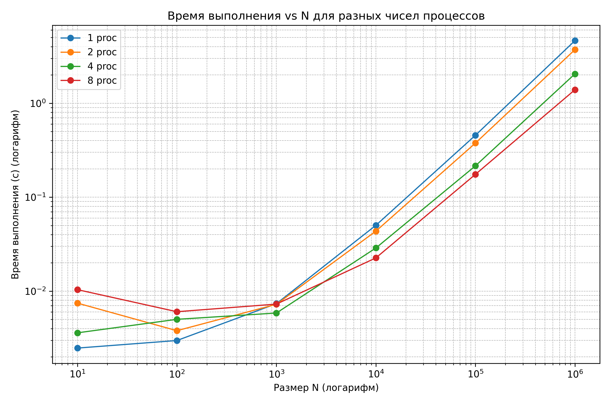
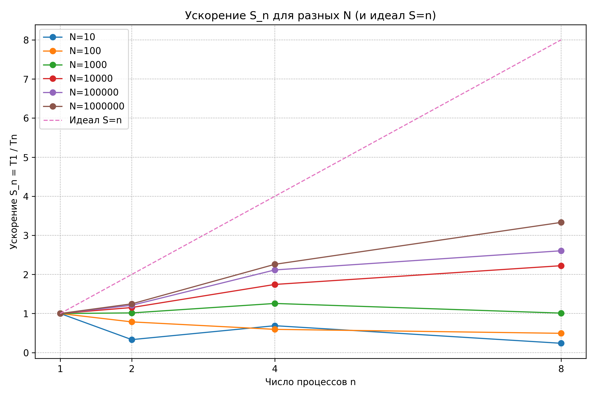
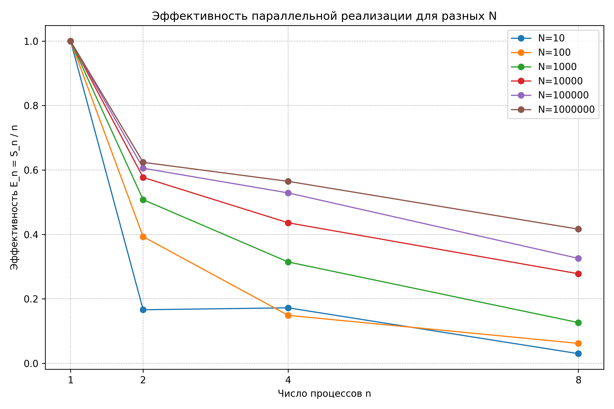

# ОТЧЕТ
## По лабораторной работе 7: Параллельный метод прогонки для решения СЛАУ с трехдиагональной матрицей

### Сведения о студенте
- **Дата:** 11.10.2025 
- **Семестр:** 1
- **Группа:** ПИН-м-о-25-1
- **Дисциплина:** Параллельные вычисления 
- **Студент:** Джабраилов Тимур Султанович

---

## 1. Цель работы

## 2. Теоретическая часть
### 2.1. Основные понятия и алгоритмы
Разреженные матрицы: Особенности хранения и обработки
Трехдиагональные матрицы: Структура и свойства
Последовательный метод прогонки: Алгоритм и вычислительная сложность
Параллельный метод прогонки: Стратегия распределения данных, этапы алгоритма
Эффективность распараллеливания: Оценка ускорения для алгоритмов с разреженными
матрицами

### 2.2. Используемые функции MPI
- Get_rank
- Get_size
- Bcast
- Wtime
- Scatterv
- Scatter
- Gatherv
- Reduce
- Allgatherv
- Reduce_scatter
- Allreduce
- Split
- Create_cart
- Shift
- Sendrecv_replace

## 3. Практическая реализация
### 3.1. Структура программы
*   Вектор индексов распределяется по процессам, корневой процесс формирует данные для `Scatter`.
*   На каждом процессе генерируются локальные части трёхдиагональной матрицы (`a_part`, `b_part`, `c_part`).
*   Модельный вектор `x` рассылается всем процессам через `Bcast`.
*   Каждый процесс вычисляет свой фрагмент правой части `b_part = A_part * x`.
*   Запускается параллельный алгоритм Томаса:
    *   **Локальная прогонка:** Прямой и обратный ход на каждом процессе для своего фрагмента.
    *   **Обмен данными:** Процессы обмениваются граничными коэффициентами по цепочке.
    *   **Решение редуцированной системы:** Корневой процесс собирает граничные коэффициенты, решает полученную систему малого размера (равного `numprocs`) и рассылает результаты через `Scatterv`.
*   Процессы восстанавливают полное локальное решение `x_part`.

### 3.2. Ключевые особенности реализации
Ключевой оссобенностью данной реализации является то, что локальная схема делает in-place модификацию диагоналей для экономии памяти; А также, то что в реализации обязательно присутвует последовательная часть алгоритма, которая не распаралеливается.


### 3.3. Инструкция по запуску
```bash
# Пример команды для запуска
mpiexec -n 2 python src/main.py
mpiexec -n 4 python src/main.py
mpiexec -n 8 python src/main.py
```

## 4. Экспериментальная часть
### 4.1. Тестовые данные
N = 4000, M = 5000

### 4.2. Методика измерений
- Intel Core i7 12700H: 6P + 8E ядра (14 ядер)
- DDR4 32GB оперативной памяти
- 5 запусков

### 4.3. Результаты измерений
#### Таблица 1. Длительность выполнений последовательной программы
|numprocs|N      |time                 |
|--------|-------|---------------------|
|1       |10     |0.0024799000238999724|
|1       |100    |0.002984600025229156 |
|1       |1000   |0.007361299940384924 |
|1       |10000  |0.05026160005945712  |
|1       |100000 |0.4558046000311151   |
|1       |1000000|4.632463800022379    |

#### Таблица 2. Длительность выполнений параллельной программы
|numprocs|N      |time                 |
|--------|-------|---------------------|
|2       |10     |0.007465700036846101 |
|4       |10     |0.0036025000736117363|
|8       |10     |0.010382100008428097 |
|2       |100    |0.003797799930907786 |
|4       |100    |0.005016900016926229 |
|8       |100    |0.006045399932190776 |
|2       |1000   |0.007249900023452938 |
|4       |1000   |0.005853899987414479 |
|8       |1000   |0.007285700063221157 |
|2       |10000  |0.04357059998437762  |
|4       |10000  |0.02882010000757873  |
|8       |10000  |0.02261079999152571  |
|2       |100000 |0.37647769995965064  |
|4       |100000 |0.21551310003269464  |
|8       |100000 |0.17499800003133714  |
|2       |1000000|3.7140806999523193   |
|4       |1000000|2.050941599998623    |
|8       |1000000|1.3909683000529185   |


## 5. Визуализация результатов

### 5.1. График времени выполнения в зависимости от размера системы


График времени по лог-оси (время и N лог) показывает, что время последовательной реализации растёт с N почти линейно в лог-масштабе (т.е. экспоненциально/степенно в обычном виде), а кривые параллельных версий пересекаются и для малых N выше (хуже) последовательной. Для больших N кривые времени для большего числа процессов смещаются вниз (меньше времени). Но разрыв между идеальной линией (всёшли бы линейно) и экспериментальной увеличивается с числом процессов — т.е. накладные расходы и последовательная доля ограничивают ускорение.

### 5.2. График ускорения


На данном графике можно заметить, что ускорее растет при N >= 10000 и чем больше N, тем выше ускорение. Для N < 1000 ускорение падает при увличении N.

### 5.3. График эффективности


увеличение N повышает эффективность распараллеливания при прочих равных, потому что фиксированные накладные расходы (стартап процессов, синхронизация, обмен) становятся пренебрежимо малы относительно полезной работы.

## 6. Анализ результатов
### 6.1. Сравнение параллельного и последовательного решений

Для малых размеров задачи (например, 𝑁 = 10 N=10 и 𝑁 = 100 N=100) параллельная реализация зачастую медленнее последовательной. Причина — накладные расходы на распараллеливание (создание потоков/процессов, синхронизация, передача данных), которые для маленькой работы не окупаются. Для больших N параллелизация начинает давать существенный выигрыш.

### 6.2. Сравнение с теоретической оценкой
Во всех измерениях выполняется неравенство Sn <= n. Нарушений не найдено.

## 7. Ответы на контрольные вопросы
В чем заключаются основные особенности трёхдиагональных матриц?
> Ненулевые элементы только на главной и двух соседних диагоналях.

Почему классический метод прогонки (Thomas) нельзя непосредственно распараллелить?
> Строгая последовательная зависимость на каждом шаге.

Опишите основные этапы параллельного алгоритма прогонки.
> Разбиение на блоки, локальная прогонка, решение редуцированной системы, обратная подстановка.

Как организован обмен данными между процессами в параллельной реализации?
> Обмен граничными коэффициентами с соседями через Sendrecv.

Какова роль редуцированной системы в параллельном алгоритме?
> Связывает решения соседних блоков, позволяет склеить локальные решения.

Какие функции MPI наиболее эффективны для организации обменов в данном алгоритме?
> Sendrecv, Sendrecv_replace.

Как размер системы влияет на эффективность параллельной реализации?
> Для малых систем накладные расходы велики. Эффективность растёт с увеличением размера.

В чем преимущества использования Sendrecv по сравнению с раздельными Send и Recv?
> Исключает дедлоки, объединяет операции, часто эффективнее.

Как оценивается предельное ускорение параллельного алгоритма прогонки?
> Ограничено затратами на решение редуцированной системы и обмены между блоками.

В каких практических задачах возникает необходимость решения трёхдиагональных систем?
> Неявные схемы для уравнений в частных производных, расчёт сплайнов, задачи моделирования.

## 8. Заключение
### 8.1. Выводы
В ходе данной лабораторной работы была освоена техника распараллеливания алгоритма для работы с разреженными матрицами специального вида. Была реализована параллельная версия метода прогонки для решения систем линейных уравнений с трехдиагональными матрицами. Эффективность алгоритма повывается вместе с увеличением значения N.

## 9. Приложения
### 9.1. Исходный код
```python
import csv
import os
from mpi4py import MPI
from numpy import empty, array, zeros, int32, float64, random
from threadpoolctl import threadpool_limits

comm = MPI.COMM_WORLD
numprocs = comm.Get_size()
rank = comm.Get_rank()


prefixPath = '../../lr4/src/data/datasets/data_C/'
inPath = prefixPath + 'in.dat'
aDataPath = prefixPath + 'AData.dat'
bDataPath = prefixPath + 'bData.dat'

with threadpool_limits(limits=1):
    if (rank == 0):
        t0 = MPI.Wtime()
    else:
        t0 = None


    def consecutive_tridiagonal_matrix_algorithm(a, b, c, d) :
        
        N = len(d)
        
        x = empty(N, dtype=float64)

        for n in range(1, N) :
            coef = a[n]/b[n-1]
            b[n] = b[n] - coef*c[n-1]
            d[n] = d[n] - coef*d[n-1]
            
        for n in range(N-2, -1, -1) :
            coef = c[n]/b[n+1]
            d[n] = d[n] - coef*d[n+1]
            
        for n in range(N) :
            x[n] = d[n]/b[n]
        
        return x


    def parallel_tridiagonal_matrix_algorithm(a_part, b_part, c_part, d_part) :
        
        N_part = len(d_part)
        
        for n in range(1, N_part) :
            coef = a_part[n]/b_part[n-1]
            a_part[n] = -coef*a_part[n-1]
            b_part[n] = b_part[n] - coef*c_part[n-1]
            d_part[n] = d_part[n] - coef*d_part[n-1]
            
        for n in range(N_part-3, -1, -1):
            coef = c_part[n]/b_part[n+1]
            c_part[n] = -coef*c_part[n+1]
            a_part[n] = a_part[n] - coef*a_part[n+1]
            d_part[n] = d_part[n] - coef*d_part[n+1]
        
        if rank > 0 :
            temp_array_send = array([a_part[0], b_part[0], c_part[0], d_part[0]], dtype=float64)
        if rank < numprocs-1 :     
            temp_array_recv = empty(4, dtype=float64)   
        
        if rank == 0 :
            comm.Recv([temp_array_recv, 4, MPI.DOUBLE], source=1, tag=0, status=None)
        if rank in range(1, numprocs-1) :
            comm.Sendrecv(sendbuf=[temp_array_send, 4, MPI.DOUBLE], dest=rank-1, sendtag=0, 
                        recvbuf=[temp_array_recv, 4, MPI.DOUBLE], source=rank+1, recvtag=MPI.ANY_TAG, status=None)
        if rank == numprocs-1 :
            comm.Send([temp_array_send, 4, MPI.DOUBLE], dest=numprocs-2, tag=0)
            
        if rank < numprocs-1 :
            coef = c_part[N_part-1]/temp_array_recv[1]
            b_part[N_part-1] = b_part[N_part-1] - coef*temp_array_recv[0]
            c_part[N_part-1] = - coef*temp_array_recv[2]
            d_part[N_part-1] = d_part[N_part-1] - coef*temp_array_recv[3]
        
        temp_array_send = array([a_part[N_part-1], b_part[N_part-1], 
                                c_part[N_part-1], d_part[N_part-1]], dtype=float64)
        
        if rank == 0 :
            A_extended = empty((numprocs, 4), dtype=float64)
        else :
            A_extended = None
            
        comm.Gather([temp_array_send, 4, MPI.DOUBLE], [A_extended, 4, MPI.DOUBLE], root=0)    
        
        if rank == 0:
            x_temp = consecutive_tridiagonal_matrix_algorithm(
                A_extended[:,0], A_extended[:,1], A_extended[:,2], A_extended[:,3])
        else :
            x_temp = None
        
        if rank == 0 :
            rcounts_temp = empty(numprocs, dtype=int32)
            displs_temp = empty(numprocs, dtype=int32)
            rcounts_temp[0] = 1
            displs_temp[0] = 0
            for k in range(1, numprocs) :
                rcounts_temp[k] = 2
                displs_temp[k] = k - 1
        else :
            rcounts_temp = None; displs_temp = None
            
        if rank == 0 :
            x_part_last = empty(1, dtype=float64)
            comm.Scatterv([x_temp, rcounts_temp, displs_temp, MPI.DOUBLE], 
                        [x_part_last, 1, MPI.DOUBLE], root=0)
        else :
            x_part_last = empty(2, dtype=float64)
            comm.Scatterv([x_temp, rcounts_temp, displs_temp, MPI.DOUBLE], 
                        [x_part_last, 2, MPI.DOUBLE], root=0) 
                
        x_part = empty(N_part, dtype=float64)   
                
        if rank == 0 :
            for n in range(N_part-1) :
                x_part[n] = (d_part[n] - c_part[n]*x_part_last[0])/b_part[n]
            x_part[N_part-1] = x_part_last[0]
        else :
            for n in range(N_part-1) :
                x_part[n] = (d_part[n] - a_part[n]*x_part_last[0] 
                            - c_part[n]*x_part_last[1])/b_part[n]
            x_part[N_part-1] = x_part_last[1]         
                
        return x_part


    # Функциия задает в качестве элементов диагоналей матрицы A произвольные числа
    def diagonals_preparation(N_part) :
        a = empty(N_part, dtype=float64)
        b = empty(N_part, dtype=float64)
        c = empty(N_part, dtype=float64)
        for n in range(N_part) :
            b[n] = random.random_sample(1)
            a[n] = random.random_sample(1)
            c[n] = random.random_sample(1)
        return a, b, c


    # Определяем N - число компонент модельного вектора x
    N = 1000000

    if rank == 0 :
        ave, res = divmod(N, numprocs)
        rcounts = empty(numprocs, dtype=int32)
        displs = empty(numprocs, dtype=int32)
        for k in range(0, numprocs) : 
            if k < res :
                rcounts[k] = ave + 1
            else :
                rcounts[k] = ave
            if k == 0 :
                displs[k] = 0
            else :
                displs[k] = displs[k-1] + rcounts[k-1]   
    else :
        rcounts = None; displs = None
        
    N_part = array(0, dtype=int32)
    displ = array(0, dtype=int32)

    comm.Scatter([rcounts, 1, MPI.INT], [N_part, 1, MPI.INT], root=0) 
    comm.Scatter([displs, 1, MPI.INT], [displ, 1, MPI.INT], root=0) 

    # Формируем на каждом mpi-процессе свои кусочки диагоналей
    codiagonal_down_part, diagonal_part, codiagonal_up_part = diagonals_preparation(N_part)

    # Задаём модельный вектор x, компонентами которого является 
    # последовательность натуральных чисел от 1 до N (включительно)
    if rank == 0 :
        x = array(range(1, N+1), dtype=float64)
    else :
        x = empty(N, dtype=float64)
        
    # Передаём модельный вектор x всем mpi-процессам
    comm.Bcast([x, N, MPI.DOUBLE], root=0)

    # Умножаем матрицу А на модельный вектор x
    # В результате получаем модельную правую часть,
    # распределённую по всем mpi-процессам по кусочкам    
    b_part = zeros(N_part, dtype=float64)
    for n in range(N_part) :
        if rank == 0 and n == 0 :
            b_part[n] = diagonal_part[n]*x[displ+n] + codiagonal_up_part[n]*x[displ+n+1]
        elif rank == numprocs-1 and n == N_part-1 :
            b_part[n] = codiagonal_down_part[n]*x[displ+n-1] + diagonal_part[n]*x[displ+n]
        else :
            b_part[n] = codiagonal_down_part[n]*x[displ+n-1] + diagonal_part[n]*x[displ+n] + codiagonal_up_part[n]*x[displ+n+1]

    # Для сформироанной матрицы А и модельной правой части b
    # запускаем реализованный нами алгоритм мрешения СЛАУ с трёхдиагональной матрицей    
    x_part = parallel_tridiagonal_matrix_algorithm(codiagonal_down_part, diagonal_part, codiagonal_up_part, b_part)

    
    if rank == 0:
        t1 = MPI.Wtime()
        elapsed = t1 - t0
        csv_file = "lr7-2-3.csv"
        need_header = not os.path.exists(csv_file)
        with open(csv_file, "a", newline="") as f:
            writer = csv.writer(f)
            if need_header:
                writer.writerow(["numprocs", "N", "M", "time"])
            writer.writerow([numprocs, N, elapsed])
        print(f"nprocs={numprocs}, time={elapsed:.6f} s (written to {csv_file})")

    # Выводим результат и убеждаемся, что на каждом mpi-процессе 
    # результат вычислений совпадает с кусочком модельного вектора
    # print('For rank={} : x_part={}'.format(rank, x_part))

```

### 9.2. Используемые библиотеки и версии
- Python 3.8+
- mpi4py 3.1.+
- NumPy 1.21.+
- OpenMPI 4.1.+
- matplotlib 3.10+

### 9.3. Рекомендуемая литература
Фундаментальные исследования (с аннотациями):
1. Gropp, W., Lusk, E., & Thakur, R. (1999). Using MPI-2: Advanced Features of the Message-Passing
Interface. MIT Press.
Аннотация: Классическое руководство по расширенным возможностям MPI-2. Содержит
детальное описание работы с группами процессов, коммуникаторами и односторонними
коммуникациями, что является теоретической основой для данной лабораторной работы. В
книге подробно разбираются функции MPI_Comm_split и MPI_Comm_create.
2. Thakur, R., Rabenseifner, R., & Gropp, W. (2005). Optimization of Collective Communication
Operations in MPICH. International Journal of High Performance Computing Applications.
Аннотация: Статья глубоко исследует внутренние механизмы и оптимизацию
коллективных операций в одной из самых популярных реализаций MPI — MPICH. Знание
0502_lab_Операции с группами процессов и коммуникаторами. Двумерная декомпозиция матрицы.md
этих принципов помогает понять, почему использование специализированных
коммуникаторов (как в данной работе) может значительно повысить производительность.
3. Barnett, M., Gupta, S., Payne, D. G., & van de Geijn, R. (1993). Broadcasting on Meshes with
Wormhole Routing. Journal of Parallel and Distributed Computing.
Аннотация: Фундаментальное исследование, анализирующее эффективность
коммуникационных операций на сеточных топологиях. Работа закладывает теоретический
базис для понимания того, почему двумерная декомпозиция и соответствующие ей
коммуникационные паттерны могут быть оптимальными для многих линейноалгебраических операций на современных суперкомпьютерных архитектурах.
Практические руководства (с аннотациями):
1. MPI Forum. (2021). MPI: A Message-Passing Interface Standard. Version 4.0.
Аннотация: Официальная спецификация стандарта MPI. Является первоисточником и
исчерпывающим справочником по всем функциям MPI, их аргументам и поведению.
Незаменима для точного понимания семантики используемых в работе функций, таких как
Scatterv, Reduce и Split.
2. Pacheco, P. (2011). An Introduction to Parallel Programming. Morgan Kaufmann.
Аннотация: Отличное практическое введение в параллельное программирование,
включая обширный раздел по MPI. Книга содержит множество примеров и упражнений,
которые помогают закрепить концепции на практике, и служит хорошим дополнением к
лекционному материалу.
3. Gropp, W., Hoefler, T., Thakur, R., & Lusk, E. (2014). Using Advanced MPI: Modern Features of the
Message-Passing Interface. MIT Press.
Аннотация: Прямое продолжение классической книги по MPI-2, фокусирующееся на
современных возможностях. Содержит разделы, посвященные топологиям виртуальных
коммуникаторов и гибридному программированию, что является логичным следующим
шагом после освоения материала данной лабораторной работы.

---

*Отчет подготовлен в рамках курса "Параллельные вычисления"*
