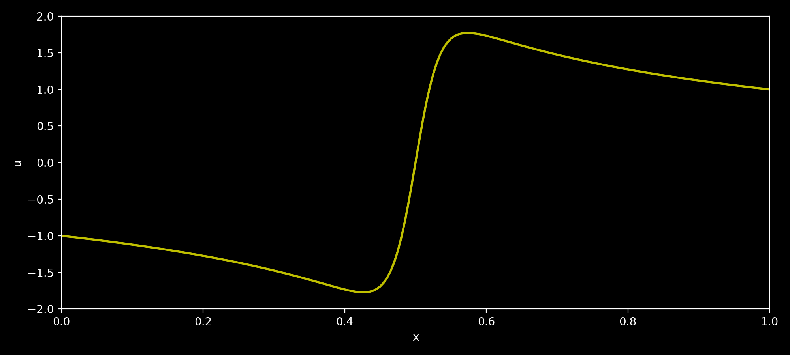

# ОТЧЕТ
## По лабораторной работе 8: Параллелизация явной схемы для одномерного уравнения теплопроводности

### Сведения о студенте
**Дата:** 12.10.2025 
**Семестр:** 1 
**Группа:** ПИН-м-о-25-1 
**Дисциплина:** Параллельные вычисления 
**Студент:** Джабраилов Тимур Султанович

---

## 1. Цель работы
Освоить методы распараллеливания алгоритмов решения уравнений в частных производных на примере явной схемы для одномерного уравнения теплопроводности. Изучить особенности распределения данных и организации коммуникаций между процессами при решении сеточных задач. Сравнить эффективность различных подходов к распараллеливанию.

## 2. Теоретическая часть
### 2.1. Основные понятия и алгоритмы
Рассматривается начально-краевая задача для уравнения параболического типа:

$$ \begin{cases} \varepsilon \frac{\partial^2 u}{\partial x^2} - \frac{\partial u}{\partial t} = -u \frac{\partial u}
{\partial x} - u^3, & x \in (a,b), , t \in (t_0,T], \ u(a,t) = u_{\text{left}}(t), & u(b,t) = u_{\text{right}}(t), , t \in (t_0,T],
\ u(x,t_0) = u_{\text{init}}(x), & x \in [a,b]. \end{cases} $$

Для численного решения используется явная схема:

$$ u_{n}^{m+1} = u_{n}^{m} + \varepsilon \frac{\tau}{h^2} \left( u_{n+1}^{m} - 2u_{n}^{m} + u_{n-1}^{m}
\right) + \frac{\tau}{2h} u_{n}^{m} \left( u_{n+1}^{m} - u_{n-1}^{m} \right) + \tau (u_{n}^{m})^3 $$

## 3. Практическая реализация
### 3.1. Структура программы
Программа решает одномерное уравнение в частных производных (типа Бюргерса или реакционно-диффузионного) с заданными начальными и граничными условиями. Архитектура построена пошагово: создаются сетки по времени и пространству, инициализируется массив решения, затем в цикле по времени выполняется явная разностная схема, обновляющая значения функции u. В конце вычисляется время выполнения и сохраняются результаты.

### 3.2. Ключевые особенности реализации
Ключевые особенности реализации — использование NumPy для работы с массивами и сетками, а также модульное определение граничных и начальных условий через отдельные функции.

### 3.3. Инструкция по запуску
```bash
# Пример команды для запуска
python main.py
```

## 4. Экспериментальная часть
### 4.1. Тестовые данные
N = 200; M = 20000

### 4.2. Методика измерений
- Intel Core i7 12700H: 6P + 8E ядра (14 ядер)
- DDR4 32GB оперативной памяти
- 5 запусков

### 4.3. Результаты измерений
#### Таблица 1. Время выполнения (секунды)
|numprocs|N  |M    |time  |
|--------|---|-----|------|
|1       |200|20000|4.5159|

### 5.1 Визуализация резульатата

Результат расчётов в виде графика x и u

## 9. Приложения
### 9.1. Исходный код
```python
from numpy import empty, linspace, sin, pi
import time

def u_init(x) :
    u_init = sin(3*pi*(x - 1/6))
    return u_init

def u_left(t) :
    u_left = -1.
    return u_left

def u_right(t) :
    u_right = 1.
    return u_right

start_time = time.time()

a = 0.; b = 1.
t_0 = 0.; T = 6.0

eps = 10**(-1.5)

N = 200; M = 20000

h = (b - a)/N; x = linspace(a, b, N+1)
tau = (T - t_0)/M; t = linspace(t_0, T, M+1)

u = empty((M + 1, N + 1))

for n in range(N + 1) :
    u[0, n] = u_init(x[n])
    
for m in range(1, M + 1) :
    u[m, 0] = u_left(t[m])
    u[m, N] = u_right(t[m])
    
for m in range(M) :
    for n in range(1, N) :
        u[m+1, n] = u[m,n] + eps*tau/h**2*(u[m,n+1] - 2*u[m,n] + u[m,n-1]) + \
            tau/(2*h)*u[m,n]*(u[m,n+1] - u[m,n-1]) + tau*u[m,n]**3

end_time = time.time()

print('Elapsed time is {:.4f} sec'.format(end_time-start_time))

from numpy import savez
savez('results_of_calculations', x=x, u=u)
```

### 9.2. Используемые библиотеки и версии
- Python 3.8+
- mpi4py 3.1.+
- NumPy 1.21.+
- OpenMPI 4.1.+

### 9.3. Рекомендуемая литература
Фундаментальные исследования (с аннотациями):
1. Hockney, R. W., & Jesshope, C. R. (1988). Parallel Computers 2: Architecture, Programming and
Algorithms. Adam Hilger.
Аннотация: Классическая работа, посвящённая архитектуре параллельных вычислительных
систем и алгоритмам для них. Содержит глубокий анализ методов распараллеливания сеточных
задач, включая явные и неявные схемы для уравнений в частных производных.
2. Ortega, J. M. (1988). Introduction to Parallel and Vector Solution of Linear Systems. Springer.
Аннотация: Фундаментальное введение в методы решения систем линейных уравнений на
параллельных архитектурах. Особое внимание уделяется алгоритмам для разреженных матриц и
их применению в задачах математической физики.
3. Gustafsson, B. (2008). High Order Difference Methods for Time Dependent PDE. Springer.
Аннотация: Монография, посвящённая численным методам высокого порядка точности для
решения уравнений в частных производных. Содержит анализ устойчивости и сходимости
разностных схем, а также вопросы их распараллеливания.
Практические руководства (с аннотациями):
1. Gropp, W., Lusk, E., & Skjellum, A. (2014). Using MPI: Portable Parallel Programming with the
Message-Passing Interface. MIT Press.
Аннотация: Практическое руководство по программированию с использованием MPI. Содержит
примеры реализации распределённых алгоритмов, включая задачи для УрЧП и методы
организации коммуникаций.
2. Pacheco, P. (2011). An Introduction to Parallel Programming. Morgan Kaufmann.
Аннотация: Учебник, ориентированный на практическое освоение параллельного
программирования. Включает разделы по MPI и примеры распараллеливания сеточных методов.
3. Dongarra, J. J., et al. (1998). Numerical Linear Algebra for High-Performance Computers. SIAM.
Аннотация: Сборник практических рекомендаций по реализации алгоритмов линейной алгебры
на высокопроизводительных системах. Содержит оптимизированные реализации методов для

---

*Отчет подготовлен в рамках курса "Параллельные вычисления"*