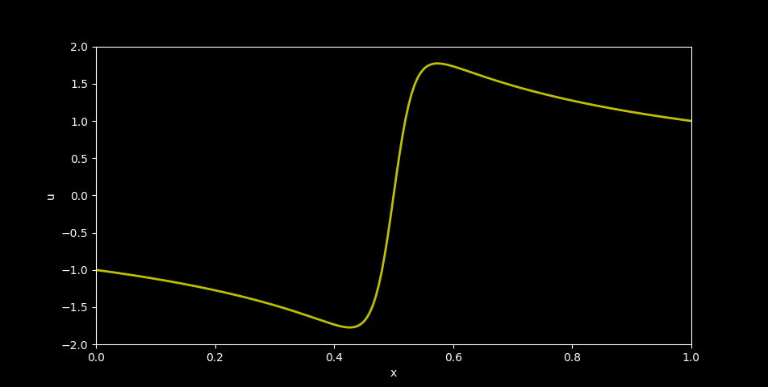
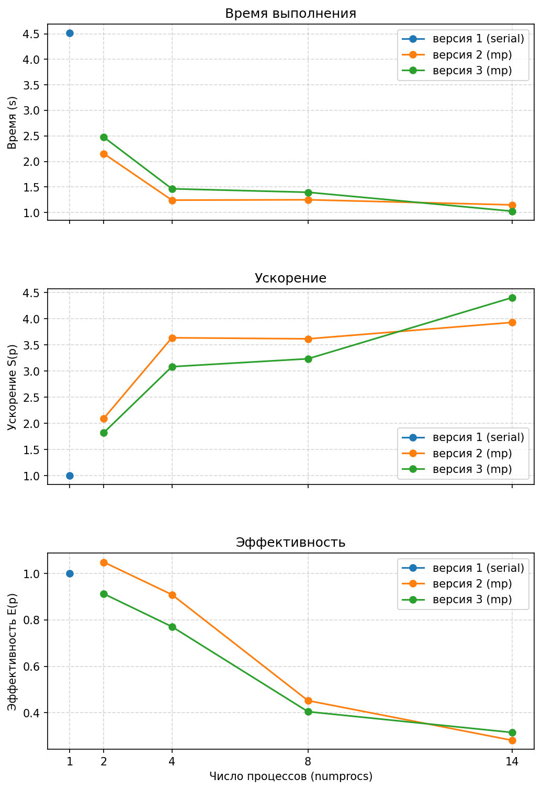

# ОТЧЕТ
## По лабораторной работе 8: Параллелизация явной схемы для одномерного уравнения теплопроводности

### Сведения о студенте
**Дата:** 12.10.2025 
**Семестр:** 1 
**Группа:** ПИН-м-о-25-1 
**Дисциплина:** Параллельные вычисления 
**Студент:** Джабраилов Тимур Султанович

---

## 1. Цель работы
Освоить методы распараллеливания алгоритмов решения уравнений в частных производных на примере явной схемы для одномерного уравнения теплопроводности. Изучить особенности распределения данных и организации коммуникаций между процессами при решении сеточных задач. Сравнить эффективность различных подходов к распараллеливанию.

## 2. Теоретическая часть
### 2.1. Основные понятия и алгоритмы
Рассматривается начально-краевая задача для уравнения параболического типа:
$$ \begin{cases} \varepsilon \frac{\partial^2 u}{\partial x^2} - \frac{\partial u}{\partial t} = -u \frac{\partial u}
{\partial x} - u^3, & x \in (a,b), , t \in (t_0,T], \ u(a,t) = u_{\text{left}}(t), & u(b,t) = u_{\text{right}}(t), , t \in (t_0,T],
\ u(x,t_0) = u_{\text{init}}(x), & x \in [a,b]. \end{cases} $$
Для численного решения используется явная схема:
$$ u_{n}^{m+1} = u_{n}^{m} + \varepsilon \frac{\tau}{h^2} \left( u_{n+1}^{m} - 2u_{n}^{m} + u_{n-1}^{m}
\right) + \frac{\tau}{2h} u_{n}^{m} \left( u_{n+1}^{m} - u_{n-1}^{m} \right) + \tau (u_{n}^{m})^3 $$

### 2.2. Используемые функции MPI
# Функции MPI, используемые в коде
- Get_size()
- Get_rank()
- Create_cart()
- Get_rank()
- Wtime()
- Scatter()
- Gatherv()
- Sendrecv()

## 3. Практическая реализация
### 3.1. Структура программы
Программа параллельно решает ту же одномерную КУЧП с помощью mpi4py, но использует декартову топологию: создаётся comm_cart = comm.Create_cart(...), сетка по пространству делится между процессами, и каждый процесс инициализирует свою локальную под-сеть

### 3.2. Ключевые особенности реализации
Ключевые особенности и отличия от предыдущей версии: используется декартов коммуникатор и точечно-точечный обмен Sendrecv для передачи соседних значений вместо каждотактного Scatterv/Gatherv — это уменьшает объём коллективной передачи и делает обмен локальным между соседями.

### 3.3. Инструкция по запуску
```bash
# Пример команды для запуска
mpiexec -n 14 python main.py
```

## 4. Экспериментальная часть
### 4.1. Тестовые данные
N = 200; M = 20000

### 4.2. Методика измерений
- Intel Core i7 12700H: 6P + 8E ядра (14 ядер)
- DDR4 32GB оперативной памяти
- 5 запусков

### 4.3. Результаты измерений
#### Таблица 1. Время выполнения (секунды)
|program|numprocs|N    |M     |time              |speedup           |efficiency         |
|-------|--------|-----|------|------------------|------------------|-------------------|
|lr8-1  |1       |200  |20000 |4.5159            |1.0               |1.0                |
|lr8-2  |2       |200  |20000 |2.152355500031262 |2.098119943445406 |1.049059971722703  |
|lr8-2  |4       |200  |20000 |1.2417560999747366|3.6367045026731706|0.9091761256682926 |
|lr8-2  |8       |200  |20000 |1.248762400005944 |3.61630042670928  |0.45203755333866   |
|lr8-2  |14      |200  |20000 |1.1489999999757856|3.930287206349147 |0.2807348004535105 |
|lr8-3  |2       |200  |20000 |2.474569599959068 |1.824923412974401 |0.9124617064872005 |
|lr8-3  |4       |200  |20000 |1.4641160999890417|3.0843865455982624|0.7710966363995656 |
|lr8-3  |8       |200  |20000 |1.3958173000719398|3.235308804216177 |0.40441360052702213|
|lr8-3  |14      |200  |20000 |1.025291100027971 |4.404505217958882 |0.3146075155684916 |

## 5. Визуализация результатов


Результат расчётов в виде графика x и u



Результат замера провоидтельности

## 6. Анализ результатов
### 6.1. Анализ производительности
Проанализировав производительность данных программ, можно понять, что обе многопоточные программы, дают заметный выйгрыш в производительности. Пример lr8-2 при маленьком наборе процессов показывает повышеное ускорение и эффективность, однако при увеличении кол-ва процессов и тем более, если увеличить количество узлов вычисления в сети пример lr8-3 покажет значительный выйгрыш засчёт того, что у него меньше накладных расходов.

### 6.2. Сравнение с теоретическими оценками
Практические результаты совпадают с теоретическими оценками.

### 6.3. Выявление узких мест
Узкое место в примере lr8-2 - это накладные расходы при увеличении кол-ва узлов.

## 7. Ответы на контрольные вопросы
### 1. Как выводится явная схема для 1D уравнения теплопроводности и в чём её смысл?

Дискретизация по времени ( t ) и пространству ( x ) даёт:

[
u_i^{n+1} = u_i^n + \alpha \frac{\Delta t}{\Delta x^2} (u_{i+1}^n - 2u_i^n + u_{i-1}^n)
]

**Смысл:** следующий временной слой вычисляется через локальную комбинацию соседних пространственных точек — легко распараллеливается по точкам.

### 2. Какое ограничение по шагу времени обеспечивает устойчивость явной схемы (CFL-условие)?

Условие Куранта–Фридрихса–Леви:

[
\Delta t \le \frac{\Delta x^2}{2\alpha}
]

(для 1D).
При нарушении — **численная неустойчивость** (рост ошибки).

### 3. Как делится область на процессы при одномерной декомпозиции и что передаётся между соседями?

* Деление по отрезку ( x ): каждому процессу — непрерывный блок узлов.
* Между соседями передаются **граничные (halo/ghost) значения** — по одному/нескольким элементам с каждой стороны на каждом временном шаге.

### 4. Какие MPI-вызовы наиболее естественны для обмена halo-данными?

* `MPI_Sendrecv` / `MPI_Sendrecv_replace` — для парного обмена с левым и правым соседом.
* Неблокирующие `MPI_Isend` / `MPI_Irecv` + `MPI_Waitall` — для **перекрытия коммуникаций и вычислений**.

### 5. Как перекрыть коммуникации вычислениями в явной схеме?

1. Инициализировать неблокирующие передачи (`Isend`/`Irecv`) граничных данных.
2. Выполнять обновление **внутренних узлов** (без краёв).
3. После завершения коммуникаций (`Wait`) — обновить **граничные узлы**.

→ Это обеспечивает перекрытие и ускорение при достаточно большой вычислительной нагрузке на процесс.

### 6. Какие граничные условия обычно используются и как их учесть в параллельной версии?

* **Дирихле:** фиксированные значения — крайние точки задаются и **не передаются**.
* **Нейман:** фиксированная производная — требуется передача виртуальных точек или одноточечные аппроксимации на границе.

В параллельной версии учёт аналогичен, только **крайние процессы** применяют специальные формулы.

### 7. Почему явная схема проста для масштабирования, но не всегда эффективна?

**Плюсы:**

* Локальность вычислений → минимальные обмены между процессами.

**Минусы:**

* Жёсткое ограничение по ( \Delta t ) → требуется **много временных шагов**,
  что увеличивает общее время вычислений при жёстких задачах.

### 8. Как оценить объём коммуникаций при одномерной декомпозиции?

* На каждом временном шаге передаётся ( O(1) ) элементов на границу с каждым соседом.
* Количество сообщений ~ числу процессов,
  а общий объём ~ (число временных шагов × число границ).

При **сильной масштабируемости** коммуникация на процесс ≈ постоянна,
при **слабой** — растёт.

### 9. Какие оптимизации применимы к явной схеме на MPI?

* Агрегация сообщений (передавать массивы вместо отдельных значений).
* Неблокирующие операции.
* Минимизация синхронизаций (локальные шаги).
* Использование эффективных `memcpy`/контейнеров.
* Оптимальное разбиение данных и баланс нагрузки.

### 10. Как тестировать корректность и производительность?

* **Корректность:**

  * Сравнение с аналитическим решением (например, задачи с известной формулой).
  * Проверка сохранения энергии/массы.

* **Производительность:**

  * Измерение времени при разных ( N ) и ( P ).
  * Построение графиков ускорения и эффективности.

## 8. Заключение
### 8.1. Выводы
В ходе данной лабораторной работы были получены навыки работы с решения уравнений в частных производных на примере явной схемы для одномерного уравнения теплопроводности. Были изучены разные способы реализции расчётов, эффективнее всего из которых оказался способ с наименьшими накладными расходами.

## 9. Приложения
### 9.1. Исходный код
```python
from mpi4py import MPI
from numpy import empty, array, int32, float64, linspace, sin, pi
from matplotlib.pyplot import style, figure, axes, show

comm = MPI.COMM_WORLD
numprocs = comm.Get_size()
rank = comm.Get_rank()

comm_cart = comm.Create_cart(dims=[numprocs], periods=[False], reorder=True)
rank_cart = comm_cart.Get_rank()

def u_init(x) :
    u_init = sin(3*pi*(x - 1/6))
    return u_init

def u_left(t) :
    u_left = -1.
    return u_left

def u_right(t) :
    u_right = 1.
    return u_right

if rank_cart == 0 :
    start_time = MPI.Wtime()

a = 0.; b = 1.
t_0 = 0.; T = 6.0
eps = 10**(-1.5)

N = 800; M = 300000

h = (b - a)/N; x = linspace(a, b, N+1)
tau = (T - t_0)/M; t = linspace(t_0, T, M+1)

if rank_cart == 0 :
    ave, res = divmod(N + 1, numprocs)
    rcounts = empty(numprocs, dtype=int32)
    displs = empty(numprocs, dtype=int32)
    for k in range(0, numprocs) : 
        if k < res :
            rcounts[k] = ave + 1
        else :
            rcounts[k] = ave
        if k == 0 :
            displs[k] = 0
        else :
            displs[k] = displs[k-1] + rcounts[k-1]   
else :
    rcounts = None; displs = None
    
N_part = array(0, dtype=int32)

comm_cart.Scatter([rcounts, 1, MPI.INT], [N_part, 1, MPI.INT], root=0) 

if rank_cart == 0 :
    rcounts_from_0 = empty(numprocs, dtype=int32)
    displs_from_0 = empty(numprocs, dtype=int32)
    rcounts_from_0[0] = rcounts[0] + 1
    displs_from_0[0] = 0
    for k in range(1, numprocs-1) :
        rcounts_from_0[k] = rcounts[k] + 2
        displs_from_0[k] = displs[k] - 1
    rcounts_from_0[numprocs-1] = rcounts[numprocs-1] + 1  
    displs_from_0[numprocs-1] = displs[numprocs-1] - 1
else :
    rcounts_from_0 = None; displs_from_0 = None
    
N_part_aux = array(0, dtype=int32); displ_aux = array(0, dtype=int32)
    
comm_cart.Scatter([rcounts_from_0, 1, MPI.INT], [N_part_aux, 1, MPI.INT], root=0) 
comm_cart.Scatter([displs_from_0, 1, MPI.INT], [displ_aux, 1, MPI.INT], root=0) 
        
u_part_aux = empty((M + 1, N_part_aux), dtype=float64)

for n in range(N_part_aux) :
    u_part_aux[0, n] = u_init(x[displ_aux + n])   
if rank_cart == 0 :
    for m in range(1, M + 1) :
        u_part_aux[m, 0] = u_left(t[m])  
if rank_cart == numprocs-1 :
    for m in range(1, M + 1) :
        u_part_aux[m, N_part_aux - 1] = u_right(t[m])
    
for m in range(M) :
    
    for n in range(1, N_part_aux - 1) :
        u_part_aux[m + 1, n] = u_part_aux[m, n] + \
            eps*tau/h**2*(u_part_aux[m, n+1] - 2*u_part_aux[m, n] + u_part_aux[m, n-1]) + \
                tau/(2*h)*u_part_aux[m, n]*(u_part_aux[m, n+1] - u_part_aux[m, n-1]) + \
                    tau*u_part_aux[m, n]**3
                
    if rank_cart == 0 :
        comm_cart.Sendrecv(sendbuf=[u_part_aux[m+1, N_part_aux-2], 1, MPI.DOUBLE], 
                           dest=1, sendtag=0, 
                           recvbuf=[u_part_aux[m+1, N_part_aux-1:], 1, MPI.DOUBLE], 
                           source=1, recvtag=MPI.ANY_TAG, status=None)
    if rank_cart in range(1, numprocs-1) :
        comm_cart.Sendrecv(sendbuf=[u_part_aux[m+1, 1], 1, MPI.DOUBLE], 
                           dest=rank_cart-1, sendtag=0, 
                           recvbuf=[u_part_aux[m+1, 0:], 1, MPI.DOUBLE], 
                           source=rank_cart-1, recvtag=MPI.ANY_TAG, status=None)
        comm_cart.Sendrecv(sendbuf=[u_part_aux[m+1, N_part_aux-2], 1, MPI.DOUBLE], 
                           dest=rank_cart+1, sendtag=0, 
                           recvbuf=[u_part_aux[m+1, N_part_aux-1:], 1, MPI.DOUBLE], 
                           source=rank_cart+1, recvtag=MPI.ANY_TAG, status=None)
    if rank_cart == numprocs-1 :
        comm_cart.Sendrecv(sendbuf=[u_part_aux[m+1, 1], 1, MPI.DOUBLE], 
                           dest=numprocs-2, sendtag=0, 
                           recvbuf=[u_part_aux[m+1, 0:], 1, MPI.DOUBLE], 
                           source=numprocs-2, recvtag=MPI.ANY_TAG, status=None)
        
if rank_cart == 0 :
    u_T = empty(N+1, dtype=float64)
else : 
    u_T = None

if rank_cart == 0 :
    comm_cart.Gatherv([u_part_aux[M, 0:N_part_aux-1], N_part, MPI.DOUBLE], 
                      [u_T, rcounts, displs, MPI.DOUBLE], root=0)
if rank_cart in range(1, numprocs-1) :
    comm_cart.Gatherv([u_part_aux[M, 1:N_part_aux-1], N_part, MPI.DOUBLE], 
                      [u_T, rcounts, displs, MPI.DOUBLE], root=0)
if rank_cart == numprocs-1 :
    comm_cart.Gatherv([u_part_aux[M, 1:N_part_aux], N_part, MPI.DOUBLE], 
                      [u_T, rcounts, displs, MPI.DOUBLE], root=0)
    
if rank_cart == 0 :
    
    end_time = MPI.Wtime()
    print('N={}, M={}'.format(N, M))
    print('Number of MPI process is {}'.format(numprocs))
    print('Elapsed time is {:.4f} sec.'.format(end_time-start_time))
    
    style.use('dark_background')
    fig = figure()
    ax = axes(xlim=(a,b), ylim=(-2.0, 2.0))
    ax.set_xlabel('x'); ax.set_ylabel('u')
    ax.plot(x,u_T, color='y', ls='-', lw=2)
    show()
```

### 9.2. Используемые библиотеки и версии
- Python 3.8+
- mpi4py 3.1.+
- NumPy 1.21.+
- OpenMPI 4.1.+

### 9.3. Рекомендуемая литература
Фундаментальные исследования (с аннотациями):
1. Hockney, R. W., & Jesshope, C. R. (1988). Parallel Computers 2: Architecture, Programming and
Algorithms. Adam Hilger.
Аннотация: Классическая работа, посвящённая архитектуре параллельных вычислительных
систем и алгоритмам для них. Содержит глубокий анализ методов распараллеливания сеточных
задач, включая явные и неявные схемы для уравнений в частных производных.
2. Ortega, J. M. (1988). Introduction to Parallel and Vector Solution of Linear Systems. Springer.
Аннотация: Фундаментальное введение в методы решения систем линейных уравнений на
параллельных архитектурах. Особое внимание уделяется алгоритмам для разреженных матриц и
их применению в задачах математической физики.
3. Gustafsson, B. (2008). High Order Difference Methods for Time Dependent PDE. Springer.
Аннотация: Монография, посвящённая численным методам высокого порядка точности для
решения уравнений в частных производных. Содержит анализ устойчивости и сходимости
разностных схем, а также вопросы их распараллеливания.
Практические руководства (с аннотациями):
1. Gropp, W., Lusk, E., & Skjellum, A. (2014). Using MPI: Portable Parallel Programming with the
Message-Passing Interface. MIT Press.
Аннотация: Практическое руководство по программированию с использованием MPI. Содержит
примеры реализации распределённых алгоритмов, включая задачи для УрЧП и методы
организации коммуникаций.
2. Pacheco, P. (2011). An Introduction to Parallel Programming. Morgan Kaufmann.
Аннотация: Учебник, ориентированный на практическое освоение параллельного
программирования. Включает разделы по MPI и примеры распараллеливания сеточных методов.
3. Dongarra, J. J., et al. (1998). Numerical Linear Algebra for High-Performance Computers. SIAM.
Аннотация: Сборник практических рекомендаций по реализации алгоритмов линейной алгебры
на высокопроизводительных системах. Содержит оптимизированные реализации методов для

---

*Отчет подготовлен в рамках курса "Параллельные вычисления"*