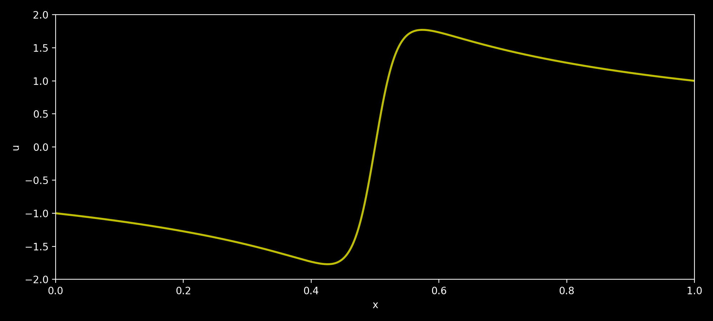

# ОТЧЕТ
## По лабораторной работе 9: Параллелизация неявной схемы для одномерного уравнения теплопроводности

### Сведения о студенте
**Дата:** 14.10.2025 
**Семестр:** 1 
**Группа:** ПИН-м-о-25-1 
**Дисциплина:** Параллельные вычисления 
**Студент:** Джабраилов Тимур Султанович

---

## 1. Цель работы
Освоить методы распараллеливания алгоритмов решения уравнений в частных производных с использованием неявных схем. Реализовать параллельную версию метода Розенброка (ROS1) для решения одномерного уравнения теплопроводности. Исследовать эффективность параллельной реализации по сравнению с последовательной версией.

## 2. Теоретическая часть
### 2.1. Основные понятия и алгоритмы
Рассматривается начально-краевая задача для уравнения параболического типа:
$$ \begin{cases} \frac{\partial^2 u}{\partial x^2} - \frac{\partial u}{\partial t} = -u \frac{\partial u}{\partial x} -
u^3, & x \in (a,b), , t \in (t_0,T], \ u(a,t) = u_{\text{left}}(t), & u(b,t) = u_{\text{right}}(t), , t \in (t_0,T], \ u(x,t_0) =
u_{\text{init}}(x), & x \in [a,b]. \end{cases} $$
Для численного решения используется неявная схема ROS1: $$ \left[ E - \alpha \tau f_y(\vec{y}_m, t_m)
\right] \vec{w}_1 = f(\vec{y}m, t_m + \frac{\tau}{2}), \quad \vec{y}{m+1} = \vec{y}_m + \tau \cdot \text{Re}
(\vec{w}_1). $$

## 3. Практическая реализация
### 3.1. Структура программы
Программа решает одномерную нелинейную КУЧП численно на равномерной сетке: задаются параметры и сетки по `x` и `t`, инициализируется поле `u` и вектор внутренних узлов `y`. Во временном цикле для текущего y формируются диагонали трёхдиагональной матрицы через `diagonals_preparation`, вычисляется правая часть `f` в полушаге `t + r/2`, решается трёхдиагонная система методом Томаса `consecutive_tridiagonal_matrix_algorithm` для получения приращения `w1`, затем y обновляется как `y += rw1`​. Краевые значения вставляются в крайние ячейки массива `u`.

### 3.2. Ключевые особенности реализации
Линейная система решается специализированным последовательным трёхдиагональным алгоритмом (Thomas) с модификацией диагоналей на месте.

### 3.3. Инструкция по запуску
```bash
mpiexec -n 4 pythoon src/main.py
```

## 4. Экспериментальная часть
### 4.1. Тестовые данные
N = 200; M = 300; alpha = 0.5 

### 4.2. Методика измерений
- Intel Core i7 12700H: 6P + 8E ядра (14 ядер)
- DDR4 32GB оперативной памяти
- 5 запусков

### 4.3. Результаты измерений
#### Таблица 1. Замеры последовательной программы
|numprocs|N  |M    |time|speedup|efficiency|
|--------|---|-----|----|-------|----------|
|1       |200|20000|10.6|1      |1         |

### 5.1 Визуализация резульатата


Результат расчётов в виде графика

## 9. Приложения
### 9.1. Исходный код
```python
from numpy import empty, linspace, sin, pi, float64
import time

def u_init(x) :
    u_init = sin(3*pi*(x - 1/6))
    return u_init

def u_left(t) :
    u_left = -1.
    return u_left

def u_right(t) :
    u_right = 1.
    return u_right

def consecutive_tridiagonal_matrix_algorithm(a, b, c, d) :
    
    N = len(d)
    
    x = empty(N, dtype=float64)

    for n in range(1, N) :
        coef = a[n]/b[n-1]
        b[n] = b[n] - coef*c[n-1]
        d[n] = d[n] - coef*d[n-1]
    
    x[N-1] = d[N-1]/b[N-1]
    
    for n in range(N-2, -1, -1) :
        x[n] = (d[n] - c[n]*x[n+1])/b[n]
        
    return x

def f(y, t, h, N, u_left, u_right, eps) :
    f = empty(N-1, dtype=float64)
    f[0] = eps*(y[1] - 2*y[0] + u_left(t))/h**2 + y[0]*(y[1] - u_left(t))/(2*h) + y[0]**3
    for n in range(1, N-2) :
        f[n] = eps*(y[n+1] - 2*y[n] + y[n-1])/h**2 + y[n]*(y[n+1] - y[n-1])/(2*h) + y[n]**3
    f[N-2] = eps*(u_right(t) - 2*y[N-2] + y[N-3])/h**2 + y[N-2]*(u_right(t) - y[N-3])/(2*h) + y[N-2]**3
    return f

def diagonals_preparation(y, t, h, N, u_left, u_right, eps, tau, alpha) :

    a = empty(N-1, dtype=float64)
    b = empty(N-1, dtype=float64)
    c = empty(N-1, dtype=float64)
    
    b[0] = 1. - alpha*tau*(-2*eps/h**2 + (y[1] - u_left(t))/(2*h) + 3*y[0]**2)
    c[0] = - alpha*tau*(eps/h**2 + y[0]/(2*h))
    for n in range(1, N-2) :
        a[n] = - alpha*tau*(eps/h**2 - y[n]/(2*h))
        b[n] = 1. - alpha*tau*(-2*eps/h**2 + (y[n+1] - y[n-1])/(2*h) + 3*y[n]**2)
        c[n] = - alpha*tau*(eps/h**2 + y[n]/(2*h))
    a[N-2] = - alpha*tau*(eps/h**2 - y[N-2]/(2*h))
    b[N-2] = 1. - alpha*tau*(-2*eps/h**2 + (u_right(t) - y[N-3])/(2*h) + 3*y[N-2]**2)
    
    return a, b, c

start_time = time.time()

a = 0.; b = 1.
t_0 = 0.; T = 2.0
eps = 10**(-1.5)

N = 200; M = 300; alpha = 0.5 

h = (b - a)/N; x = linspace(a, b, N+1)
tau = (T - t_0)/M; t = linspace(t_0, T, M+1)

u = empty((M + 1, N + 1))

for n in range(N + 1) :
    u[0, n] = u_init(x[n])
    
y = u_init(x[1:N])

for m in range(M) :
    
    codiagonal_down, diagonal, codiagonal_up = diagonals_preparation(
        y, t[m], h, N, u_left, u_right, eps, tau, alpha)
    w_1 =  consecutive_tridiagonal_matrix_algorithm(
        codiagonal_down, diagonal, codiagonal_up, 
        f(y, t[m]+tau/2, h, N, u_left, u_right, eps))
    y = y + tau*w_1.real

    u[m + 1, 0] = u_left(t[m+1])
    u[m + 1, 1:N] = y
    u[m + 1, N] = u_right(t[m+1])

end_time = time.time()

print('Elapsed time is {:.4f} sec'.format(end_time-start_time))

from numpy import savez
savez('results_of_calculations', x=x, t=t, u=u)
```

### 9.2. Используемые библиотеки и версии
- Python 3.8+
- mpi4py 3.1.+
- NumPy 1.21.+
- OpenMPI 4.1.+

### 9.3. Рекомендуемая литература
Фундаментальные исследования (с аннотациями):
1. Hockney, R. W., & Jesshope, C. R. (1988). Parallel Computers 2: Architecture, Programming and
Algorithms. Adam Hilger.
Аннотация: Классическая работа, посвящённая архитектуре параллельных вычислительных
систем и алгоритмам для них. Содержит глубокий анализ методов распараллеливания сеточных
задач, включая явные и неявные схемы для уравнений в частных производных.
2. Ortega, J. M. (1988). Introduction to Parallel and Vector Solution of Linear Systems. Springer.
Аннотация: Фундаментальное введение в методы решения систем линейных уравнений на
параллельных архитектурах. Особое внимание уделяется алгоритмам для разреженных матриц и
их применению в задачах математической физики.
3. Gustafsson, B. (2008). High Order Difference Methods for Time Dependent PDE. Springer.
Аннотация: Монография, посвящённая численным методам высокого порядка точности для
решения уравнений в частных производных. Содержит анализ устойчивости и сходимости
разностных схем, а также вопросы их распараллеливания.
Практические руководства (с аннотациями):
1. Gropp, W., Lusk, E., & Skjellum, A. (2014). Using MPI: Portable Parallel Programming with the
Message-Passing Interface. MIT Press.
Аннотация: Практическое руководство по программированию с использованием MPI. Содержит
примеры реализации распределённых алгоритмов, включая задачи для УрЧП и методы
организации коммуникаций.
2. Pacheco, P. (2011). An Introduction to Parallel Programming. Morgan Kaufmann.
Аннотация: Учебник, ориентированный на практическое освоение параллельного
программирования. Включает разделы по MPI и примеры распараллеливания сеточных методов.
3. Dongarra, J. J., et al. (1998). Numerical Linear Algebra for High-Performance Computers. SIAM.
Аннотация: Сборник практических рекомендаций по реализации алгоритмов линейной алгебры
на высокопроизводительных системах. Содержит оптимизированные реализации методов для

---

*Отчет подготовлен в рамках курса "Параллельные вычисления"*