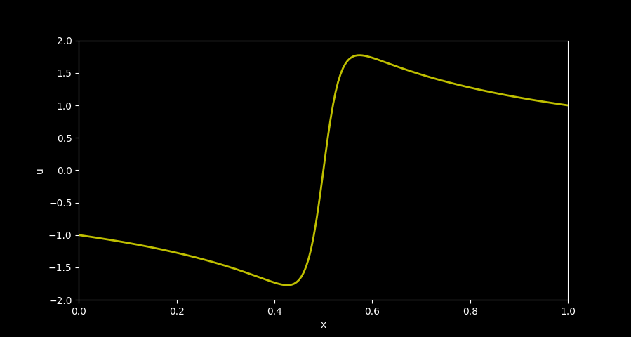
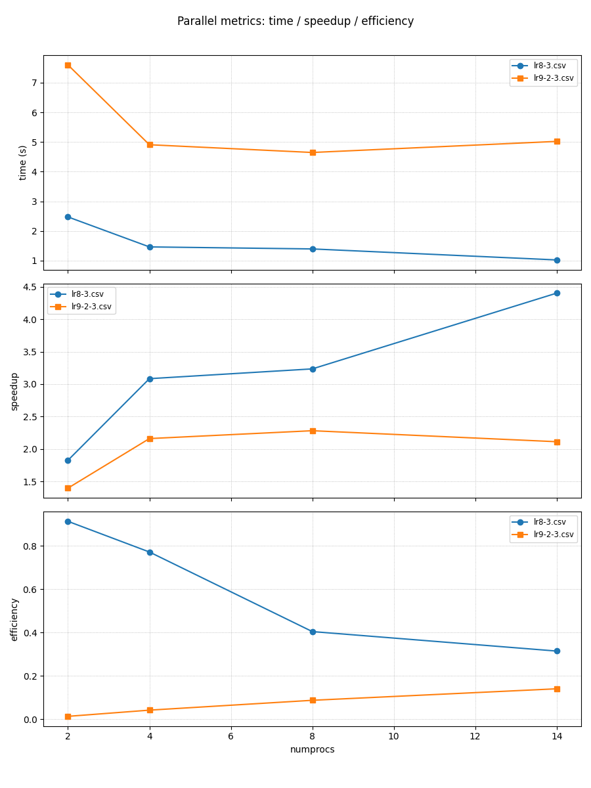

# ОТЧЕТ
## По лабораторной работе 9: Параллелизация неявной схемы для одномерного уравнения теплопроводности

### Сведения о студенте
**Дата:** 14.10.2025 
**Семестр:** 1 
**Группа:** ПИН-м-о-25-1 
**Дисциплина:** Параллельные вычисления 
**Студент:** Джабраилов Тимур Султанович

---

## 1. Цель работы
Освоить методы распараллеливания алгоритмов решения уравнений в частных производных с использованием неявных схем. Реализовать параллельную версию метода Розенброка (ROS1) для решения одномерного уравнения теплопроводности. Исследовать эффективность параллельной реализации по сравнению с последовательной версией.

## 2. Теоретическая часть
### 2.1. Основные понятия и алгоритмы
Рассматривается начально-краевая задача для уравнения параболического типа:
$$ \begin{cases} \frac{\partial^2 u}{\partial x^2} - \frac{\partial u}{\partial t} = -u \frac{\partial u}{\partial x} -
u^3, & x \in (a,b), , t \in (t_0,T], \ u(a,t) = u_{\text{left}}(t), & u(b,t) = u_{\text{right}}(t), , t \in (t_0,T], \ u(x,t_0) =
u_{\text{init}}(x), & x \in [a,b]. \end{cases} $$
Для численного решения используется неявная схема ROS1: $$ \left[ E - \alpha \tau f_y(\vec{y}_m, t_m)
\right] \vec{w}_1 = f(\vec{y}m, t_m + \frac{\tau}{2}), \quad \vec{y}{m+1} = \vec{y}_m + \tau \cdot \text{Re}
(\vec{w}_1). $$

### 2.2. Используемые функции MPI
- comm.Get_size() - получение количества процессов в коммуникаторе
- comm.Create_cart() - создание декартовой топологии коммуникатора
- comm_cart.Get_rank() - получение ранга процесса в коммуникаторе
- comm_cart.Recv() - блокирующий прием сообщения
- comm_cart.Sendrecv() - комбинированная операция отправки и приема
- comm_cart.Send() - блокирующая отправка сообщения
- comm_cart.Gather() - сбор данных от всех процессов в один процесс
- comm_cart.Scatterv() - распределение данных с различным количеством элементов для каждого процесса
- comm_cart.Scatter() - распределение данных от одного процесса всем процессам
- comm_cart.Gatherv() - сбор данных с различным количеством элементов от каждого процесса
- MPI.Wtime() - получение текущего времени (для замера производительности)

## 3. Практическая реализация
### 3.1. Структура программы
Программа решает ту же одномерную нелинейную краевой задачу на равномерной сетке в параллельном режиме с использованием `mpi4py` и декартовой топологии. Сначала процессы делят пространственную сетку и инициализируют локальные буферы `u_part_aux` (хранят всю локальную временную историю сегмента). В каждом временном шаге формируются локальные диагонали и правая часть, затем вызывается `parallel_tridiagonal_matrix_algorithm` для решения трёхдиагонной системы по всему домену в параллели; после обновления внутренних узлов выполняется обмен значениями с соседями через `Sendrecv`.

### 3.2. Ключевые особенности реализации
вместо глобального `Scatterv/Gatherv` на каждом шаге используется комбинированный обмен (точечно-точечные `Sendrecv` + `Gather/Scatterv` для компактного редуцированного решения), что сложнее в реализации, но снижает объём глобальной передачи больших блоков и распределяет нагрузку решения трёхдиагонной системы между процессами.

### 3.3. Инструкция по запуску
```bash
mpiexec -n 4 pythoon src/main.py
```

## 4. Экспериментальная часть
### 4.1. Тестовые данные
N = 200; M = 300; alpha = 0.5 

### 4.2. Методика измерений
- Intel Core i7 12700H: 6P + 8E ядра (14 ядер)
- DDR4 32GB оперативной памяти
- 5 запусков

### 4.3. Результаты измерений
#### Таблица 1. Замеры производительности параллельной программы lr9-2-3.csv
|numprocs|N  |M    |time|speedup|efficiency|
|--------|---|-----|----|-------|----------|
|2       |2000|2000 |7.246879100101069|1.4626986118551595|0.0014612373744806789|
|4       |2000|2000 |4.3471389000769705|2.438385394083524|0.004867036714737573|
|8       |2000|2000 |3.164227499975823|3.349948763191329|0.013346409415104897|
|14      |2000|2000 |2.290876599960029|4.6270497503815555|0.03235699126140948|
|2       |200|20000|7.233111900044605|1.4654826506879606|0.014509729214732283|
|4       |200|20000|4.622860600007698|2.2929525497659067|0.044959853916978564|
|8       |200|20000|4.55556709994562|2.3268233718095237|0.08949320660805861|
|14      |200|20000|4.915129299974069|2.1566065413693027|0.1437737694246202|
|2       |20000|200  |7.6241303000133485|1.3903225132421255|0.00013901834948926362|
|4       |20000|200  |4.198274799971841|2.5248466346393275|0.0005048683532572141|
|8       |20000|200  |2.915661499951966|3.635538624828235|0.0014536339963327608|
|14      |20000|200  |2.121317199897021|4.996895325467863|0.0034967776945191483|

#### Таблица 2. Замеры производительности lr8-3.csv
|numprocs|N  |M    |time|speedup|efficiency|
|--------|---|-----|----|-------|----------|
|2       |200|20000|2.474569599959068|1.824923412974401|0.9124617064872005|
|4       |200|20000|1.4641160999890417|3.0843865455982624|0.7710966363995656|
|8       |200|20000|1.3958173000719398|3.235308804216177|0.40441360052702213|
|14      |200|20000|1.025291100027971|4.404505217958882|0.3146075155684916|


### 5.1 Визуализация резульатата


Результат расчётов в виде графика



Замеры производительности lr9-1, lr8-3 и lr9-2-3

### 6.1 Анализ результатов
#### 6.1.1 Анализ эффектвности и ускорения
При увеличении числа процессов speedup растёт, но эффективность падает — классическое сильное масштабирование, где коммуникация/синхронизация начинает доминировать. Лучшее масштабирование у lr9 достигается при (N=20000, M=200): при 14 процессах скорость увеличивается почти в 5 раз.

#### 6.1.2 Влияние параметров N и M
Форма блока (отношение N:M) сильно влияет на масштабируемость. При очень «длинных» блоках в одном измерении (N=20000, M=200) масштабирование лучше, чем при N=200, M=20000. Это говорит о том, что коммуникационные границы (длина границы между соседями, количество граничных элементов, частота обменов) и/или способ разбиения по ранкам (строками/столбцами) существенно влияют на overhead. Если разбиение порождает много коротких, длинных сообщений или большое число соседей — коммуникация растёт.

#### 6.1.3 Сравнение явной и неявной схемы
По всем числам процессов lr8 быстрее: отношения времени lr9 к lr8 для numprocs = 2,4,8,14 примерно = 2.92, 3.16, 3.26, 4.79 соответственно. Неявные схемы используют глобальные операции, что увеличивает синхронизацию и объём общения между процессами.

## 7 Ответы на контрольные вопросы
1. **Какие варианты декомпозиции области используются для 2D-задачи?**
   Одномерное - разрез по строкам или столбцам и двумерное разбиение на блоки. Двумерная декомпозиция лучше уменьшает граничный или коммуникационный объём при большем числе процессов.

2. **Какие данные нужно обменивать между соседями в 2D-разбиении?**
   Гало-слои: строки или столбцы узлов по четырём направлениям вверх, вниз, влево и вправо. При схеме с шириной граничных слоёв >1 - обмены увеличиваются. 

3. **Как реализовать обмен halo-данных эффективно?**
   Использовать `Sendrecv` или `Isend` + `Irecv` по направлениям, агрегировать передачи (отправлять смежные блоки одной операцией), применять временные буферы и пытаться перекрыть вычисления внутренних точек с коммуникациями краёв. 

4. **В чём преимущество двумерной декомпозиции для 2D-задач?**
   Снижается отношение периметра блока к его площади - меньше коммуникаций на единицу вычислений при росте числа процессов. Улучшается локальность. 

5. **Какие проблемы возникают с балансом нагрузки?**
   Если размеры сетки не кратны числу блоков, возникают «краевые» процессы с меньшим объёмом работы - дисбаланс. Требуется аккуратный расчёт counts и displs или использование распределения с учётом остатков. 

6. **Как учитывать граничные условия в 2D-параллели?**
   Процессы на физических границах применяют граничные формулы; при периодических условиях - используют wrap-around (тор), что легко задать в декартовой топологии.

7. **Когда имеет смысл использовать виртуальную топологию (Create_cart) для 2D-задачи?**
   Когда коммуникации регулярны (соседи по 4 направлениям). `Create_cart` даёт удобный доступ к соседям с помощью `Shift` и позволяет MPI попытаться оптимально сопоставить ранги с физической сетью. 

8. **Какие измерения проводить при сравнении одномерной и двумерной декомпозиций?**
   Время выполнения, ускорение, эффективность, объём переданных данных, нагрузочный баланс при разном P (4,9,16...). Строят графики и сравнивают пороги, где одна схема лучше другой. 

9. **Какие оптимизации особенно важны для 2D-задач?**
   Агрегация сообщений, перекрытие коммуникаций, выбор P_row * P_col с учётом сетки и сети, использование неблокирующих или постоянных коммуникаций.

10. **Практические замечания по отладки и тестированию 2D-версии**
    Тестировать на небольших конфигурациях с известным решением; проверять корректность обмена (напр., заполнить локальные блоки уникальными метками и проследить их распространение); профилировать коммуникации и время ожидания. 

## 8. Заключение
### 8.1. Выводы
В ходе данной лабораторной работы была разработанна программа распараллеливания решения уравнений в частных производных с использованием неявных схем. Однако подход с неявными схемами показал меньшую эффективность, чем подход с явными схемами при имеющимся наборе данных и тестового оборудования.

## 9. Приложения
### 9.1. Исходный код
```python
from mpi4py import MPI
from numpy import empty, array, int32, float64, linspace, sin, pi
from matplotlib.pyplot import style, figure, axes, show

comm = MPI.COMM_WORLD
numprocs = comm.Get_size()

comm_cart = comm.Create_cart(dims=[numprocs], periods=[False], reorder=True)
rank_cart = comm_cart.Get_rank()

def u_init(x) :
    u_init = sin(3*pi*(x - 1/6))
    return u_init

def u_left(t) :
    u_left = -1.
    return u_left

def u_right(t) :
    u_right = 1.
    return u_right

def consecutive_tridiagonal_matrix_algorithm(a, b, c, d) :
    
    N = len(d)
    
    x = empty(N, dtype=float64)

    for n in range(1, N) :
        coef = a[n]/b[n-1]
        b[n] = b[n] - coef*c[n-1]
        d[n] = d[n] - coef*d[n-1]
    
    x[N-1] = d[N-1]/b[N-1]
    
    for n in range(N-2, -1, -1) :
        x[n] = (d[n] - c[n]*x[n+1])/b[n]
        
    return x

def parallel_tridiagonal_matrix_algorithm(a_part, b_part, c_part, d_part) :
       
    N_part = len(d_part)
    
    for n in range(1, N_part) :
        coef = a_part[n]/b_part[n-1]
        a_part[n] = -coef*a_part[n-1]
        b_part[n] = b_part[n] - coef*c_part[n-1]
        d_part[n] = d_part[n] - coef*d_part[n-1]
        
    for n in range(N_part-3, -1, -1):
        coef = c_part[n]/b_part[n+1]
        c_part[n] = -coef*c_part[n+1]
        a_part[n] = a_part[n] - coef*a_part[n+1]
        d_part[n] = d_part[n] - coef*d_part[n+1]
    
    if rank_cart > 0 :
        temp_array_send = array([a_part[0], b_part[0], 
                                 c_part[0], d_part[0]], dtype=float64)
    if rank_cart < numprocs-1 :     
        temp_array_recv = empty(4, dtype=float64)   
    
    if rank_cart == 0 :
        comm_cart.Recv([temp_array_recv, 4, MPI.DOUBLE], 
                       source=1, tag=0, status=None)
    if rank_cart in range(1, numprocs-1) :
        comm_cart.Sendrecv(sendbuf=[temp_array_send, 4, MPI.DOUBLE], 
                           dest=rank_cart-1, sendtag=0, 
                           recvbuf=[temp_array_recv, 4, MPI.DOUBLE], 
                           source=rank_cart+1, recvtag=MPI.ANY_TAG, status=None)
    if rank_cart == numprocs-1 :
        comm_cart.Send([temp_array_send, 4, MPI.DOUBLE], 
                       dest=numprocs-2, tag=0)
        
    if rank_cart < numprocs-1 :
        coef = c_part[N_part-1]/temp_array_recv[1]
        b_part[N_part-1] = b_part[N_part-1] - coef*temp_array_recv[0]
        c_part[N_part-1] = - coef*temp_array_recv[2]
        d_part[N_part-1] = d_part[N_part-1] - coef*temp_array_recv[3]
    
    temp_array_send = array([a_part[N_part-1], b_part[N_part-1], 
                             c_part[N_part-1], d_part[N_part-1]], 
                            dtype=float64)
     
    if rank_cart == 0 :
        A_extended = empty((numprocs, 4), dtype=float64)
    else :
        A_extended = None
        
    comm_cart.Gather([temp_array_send, 4, MPI.DOUBLE], 
                     [A_extended, 4, MPI.DOUBLE], root=0)    
    
    if rank_cart == 0:
        x_temp = consecutive_tridiagonal_matrix_algorithm(
            A_extended[:,0], A_extended[:,1], A_extended[:,2], A_extended[:,3])
    else :
        x_temp = None
    
    if rank_cart == 0 :
        rcounts_temp = empty(numprocs, dtype=int32)
        displs_temp = empty(numprocs, dtype=int32)
        rcounts_temp[0] = 1
        displs_temp[0] = 0
        for k in range(1, numprocs) :
            rcounts_temp[k] = 2
            displs_temp[k] = k - 1
    else :
        rcounts_temp = None; displs_temp = None
        
    if rank_cart == 0 :
        x_part_last = empty(1, dtype=float64)
        comm_cart.Scatterv([x_temp, rcounts_temp, displs_temp, MPI.DOUBLE], 
                           [x_part_last, 1, MPI.DOUBLE], root=0)
    else :
        x_part_last = empty(2, dtype=float64)
        comm_cart.Scatterv([x_temp, rcounts_temp, displs_temp, MPI.DOUBLE], 
                           [x_part_last, 2, MPI.DOUBLE], root=0) 
              
    x_part = empty(N_part, dtype=float64)   
              
    if rank_cart == 0 :
        for n in range(N_part-1) :
            x_part[n] = (d_part[n] - c_part[n]*x_part_last[0])/b_part[n]
        x_part[N_part-1] = x_part_last[0]
    else :
        for n in range(N_part-1) :
            x_part[n] = (d_part[n] - a_part[n]*x_part_last[0] 
                         - c_part[n]*x_part_last[1])/b_part[n]
        x_part[N_part-1] = x_part_last[1]     
              
    return x_part

def f_part(y, t, h, N_part_aux, u_left, u_right, eps) :
    N_part = N_part_aux - 2
    f_part = empty(N_part, dtype=float64) 
    if rank_cart == 0 :
        f_part[0] = eps*(y[2] - 2*y[1] + u_left(t))/h**2 + \
            y[1]*(y[2] - u_left(t))/(2*h) + y[1]**3
        for n in range(2, N_part_aux-1) :
            f_part[n-1] = eps*(y[n+1] - 2*y[n] + y[n-1])/h**2 + \
                y[n]*(y[n+1] - y[n-1])/(2*h) + y[n]**3
    if rank_cart in range(1, numprocs-1) :
        for n in range(1, N_part_aux-1) :
            f_part[n-1] = eps*(y[n+1] - 2*y[n] + y[n-1])/h**2 + \
                y[n]*(y[n+1] - y[n-1])/(2*h) + y[n]**3
    if rank_cart == numprocs-1 :
        for n in range(1, N_part_aux-2) :
            f_part[n-1] = eps*(y[n+1] - 2*y[n] + y[n-1])/h**2 + \
                y[n]*(y[n+1] - y[n-1])/(2*h) + y[n]**3
        f_part[N_part-1] = eps*(u_right(t) - 2*y[N_part_aux-2] + y[N_part_aux-3])/h**2 + \
            y[N_part_aux-2]*(u_right(t) - y[N_part_aux-3])/(2*h) + y[N_part_aux-2]**3
    return f_part

def diagonals_preparation(y, t, h, N_part_aux, u_left, u_right, eps, tau, alpha) :
    
    N_part = N_part_aux - 2
    a_part = empty(N_part, dtype=float64)
    b_part = empty(N_part, dtype=float64)
    c_part = empty(N_part, dtype=float64)

    if rank_cart == 0 :
        b_part[0] = 1. - alpha*tau*(-2*eps/h**2 + (y[2] - u_left(t))/(2*h) + 3*y[1]**2)
        c_part[0] = - alpha*tau*(eps/h**2 + y[1]/(2*h))
        for n in range(2, N_part_aux-1) :
            a_part[n-1] = - alpha*tau*(eps/h**2 - y[n]/(2*h))
            b_part[n-1] = 1. - alpha*tau*(-2*eps/h**2 + (y[n+1] - y[n-1])/(2*h) + 3*y[n]**2)
            c_part[n-1] = - alpha*tau*(eps/h**2 + y[n]/(2*h))
    if rank_cart in range(1, numprocs-1) :
        for n in range(1, N_part_aux-1) :
            a_part[n-1] = - alpha*tau*(eps/h**2 - y[n]/(2*h))
            b_part[n-1] = 1. - alpha*tau*(-2*eps/h**2 + (y[n+1] - y[n-1])/(2*h) + 3*y[n]**2)
            c_part[n-1] = - alpha*tau*(eps/h**2 + y[n]/(2*h))
    if rank_cart == numprocs-1 :
        for n in range(1, N_part_aux-2) :
            a_part[n-1] = - alpha*tau*(eps/h**2 - y[n]/(2*h))
            b_part[n-1] = 1. - alpha*tau*(-2*eps/h**2 + (y[n+1] - y[n-1])/(2*h) + 3*y[n]**2)
            c_part[n-1] = - alpha*tau*(eps/h**2 + y[n]/(2*h))
        a_part[N_part-1] = - alpha*tau*(eps/h**2 - y[N_part_aux-2]/(2*h))
        b_part[N_part-1] = 1. - alpha*tau*(-2*eps/h**2 + (u_right(t) - y[N_part_aux-3])/(2*h) + \
                                           3*y[N_part_aux-2]**2)
    
    return a_part, b_part, c_part

if rank_cart == 0 :
    start_time = MPI.Wtime()

a = 0.; b = 1.
t_0 = 0.; T = 2.0
eps = 10**(-1.5)

N = 200; M = 300; alpha = 0.5 

h = (b - a)/N; x = linspace(a, b, N+1)
tau = (T - t_0)/M; t = linspace(t_0, T, M+1)

if rank_cart == 0 :
    ave, res = divmod(N + 1, numprocs)
    rcounts = empty(numprocs, dtype=int32)
    displs = empty(numprocs, dtype=int32)
    for k in range(0, numprocs) : 
        if k < res :
            rcounts[k] = ave + 1
        else :
            rcounts[k] = ave
        if k == 0 :
            displs[k] = 0
        else :
            displs[k] = displs[k-1] + rcounts[k-1]   
else :
    rcounts = None; displs = None
    
N_part = array(0, dtype=int32)

comm_cart.Scatter([rcounts, 1, MPI.INT], [N_part, 1, MPI.INT], root=0) 

if rank_cart == 0 :
    rcounts_aux = empty(numprocs, dtype=int32)
    displs_aux = empty(numprocs, dtype=int32)
    rcounts_aux[0] = rcounts[0] + 1
    displs_aux[0] = 0
    for k in range(1, numprocs-1) :
        rcounts_aux[k] = rcounts[k] + 2
        displs_aux[k] = displs[k] - 1
    rcounts_aux[numprocs-1] = rcounts[numprocs-1] + 1  
    displs_aux[numprocs-1] = displs[numprocs-1] - 1
else :
    rcounts_aux = None; displs_aux = None
    
N_part_aux = array(0, dtype=int32); displ_aux = array(0, dtype=int32)
    
comm_cart.Scatter([rcounts_aux, 1, MPI.INT], [N_part_aux, 1, MPI.INT], root=0) 
comm_cart.Scatter([displs_aux, 1, MPI.INT], [displ_aux, 1, MPI.INT], root=0) 
        
u_part_aux = empty((M + 1, N_part_aux), dtype=float64)

for n in range(N_part_aux) :
    u_part_aux[0, n] = u_init(x[displ_aux + n])
    
y_part = u_part_aux[0, 1:N_part_aux-1]

for m in range(M) :
    
    codiagonal_down_part, diagonal_part, codiagonal_up_part = diagonals_preparation(
        u_part_aux[m], t[m], h, N_part_aux, u_left, u_right, eps, tau, alpha)
    w_1_part =  parallel_tridiagonal_matrix_algorithm(
        codiagonal_down_part, diagonal_part, codiagonal_up_part, 
        f_part(u_part_aux[m], t[m]+tau/2, h, N_part_aux, u_left, u_right, eps))
    y_part = y_part + tau*w_1_part.real
       
    u_part_aux[m + 1, 1:N_part_aux-1] = y_part
    if rank_cart == 0 :
        u_part_aux[m+1, 0] = u_left(t[m+1])  
    if rank_cart == numprocs-1 :
        u_part_aux[m+1, N_part_aux-1] = u_right(t[m+1])
        
    if rank_cart == 0 :
        comm_cart.Sendrecv(sendbuf=[u_part_aux[m+1, N_part_aux-2], 1, MPI.DOUBLE], 
                           dest=1, sendtag=0, 
                           recvbuf=[u_part_aux[m+1, N_part_aux-1:], 1, MPI.DOUBLE], 
                           source=1, recvtag=MPI.ANY_TAG, status=None)
    if rank_cart in range(1, numprocs-1) :
        comm_cart.Sendrecv(sendbuf=[u_part_aux[m+1, 1], 1, MPI.DOUBLE], 
                           dest=rank_cart-1, sendtag=0, 
                           recvbuf=[u_part_aux[m+1, 0:], 1, MPI.DOUBLE], 
                           source=rank_cart-1, recvtag=MPI.ANY_TAG, status=None)
        comm_cart.Sendrecv(sendbuf=[u_part_aux[m+1, N_part_aux-2], 1, MPI.DOUBLE], 
                           dest=rank_cart+1, sendtag=0, 
                           recvbuf=[u_part_aux[m+1, N_part_aux-1:], 1, MPI.DOUBLE], 
                           source=rank_cart+1, recvtag=MPI.ANY_TAG, status=None)
    if rank_cart == numprocs-1 :
        comm_cart.Sendrecv(sendbuf=[u_part_aux[m+1, 1], 1, MPI.DOUBLE], 
                           dest=numprocs-2, sendtag=0, 
                           recvbuf=[u_part_aux[m+1, 0:], 1, MPI.DOUBLE], 
                           source=numprocs-2, recvtag=MPI.ANY_TAG, status=None)

if rank_cart == 0 :
    u_T = empty(N+1, dtype=float64)
else : 
    u_T = None

if rank_cart == 0 :
    comm_cart.Gatherv([u_part_aux[M, 0:N_part_aux-1], N_part, MPI.DOUBLE], 
                      [u_T, rcounts, displs, MPI.DOUBLE], root=0)
if rank_cart in range(1, numprocs-1) :
    comm_cart.Gatherv([u_part_aux[M, 1:N_part_aux-1], N_part, MPI.DOUBLE], 
                      [u_T, rcounts, displs, MPI.DOUBLE], root=0)
if rank_cart == numprocs-1 :
    comm_cart.Gatherv([u_part_aux[M, 1:N_part_aux], N_part, MPI.DOUBLE], 
                      [u_T, rcounts, displs, MPI.DOUBLE], root=0)

if rank_cart == 0 :
    end_time = MPI.Wtime()
    print('N={}, M={}'.format(N, M))
    print('Number of MPI process is {}'.format(numprocs))
    print('Elapsed time is {:.4f} sec.'.format(end_time-start_time))
    style.use('dark_background')
    fig = figure()
    ax = axes(xlim=(a,b), ylim=(-2.0, 2.0))
    ax.set_xlabel('x'); ax.set_ylabel('u')
    ax.plot(x,u_T, color='y', ls='-', lw=2)
    show()
```

### 9.2. Используемые библиотеки и версии
- Python 3.8+
- mpi4py 3.1.+
- NumPy 1.21.+
- OpenMPI 4.1.+

### 9.3. Рекомендуемая литература
Фундаментальные исследования (с аннотациями):
1. Hockney, R. W., & Jesshope, C. R. (1988). Parallel Computers 2: Architecture, Programming and
Algorithms. Adam Hilger.
Аннотация: Классическая работа, посвящённая архитектуре параллельных вычислительных
систем и алгоритмам для них. Содержит глубокий анализ методов распараллеливания сеточных
задач, включая явные и неявные схемы для уравнений в частных производных.
2. Ortega, J. M. (1988). Introduction to Parallel and Vector Solution of Linear Systems. Springer.
Аннотация: Фундаментальное введение в методы решения систем линейных уравнений на
параллельных архитектурах. Особое внимание уделяется алгоритмам для разреженных матриц и
их применению в задачах математической физики.
3. Gustafsson, B. (2008). High Order Difference Methods for Time Dependent PDE. Springer.
Аннотация: Монография, посвящённая численным методам высокого порядка точности для
решения уравнений в частных производных. Содержит анализ устойчивости и сходимости
разностных схем, а также вопросы их распараллеливания.
Практические руководства (с аннотациями):
1. Gropp, W., Lusk, E., & Skjellum, A. (2014). Using MPI: Portable Parallel Programming with the
Message-Passing Interface. MIT Press.
Аннотация: Практическое руководство по программированию с использованием MPI. Содержит
примеры реализации распределённых алгоритмов, включая задачи для УрЧП и методы
организации коммуникаций.
2. Pacheco, P. (2011). An Introduction to Parallel Programming. Morgan Kaufmann.
Аннотация: Учебник, ориентированный на практическое освоение параллельного
программирования. Включает разделы по MPI и примеры распараллеливания сеточных методов.
3. Dongarra, J. J., et al. (1998). Numerical Linear Algebra for High-Performance Computers. SIAM.
Аннотация: Сборник практических рекомендаций по реализации алгоритмов линейной алгебры
на высокопроизводительных системах. Содержит оптимизированные реализации методов для

---

*Отчет подготовлен в рамках курса "Параллельные вычисления"*